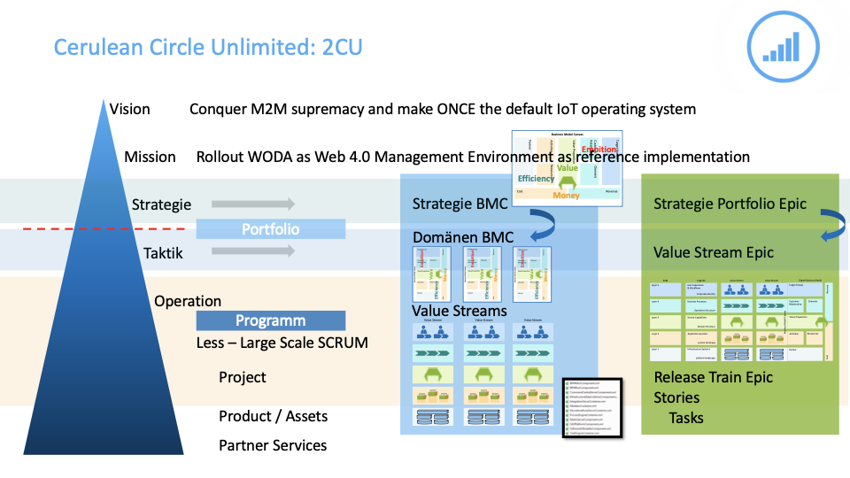

# Cerulean Circle Unlimited: 2CU

> [!TIP]
> Welcome to your first space. Go ahead, edit and customize this home page any way you like. We've added some sample content to get you started.

* * *

# **Goal**

## *Understand at any point in time where we are heading to, what we want to achieve and how we will do that. Have ONE place to enter and trace down whatever you need for your daily work.*

* * *

   

Collapse all

[Expand all](#)   [Collapse all](#)

            

# **Core team**

|     |     |     |     |
| --- | --- | --- | --- |
|   **Harvey Honner-white**   Team Lead |   **Alana Baczewski**    Tech Lead |   **Sameer Farrell**    Marketing |   **Mia Bednarczyk**    Recruitment |

# **Roadmap**

You can edit this roadmap or create a new one by adding the Roadmap Planner macro from the Insert menu. Link your Confluence pages to each bar to add visibility, and find more tips by reading the Atlassian blog: [Plan better in 2015 with the Roadmap Planner macro](http://blogs.atlassian.com/2015/01/roadmap-planner-macro/).

# **Know your spaces** 

Everything your team is working on - meeting notes and agendas, project plans and timelines, technical documentation and more - is located in a space; it's home base for your team.

A small team should plan to have a space for the team, and a space for each big project. If you'll be working in Confluence with several other teams and departments, we recommend a space for each team as well as a space for each major cross-team project. The key is to think of a space as the container that holds all the important stuff - like pages, files, and blog posts - a team, group, or project needs to work.

# **Know your pages**

If you're working on something related to your team - project plans, product requirements, blog posts, internal communications, you name it - create and store it in a Confluence page. Confluence pages offer a lot of flexibility in creating and storing information, and there are a number of useful page templates included to get you started, like the meeting notes template. Your spaces should be filled with pages that document your business processes, outline your plans, contain your files, and report on your progress. The more you learn to do in Confluence (adding tables and graphs, or embedding video and links are great places to start), the more engaging and helpful your pages will become.

Learn more by reading [Confluence 101: organize your work in spaces](https://www.atlassian.com/collaboration/confluence-organize-work-in-spaces)

- [ ] [Customize the name, colour, and icon of Confluence](https://confluence.atlassian.com/x/NgszKw).
- [ ] Decide who can see and edit this space or a specific page by clicking the 
 icon. Learn more about [Page Restrictions](https://confluence.atlassian.com/x/liAC) and [Space Permissions](https://confluence.atlassian.com/x/ASEC).
- [ ] Try adding an [inline comment](https://confluence.atlassian.com/x/2yAC) by highlighting some text and click the comment icon.
- [ ] Learn more about [inviting your team to Confluence](https://confluence.atlassian.com/x/SRwC).

## Whats new

Error rendering macro 'recently-updated' : com.atlassian.confluence.search.v2.InvalidSearchException: com.atlassian.confluence.api.service.exceptions.SSStatusCodeException: There was an illegal request passed to XP-Search Aggregator API : HTTP/1.1 403 Forbidden