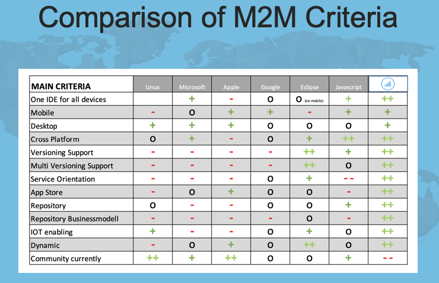
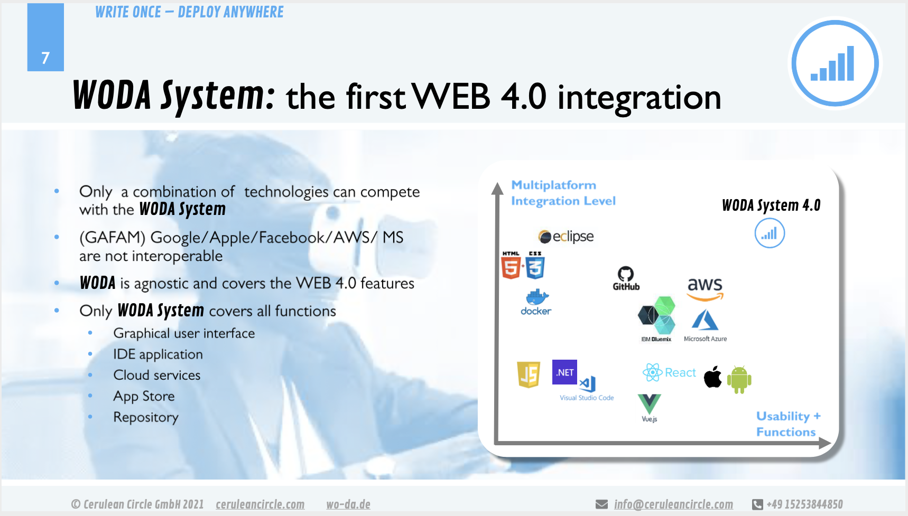

[📁 Max Planck Gesellschaft Mpg](../max-planck-gesellschaft-mpg.md) | [🌐 Page Structure GitHub](/2cu.atlassian.net/wiki/spaces/CCU/pages/500000020/mpg-use-case-realization-20211118-meeting-notes.md) | [🌐 Page Structure local SymLink](./mpg-use-case-realization-20211118-meeting-notes.page.md)

# MPG Use Case Realization - 20211118 Meeting notes

## Date

18 Nov 2021

## Participants

[Pascal Boullie <pascal.boullie@gv.mpg.de>](https://ox.hosteurope.de/appsuite/#) , Tel: 0151 46114243, Abteilung III

### Session Hosts

Marcel Donges, Andre Marquis

## Goals

MPG feedback from Woda USP meeting

## Discussion topics

| Time | Topic | Notes |
| --- | --- | --- |
| 1 h | Feedback from Woda USP meeting | - listen to Pascals information and provide answers to open questions |

## Insights

tbd

## Action items

## Decisions

### Email Correspondence

tbd
tbd
