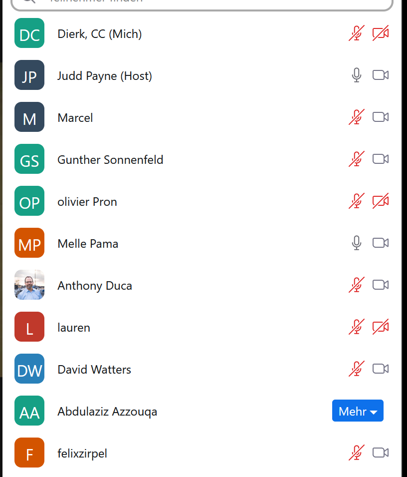
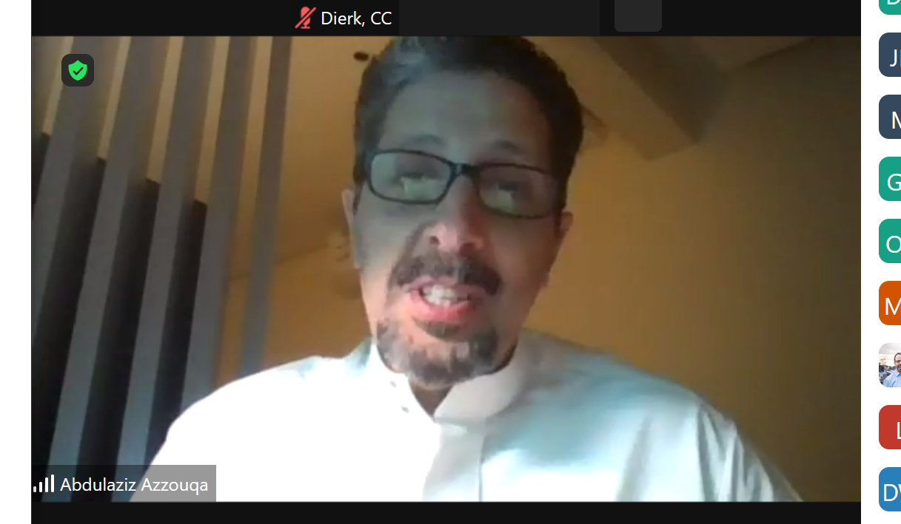

[📁 Mep Metaverse Main](../mep-metaverse-main.md) | [🌐 Page Structure GitHub](/2cu.atlassian.net/wiki/spaces/CCU/pages/500000030/rfi-meetings.md) | [🌐 Page Structure local SymLink](./rfi-meetings.page.md)

# RFI - Meetings

26.4.23

MD, FZ, GS, DW

- Introducing FZ to GS

Talking about the RFI

Not assuming Judd changed the Document.

We take the lead for the RFI and not going for consult c[avrn.us.](http://cavrn.us)

How to interact with Judd:

* * *

27.4.23

Dier, Judd, MD, GS, Olivier, Melle, Felix, Anthony Duca, Lauren, David Watters, || Abdulaziz,

Olivier: not enough time until EOT

Melle (World Expo Expertise)

Antony: This are requests which might be diffrent from NEOM

Abdulaziz Azzouqa: From Saudi Arabia: MEP,

Judd:

- Timeline
- 10 Microverses
- “another 24 month”

Abdul: We have no plan of the scope, so it is a pilot.

Abdul: Will a start to allocate budget, until we know the scope. 3000€ MD as an exchange currency

Abdul: we want to have a platform to work on

Anthony: We know this and the dynamics that the customers do not know what they want

Abdul: Agreed on this, it's all about investment attractions

Anthony: noone understand the value points, so everone is struggling

Marcel: First of all Contact, Explains SBD, (Abdul agrees apparently)

Abdul: we need any return, investment attr, tourism, etc… we only showed the initial list,

Marcel: always good to show potential to the customer

Gunther: goes into metaverse terms, economic and social incentives,

Marcel: we like the agile approach, barcamp (agile conference with stakeholders)

Abdul: we need a team to lead it, agrees to barcamp; meeting w/ acc and m$ is already planned

Abdul: lack of understanding of MV AND convince the gov mindsets to see the necessity

Abdul: is the MV dying down?

Anthony: Nooo, there are cycles, that is always coming on, ecommerce, social media, next step after the “flat web”, Apple is the sleeping lion, coming up with s/th great

Abdul: (headsets + ecosystem)?

Marcel: there is a hurdle to get into the MV: how to lower the entry hurdle; therefore put it on any device in the browser, The transition is lacking; CC is having the software on any device

Abdul: Do we have the right team? Are we missing anything?

Judd: Cerulean with Team, cavrn.us with Teams, World Expo, having SME, we can get to other companies to get the needed know how

Marcel: we can provide migration to the DC, it’s a large amount in the budget

Abdul: do you have oracle oci infrastructure?

Marcel: we will go to oci // but there is no oci DC // we are fine with OCI

Abdul: we can migrate safely next year // national cyber security team is touchy

Abdul: **we need a proposal yesterday**

Marcel: Methodology of initial meetings is crucial and should be done with people on-site

Abdul: next call urgent

\=====

Head of Metaverse: ??

Judd: they don't pay

Marcel: they need to follow our methodology, using lego bricks

Judd: we are not there to see a light on the end of the tunnel

Marcel: we could give a number today, but Judd says no way

Gunther: create a supposal, each one creates his own proposal

Anthony: Experience, Creation, Content, Tourist Attractions,

Melle: Create the ask…. let them ask them to pay us to find their ask, since the bucket is fixed, we need to specify the lego blocks intelligently

Melle: Create the lego blocking blocks, and get them paid and continue with the next time.

Judd: Saudi are Trained to not pay you.

\=====

Anthony, Melle, Judd: What shall we build for the saudi village. Heritage site.

Anthony: show the microverses, has all the features, runs on all devices

Melle: Urban Masterplan of Destinations

\===

debrief

\-

GS

- rfi is worth nothing
- idea does not know about approach
- [cavrn.us](http://cavrn.us) is doing their own stuff
- judd is afraid to ask for the money
- therefore:
  - submit our own proposal
  - idea will do the design work
  - they need ROI - [cavrn.us](http://cavrn.us) does not care
  - salvage : we submit own proposal

Defining the Ask

Understanding the Incentives

Understanding the problems with the incentives

What kind of experiences can be done

What is the return of investment

Applying to real use cases

MD: defining the ask is understanding the incentives discovering the problems with the incentives What kind of civic and business use cases ROI

Design: 300000/500000
