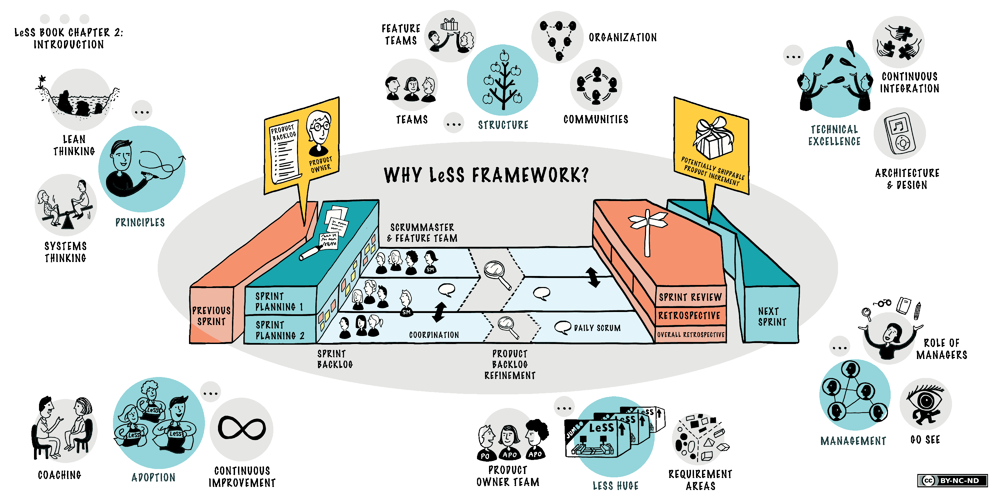

[📁 Bp Agile Workflow Management](../bp-agile-workflow-management.md) | [🌐 Page Structure GitHub](/2cu.atlassian.net/wiki/spaces/CCU/pages/300000045/scrum.entry.md) | [🌐 Page Structure local SymLink](./scrum.entry.page.md)

# Scrum

In order to guarantee scalability and a minim management overhead we use the Large Scale Scrum (LeSS) approach.

  
A comprehensive documentation can be found here: [https://less.works/](https://less.works/)

A quick intro here: [https://less.works/attachments/introduction-to-LeSS-by-Dawson.mp4](https://less.works/attachments/introduction-to-LeSS-by-Dawson.mp4)

## Useful links

[Jira WODA Backlog](https://2cu.atlassian.net/secure/RapidBoard.jspa?rapidView=1&projectKey=WODA&view=planning&issueLimit=100&atlOrigin=eyJpIjoiMzM1OTRkOTdlYzEwNGQyNGFhNGI3YTEyYjE0ZjY4YzUiLCJwIjoiaiJ9)

[https://2cu.atlassian.net/l/c/FQdmWw9J](https://2cu.atlassian.net/l/c/FQdmWw9J) , [https://2cu.atlassian.net/l/c/opiPfU1H](https://2cu.atlassian.net/l/c/opiPfU1H) , [https://2cu.atlassian.net/l/c/TCpvH1rn](https://2cu.atlassian.net/l/c/TCpvH1rn)

## Overview

- [Sprint characteristics](../../../../../2cu.atlassian.net/wiki/spaces/CCU/pages/81133583/Sprint_characteristics.md)
- [Definition of DONE](../../../../../2cu.atlassian.net/wiki/spaces/CCU/pages/119111681/Definition_of_DONE.md)
- [Scrum Teams](../../../../../2cu.atlassian.net/wiki/spaces/CCU/pages/88211457/Scrum_Teams.md)
- [Scrum Templates](../../../../../2cu.atlassian.net/wiki/spaces/CCU/pages/105512982/Scrum_Templates.md)
- [Sprint planning](../../../../../2cu.atlassian.net/wiki/spaces/CCU/pages/88375379/Sprint_planning.md)
- [Reviews](../../../../../2cu.atlassian.net/wiki/spaces/CCU/pages/95060086/Reviews.md)
- [Retros team](../../../../../2cu.atlassian.net/wiki/spaces/CCU/pages/95158337/Retros_team.md)
- [Retros all](../../../../../2cu.atlassian.net/wiki/spaces/CCU/pages/95060101/Retros_all.md)
