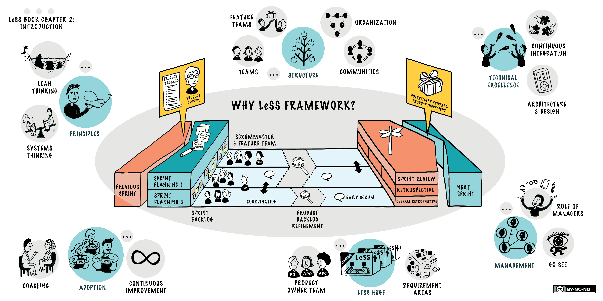

# Scrum

In order to guarantee scalability and a minim management overhead we use the Large Scale Scrum (LeSS) approach.

  
A comprehensive documentation can be found here: [https://less.works/](https://less.works/)

A quick intro here: [https://less.works/attachments/introduction-to-LeSS-by-Dawson.mp4](https://less.works/attachments/introduction-to-LeSS-by-Dawson.mp4)

## Useful links

[Jira WODA Backlog](https://2cu.atlassian.net/secure/RapidBoard.jspa?rapidView=1&projectKey=WODA&view=planning&issueLimit=100&atlOrigin=eyJpIjoiMzM1OTRkOTdlYzEwNGQyNGFhNGI3YTEyYjE0ZjY4YzUiLCJwIjoiaiJ9)

[https://2cu.atlassian.net/l/c/FQdmWw9J](https://2cu.atlassian.net/l/c/FQdmWw9J) , [https://2cu.atlassian.net/l/c/opiPfU1H](https://2cu.atlassian.net/l/c/opiPfU1H) , [https://2cu.atlassian.net/l/c/TCpvH1rn](https://2cu.atlassian.net/l/c/TCpvH1rn)

## Overview

- [Sprint characteristics](https://2cu.atlassian.net/wiki/spaces/CCU/pages/81133583/Sprint+characteristics)
- [Definition of DONE](https://2cu.atlassian.net/wiki/spaces/CCU/pages/119111681/Definition+of+DONE)
- [Scrum Teams](https://2cu.atlassian.net/wiki/spaces/CCU/pages/88211457/Scrum+Teams)
- [Scrum Templates](https://2cu.atlassian.net/wiki/spaces/CCU/pages/105512982/Scrum+Templates)
- [Sprint planning](https://2cu.atlassian.net/wiki/spaces/CCU/pages/88375379/Sprint+planning)
- [Reviews](https://2cu.atlassian.net/wiki/spaces/CCU/pages/95060086/Reviews)
- [Retros team](https://2cu.atlassian.net/wiki/spaces/CCU/pages/95158337/Retros+team)
- [Retros all](https://2cu.atlassian.net/wiki/spaces/CCU/pages/95060101/Retros+all)