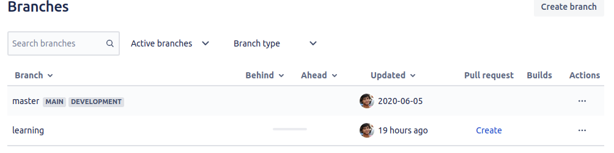

[📁 Business Processes](../business-processes.md) | [🌐 Page Structure GitHub](/2cu.atlassian.net/wiki/spaces/CCU/pages/300000053/bp-devops.md) | [🌐 Page Structure local SymLink](./bp-devops.page.md)

# BP DevOps

# Working with GIT and GIT Flow

- GIT Flow
  - English: [https://nvie.com/posts/a-successful-git-branching-model/](https://nvie.com/posts/a-successful-git-branching-model/)
  - German: [https://www.atlassian.com/de/git/tutorials/comparing-workflows/gitflow-workflow](https://www.atlassian.com/de/git/tutorials/comparing-workflows/gitflow-workflow)
- Git power tools
  - [https://nvie.com/posts/git-power-tools/](https://nvie.com/posts/git-power-tools/)
- Commit message conventions
  - [http://karma-runner.github.io/4.0/dev/git-commit-msg.html](http://karma-runner.github.io/4.0/dev/git-commit-msg.html)  

# Fork Concepts

**What is the ‘master’ branch?**  
The ‘master' branch is the production code and locked repo (DevOps can only access). As a developer, is our duty to make sure that the master code always running, clean, and optimize.

**What is the ‘develop’ branch?**  
A ‘develop’ branch is exact copy of the ‘master’ branch, including new changes done by the developer and reviewed by senior via 'Pull Request'.

**Creating a working branch/repo?**  
Always create your ‘<development>’ branch from ‘develop’. So, that you have an exact copy of the ‘master' and all new changes ready for production and less issue on the conflict at a time of 'pull-request’.

## Git Branch Naming Conventions

- master
- develop
- release
  - nextVersion
  - latestStableVersion
- development
  - `learn`: (new learning and R&D stuff)
  - `feat`: (new feature for the user, not a new feature for build script)
  - `enhance`: (enhancement in the code)
  - `fix`: (bug fix for the user, not a fix to a build script)
  - `docs`: (changes to the documentation)
  - `style`: (formatting, missing semicolons, etc; no production code change)
  - `refactor`: (refactoring production code, eg. renaming a variable)
  - `test`: (adding missing tests, refactoring tests; no production code change)
  - `chore`: (updating grunt tasks etc; no production code change)
  - `bug`: (Code changes linked to a known issue)
  - `hotfix`: (Quick fixes to the codebase)
  - `junk` : (Experiments (will never be merged))

**Examples**  
`feat/renderer-cookies hotfix/dockerfile-base-image bug/login-ie`

***Note:***

- *Always use ( - ) dashes to separate words, and keep it short.*
- Use ( / ) slash after the prefix, so the branch can pe group by git tree.
- Generally, we got prefix from the Jira ticket type. But as best practices don’t use “story/epic” as a prefix. And convert that “story/epic” in sub-task and mention label as required. (feat, fix, bug, enhancement, etc.).

# Git Commit Msg

**The reasons for these conventions:**

- automatic generating of the changelog
- simple navigation through git history (e.g. ignoring style changes)

**Format of the commit message:**  
`<type>(<scope>): <subject>`  
`<body>`  
`<footer>`

**Example commit message:**  
`fix(middleware): ensure Range headers adhere more closely to RFC 2616`  
``Add one new dependency, use `range-parser` (Express dependency) to compute range. It is more well-tested in the wild.``  
`Fixes #2310`

**For References:-**  
Karma documentation is very helpful  
[Link](http://karma-runner.github.io/4.0/dev/git-commit-msg.html)

# Developer Last Stage - Pull Request

**Before 'Pull request'**  
Before these steps, the developer needs to sure that they

- commit and push all the changes in their development repo.
- <development> branch is clean, ready and latest from 'develop'

Once the developer done with all the above points, visit Bitbucket in branch and there is an option to <create pull request> mention in-branch row.

- Create, 'Pull request'
- Mention your changes, in your branch and in this ‘pull request’
- Mention assignee and reporter properly.
- Specifically mention, all global variable, structural, and framework related changes, that can impact on globally.

**After ‘Pull request'**  
That’s very possible that you will receive changes from your reporter (who reviewed pull request)

*In that case:-*

- Do your changes.
- Commit with proper message and push.
- Mark done the changes in the ‘pull request’.
- repeat, the process till ‘pull-request' review not done.

Note: Carefully do initial steps, check your code, self-test the task/feat/fix/bug/changes. Increase the chances that your code gets merge without hassle.
