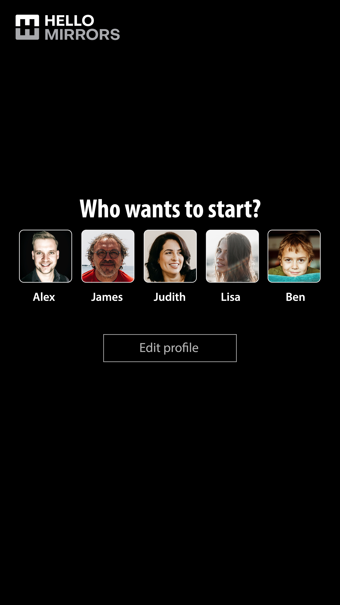
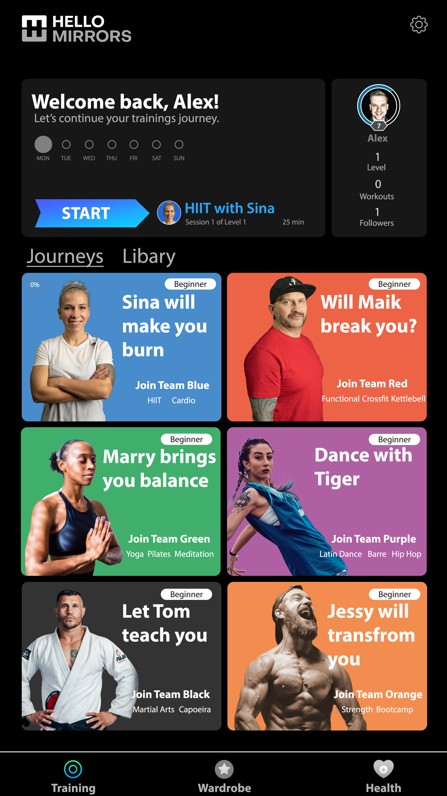
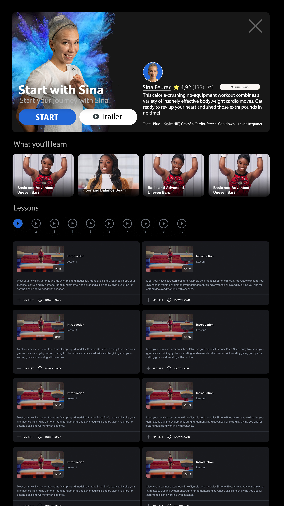
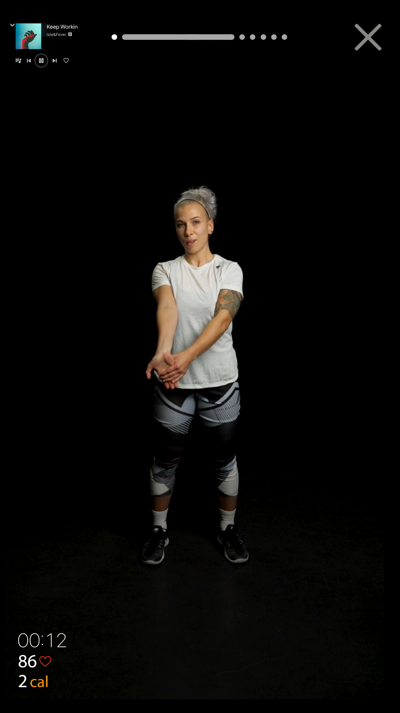
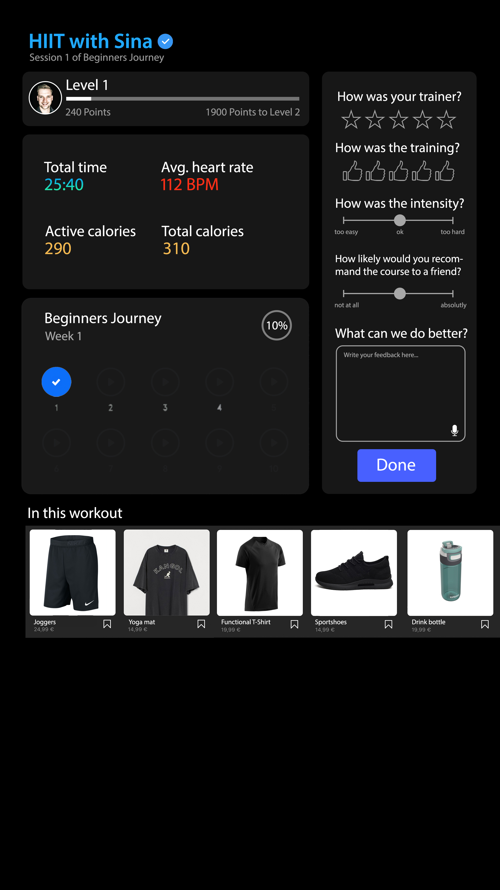

[📁 Hello Mirrors Development](../hello-mirrors-development.md) | [🌐 Page Structure GitHub](/2cu.atlassian.net/wiki/spaces/CCU/pages/400000009/mirror-pages.md) | [🌐 Page Structure local SymLink](./mirror-pages.page.md)

# Mirror Pages

Photoshop Files: [https://we.tl/t-uOEL3jKuWx](https://we.tl/t-uOEL3jKuWx)

Sketch Files: [https://we.tl/t-HYIp0WYpal](https://we.tl/t-HYIp0WYpal)

SketchCloud (for Inspect) [https://www.sketch.com/s/28dc4c5b-314f-4779-b710-86eda17bde0a](https://www.sketch.com/s/28dc4c5b-314f-4779-b710-86eda17bde0a)

Prototype in Figma:

| **Page name** |     | **Description** | **Commend** |
| --- | --- | --- | --- |
| Bootscreen |  | Hello Mirrors Logo as a Bootscreen. | For MVP 1, a picture will be enough.  For MVP 2, a short animation for 5 seconds while system is booting. |
| Member Page |  | This page shows all family members who have a personal training account.   (Style reference Netflix)  The family member can choose his account and will be redirected to his personal start page. | Only for MVP 2 relevant.  However, it should be possible to implement the following at an early stage. |
| Start Page |  | On the top the Hello Mirror logo.  On the top settings menu to configure settings like:  - Name - Gender - Mobile number - Payment - Membership - etc.  Than we have the Journey Dashboard, where you can see what Journey and Trainer you have selected. Also you see the status of your trainings progress and the duration of the training. Furthermore, you have an overview on what days of the week you have selected to train.  Next to the Journey Dashboard you have the Personal Board, where you can see:  - Level - Amount of Workouts - Followers  At the body you can see the 6 Trainings Journeys. You can choose one at the beginning.  At the bottom you have a menu selection between:  - Training - Wardrobe - Health |     |
| Journey Detail Page |  | On the Journey Detail Page you see:  1. A short description of the trainer 2. What you will learn in the training 3. The amount of lessons you have. 4. The detail page for each workout with a screenshot and a short description what the topic of the training is. |     |
| Training Page |  | On the trainings page you have 4 Main components.  1. Your Spotify integration, with controls. 2. The duration of the training with dots and progress bar. 3. The main Video that is playing in the body 4. Your time and vital data like heartbeat and calories count. | For the Vital data on point 4. we will use for the MVP 1 only the calories that we estimate that a person will burn during the workout.  In the MVP 2 we want to connect via Bluetooth devices like the Apple Watch or a heartbeat tracker. |
| Success Page |  | On the success page you see 5 components:  1. Your level that you are currently in. 2. The time and the vital data. 3. Your progress on the Trainings Journey 4. A review and feedback part. 5. Products that are shown in the workout, that you can buy. | For us is 4. Component the most important because we want to work with the customer closely to develop the best product possible.  The 5. Component is not relevant in the MVP 1 stage. |
