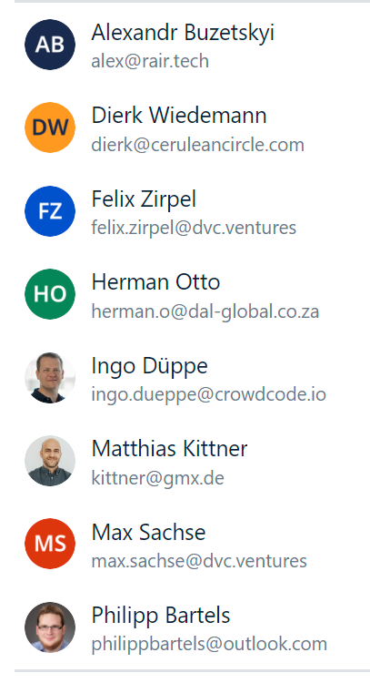

# NEOM PoC

- [NEOM Basics](./neom-poc/neom-basics.md)
- [NEOM PoC Roadmap](./neom-poc/neom-poc-roadmap.md)
- [NEOM PoC Meetings](./neom-poc/neom-poc-meetings.md)
- [NEOM PoC Spec](./neom-poc/neom-poc-spec.md)
- [NEOM Development](./neom-poc/neom-development.md)
- [NEOM PoC Recordings](./neom-poc/neom-poc-recordings.md)
- [Forschung](./neom-poc/forschung.md)
- [Non Functional Requirements](./neom-poc/non-functional-requirements.md)
- [Dies und Das](./neom-poc/dies-und-das.md)

* * *

- [Team Table](#team-table)
- [Access](#access)

# Team Table

|     | **Full Name** | **Role** | **Company** | **Email (Atlasssian)** | **WhatsApp**  [https://chat.whatsapp.com/GPwVBuQ9R1x3zZFtikMpHg](https://chat.whatsapp.com/GPwVBuQ9R1x3zZFtikMpHg) | **github**   **account** | **OS** | **Status** |
| --- | --- | --- | --- | --- | --- | --- | --- | --- |
| 1   | Marcel Donges | PL  | Cerulean Circle & IDEA | marcel.donges@ceruleancircle.com |     | mdonges | Mac | active |
| 2   | Dierk Wiedemann | PMO | Cerulean Circle | dierk@ceruleancircle.com | 0049 170 4433633 | udwcp1 | Windows | active |
| 3   | Matthias Kittner | Infrastruktur   QA | Cerulean Circle | [me@matthiaskittner.de](mailto:me@matthiaskittner.de) | 0049 178 7907530 | mkt1 | Windows | active |
| 4   | Felix Zirpel | Planning   RM | DVC | felix.zirpel@dvc.ventures | 004917632876894 |     | Mac | active |
| 5   | Fabio Tea | Wherever needed | DVC | fabio.tea@dvc.ventures | 0049 160 2722027 | fabiodvc | All | active |
| 6   | Nico Born | Backend | DVC | nico.born@dvc.ventures | 0049 1749615133 |     | Windows/anche | active |
| 7   | Ingo Düppe | ARC PO | CROWDCODE | [ingo.dueppe@crowdcode.io](mailto:ingo.dueppe@crowdcode.io) | 0049 172 2325299 |     | Mac | active |
| 8   | Marcus Nörder-Tuitje | ARC PO | CROWDCODE | [marcus.noerder-tuitje@crowdcode.io](mailto:marcus.noerder-tuitje@crowdcode.io) | 0049 172 6778126 |     | Windows | active |
| 9   | Daniel Eger | DEV | CROWDCODE | [daniel.eger@crowdcode.io](mailto:daniel.eger@crowdcode.io) | 0049 170 2266818 |     | Mac | active |
| 10  | Simone Kerckhoff | Design | CROWDCODE | simone.keckhoff@crowdcode.io | 004915752410044 |     |     |     |
| 11  | Christoph Schemmelmann | DEV / OPS | CROWDCODE | [christoph.schemmelmann@crowdcode.io](mailto:christoph.schemmelmann@crowdcode.io) | 0049 170 2266818 |     | Mac | inactive |
| 12  | Herman Otto | IAM Dev   DAL PO / TPL | DAL | [herman.o@dal-global.co.za](mailto:herman.o@dal-global.co.za) | 0049 27647522935 |     | Win | pending |
| 13  | Volker Engels |     |     | (Fraunhofer IML) |     |     | NUR Signal   0177 3383138 | observer |
| 14  | David Gundelbacher | Fullstack   Master   myData under myControl | Cerulean Circle |     | +49 170 7750047 |     |     | observer |
| 15  | Till Ruda | CFO | Cerulean Circle |     |     |     |     | active |
| 16  | Ralf Jäger | DEV | DVC | ralf.jaeger@dvc.ventures | +4915253714720 |     | MacOS | active |
| 17  | David Watters | PO  | Cavrnus | david@cavrn.us | +1-614-371-0636 |     | Windows | active |
| 18  | Anthony Duca | PM  | Cavrnus | anthony@cavrn.us | +17606725719 |     | Windows | active |
| 19  | Nick Gebbie | CTO | Cavrnus | nick@cavrn.us |     |     | Windows | active |
| 20  | Ben Tohsakul | Sr. Software Architect (Full Stack) | Cavrnus | ben@cavrn.us |     |     | Windows | active |
| 21  | Loren Colin | PM  | Cavrnus | loren@cavrn.us |     |     | macOS | active |
| 22  | Mark Visconti | Application Engineer (Unreal Engine) | Cavrnus | mark@cavrn.us |     |     | Windows | active |
| 23  | Josh Criz | Unreal Engine Developer Lead | Cavrnus | josh.criz@cavrn.us |     |     | Windows | active |
| 24  | Daniel Soraluz |     |     | [d.soraluz@gmail.com](mailto:d.soraluz@gmail.com) | +1-954-673-4484 |     | Linux |     |

|     | **Full Name** | **Role** | **Company** | **Email (Atlasssian)** | **WhatsApp** | **OS** | **Status** |
| --- | --- | --- | --- | --- | --- | --- | --- |
| 1   | Max Sachse | UI   Fullstack | DVC | max.sachse@dvc.ventures | 0049 173 1067873 | Windows | parental leave |
| 2   | Johannes Werre | DEV | DVC | [Johannes.Werre@gmail.com](mailto:Johannes.Werre@gmail.com) | +49 178 919 9094 | Windows | observer |
| 3   | Philipp Bartels |     | Cerulean Circle |     |     |     | inactive |

# Access

|     | **Full Name** | **Atlassian**   Confluence   Jira   Bitbucket | **Slack** | **Google**   Kalender | **WhatsApp Group w/ NDA** | **Dokumente**   miro   dependency-matrix | **Development Workstation**   setup:   IDE,   local Server | **Zugriff auf**  Woda.prod, test,dev | **Youtube WODA Training** |
| --- | --- | --- | --- | --- | --- | --- | --- | --- | --- |
| 1   |     | Confluence:  [NEOM PoC](../../../../2cu.atlassian.net/wiki/spaces/CCU/pages/1850671105/NEOM_PoC.md)  Jira:  [https://2cu.atlassian.net/jira/software/c/projects/N1/boards/9](https://2cu.atlassian.net/jira/software/c/projects/N1/boards/9)  Bitbucket:  tbd | [https://join.slack.com/t/cerulean-circle/shared\_invite/zt-1vy248r0l-zlE6DJ9w27DEO5HHRXlFZg](https://join.slack.com/t/cerulean-circle/shared_invite/zt-1vy248r0l-zlE6DJ9w27DEO5HHRXlFZg)  link bis 26.6.2023 | [https://calendar.google.com/calendar/u/0?cid=Y19mY2I3ZWRlNjE3MzRlMWQyZTFkYTk2NGI3YmI0YmJiNTdjOWU3Y2I3MTQwMGI1YTQ4Y2Q5NjA2NTAzYzNkNDU3QGdyb3VwLmNhbGVuZGFyLmdvb2dsZS5jb20](https://calendar.google.com/calendar/u/0?cid=Y19mY2I3ZWRlNjE3MzRlMWQyZTFkYTk2NGI3YmI0YmJiNTdjOWU3Y2I3MTQwMGI1YTQ4Y2Q5NjA2NTAzYzNkNDU3QGdyb3VwLmNhbGVuZGFyLmdvb2dsZS5jb20) | [https://chat.whatsapp.com/GPwVBuQ9R1x3zZFtikMpHg](https://chat.whatsapp.com/GPwVBuQ9R1x3zZFtikMpHg) | Miro:   [https://miro.com/app/board/uXjVPwfzfQc=/](https://miro.com/app/board/uXjVPwfzfQc=/)  Dependency-Matrix   [https://docs.google.com/spreadsheets/d/1T2cSe\_vexKPZS-GS0XnuwsnB5Ejl44jU/edit#gid=1572768385](https://docs.google.com/spreadsheets/d/1T2cSe_vexKPZS-GS0XnuwsnB5Ejl44jU/edit#gid=1572768385) |     |     | [https://www.youtube.com/@quirk407/playlists](https://www.youtube.com/@quirk407/playlists)  please comment “like hell” |
| 2   | Marcel Donges | ja  | ja  | ja  |     | ja  | ja  | ja  |     |
| 3   | Dierk Wiedemann | ja  | ja  | ja  |     | ja  | bedingt | bedingt |     |
| 4   | Philipp Bartels | n/a | n/a | n/a |     | n/a | n/a | n/a |     |
| 5   | Matthias Kittner | ja  | ja  | ja  |     | ja  | ja  | ja  |     |
| 6   | Felix Zirpel | ja  | ja  | ja  |     | ja  | n/a | n/a |     |
| 7   | Max Sachse | ja  | ja  | ja  |     | ja  | ja  | ja  |     |
| 8   | Nico Born | ja  | ja  | ja  |     | ja  | ja  | ja  |     |
| 9   | Fabio Tea | ja  | ja  | ja  | ja  | ja  | nein | nein |     |
| 10  | Ingo Düppe |     |     |     |     |     |     |     |     |
| 11  | Marcus Nörder-Tuitje |     |     |     |     |     |     |     |     |
| 12  | Daniel Eger | ja  | ja  | ja  |     | ja  | ja  |     |     |
| 13  | Christoph Schemmelmann |     |     |     |     |     |     |     |     |
| 14  | Herman Otto | ja  | ja  | ja  |     | ja  | ja  |     |     |
| 15  | Volker Engels |     |     |     |     |     |     |     |     |
| 16  | David Gundelbacher |     |     |     |     |     |     |     |     |
| 17  | Till Ruda | n/a | n/a | n/a |     | n/a | n/a | n/a |     |
| 18  | Johannes Werre | ja  | ja  | ja  |     | ja  | ja  | ja  |     |
| 19  | Ralf Jäger | ja  | ja  | ja  |     | \-  | \-  | \-  |     |

Atlassian List

| userlister.group: 2cu@NEOM |
| --- |
|    [Matthias Kittner] |