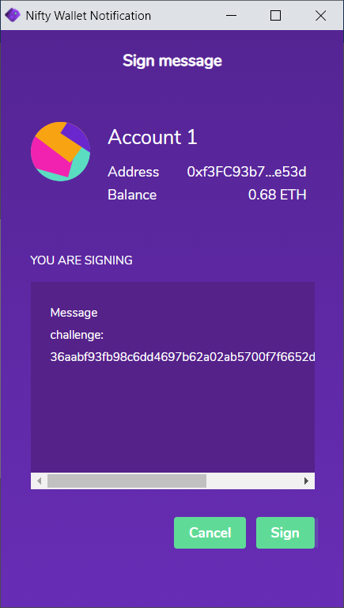
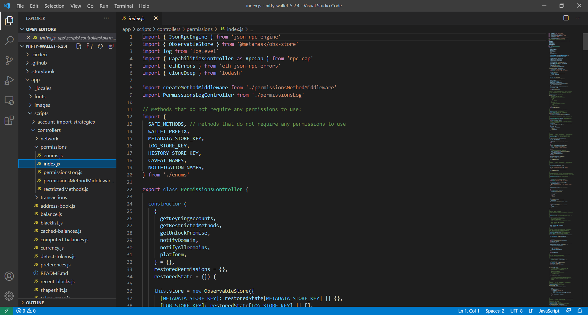
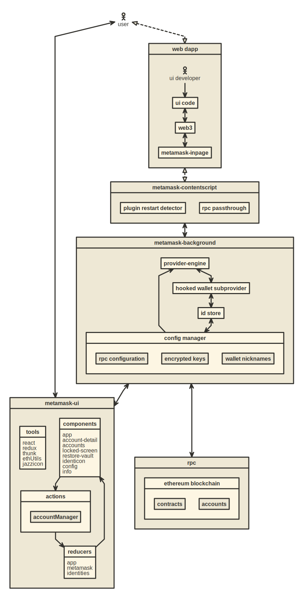
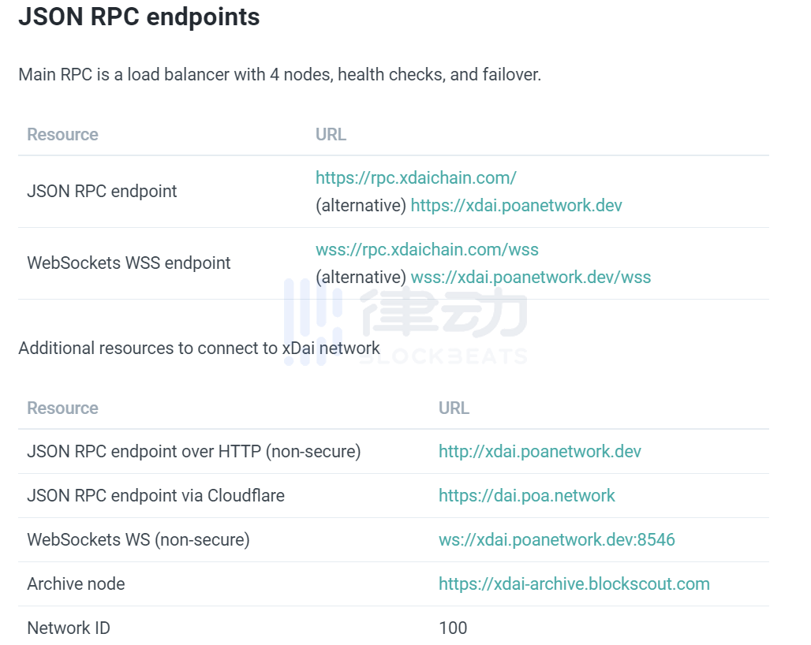
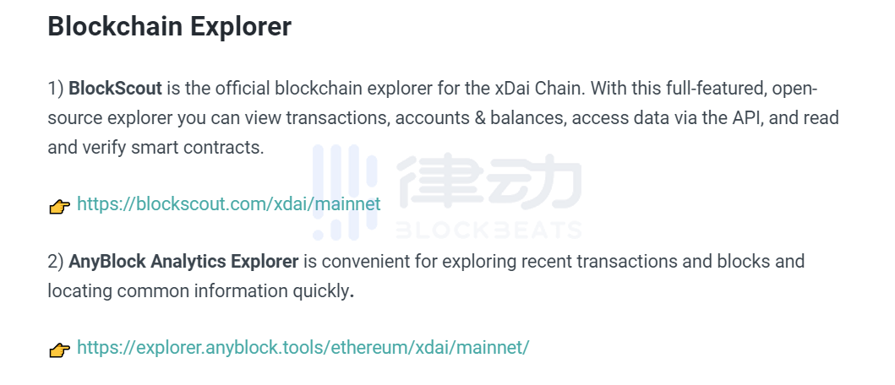
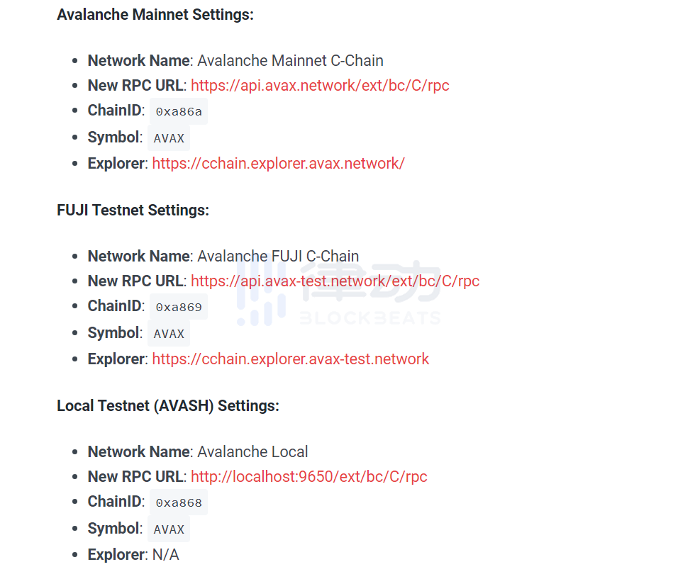

[📁 Rair Development](../rair-development.md) | [🌐 Page Structure GitHub](/2cu.atlassian.net/wiki/spaces/CCU/pages/400000024/crypto-partnerships-guide.md) | [🌐 Page Structure local SymLink](./crypto-partnerships-guide.page.md)

# Crypto Partnerships Guide

- [Wallet Providers](#wallet-providers)
  - [Metamask](#metamask)
  - [Nifty Wallet](#nifty-wallet)
- [Scalable ETH Compatible Chains](#scalable-eth-compatible-chains)
  - [xDAI](#xdai)
    - [How to add xDAI network on MetaMask?](#how-to-add-xdai-network-on-metamask)
    - [How to get xDAI without handling fee?](#how-to-get-xdai-without-handling-fee)
  - [Avalanche](#avalanche)
- [Fiat Onboarding](#fiat-onboarding)
  - [Ramp.network](#rampnetwork)
- [Scalable NFT Marketplaces](#scalable-nft-marketplaces)
  - [Eporio](#eporio)
  - [Unifty](#unifty)
- [IPFS Infrastructure](#ipfs-infrastructure)
  - [Textile](#textile)
  - [Pinata](#pinata)
- [Contact Table](#contact-table)

# Wallet Providers

### Metamask

Main branch of Metamask

[https://github.com/MetaMask](https://github.com/MetaMask)

(GNU COPYLEFT LICENSE)

### Nifty Wallet

Nifty Wallet is a fork of Metamask (thus has interoperability with the RAIR node) [https://github.com/poanetwork/nifty-wallet](https://github.com/poanetwork/nifty-wallet)

(MIT LICENSE!)

Works with RAIRnode as is!

 Latest release code available here - [https://github.com/poanetwork/nifty-wallet/releases/tag/v5.2.4](https://github.com/poanetwork/nifty-wallet/releases/tag/v5.2.4)

Need to understand everything in app → scripts folder enough to replicate. Nifty is a fork of Metamask so I would assume we can eventually fork the fork!

# Scalable ETH Compatible Chains

## xDAI

Metamask/Nifty RPC compatible chain that can scale NFTs

The xDai chain uses the ERC20 to Native TokenBridge functionality to provide fast, inexpensive and stable transactions. This bridge allows users to transform DAI (an ERC20 stable token) on the mainnet into xDAI on a compatible chain. 

> [!NOTE]
> Note that the xDai chain is not those who support mining, it must generate XDAI coins by transferring Dai to the xDai chain through TokenBridge.

Other features are the same as POA Core, such as the block generation time of 5 seconds, the gas cost of each transaction is 1Gwei, so the transaction cost on the xDai chain is very low.

#### How to add xDAI network on MetaMask?

1. Install the metamask or nifty Wallet extension
2. Click on the upper right corner to select the network, click "Custom PRC" (Custom RPC) Network name: xDai Added RPC  URL:  [https://rpc.xdaichain.com/](https://rpc.xdaichain.com/) Chain ID: 100 Symbol: xDai Blockchain browser URL:  [https://blockscout.com/poa/xdai](https://blockscout.com/poa/xdai)

#### How to get xDAI without handling fee?

The token of the xDAI network is XDAI, which functions like ETH on the ETH network. Transfers and transactions need to consume it, but the difference is that it is a stable currency.

1)Official faucet: 

[https://blockscout.com/poa/xdai/faucet](https://blockscout.com/poa/xdai/faucet) (this website may not be open)

0.1XDAI is provided free of charge, the quantity is small, but it can be used for a long time, but I have tried many times, and none of them succeeded in receiving it on this website.

2)The cross-chain bridge 

[https://bridge.xdaichain.com/](https://bridge.xdaichain.com/) can convert DAI on Ethereum into XDAI, which will consume high fees.

3)The exchange is free of handling fee for transfers. Bitmax does not require any handling fee for XDAI transfers.

BitMax address: [https://m.btmx.io/register?inviteCode=VOL10K19](https://m.btmx.io/register?inviteCode=VOL10K19)  

1\. transfer USDT (TRC tokens) from the accounts of the three major exchanges (or your wallet) to BitMax exchange. Since it is TRC tokens, there is no handling fee.

2\. In the BitMax exchange, USDT is exchanged for XDAI through currency trading. 

> [!INFO]
> Note: BitMax cannot transfer tokens within 24 hours, so you can proceed to the next step after 24 hours.

3.Transfer from BitMax exchange to XDAI's wallet address

> [!WARNING]
> Note: I haven't performed real-name authentication, and it will not affect the small-value transaction without real-name.

## Avalanche

Does not have ERC1155 compatible support yet like xDAI doe

The AVA blockchain platform testnet consists of three chains: P-Chain, C-Chain and X-Chain. C-Chain adopts the Ethereum virtual machine use case agreed by AVA Snowman to achieve compatibility with Ethereum.

Network name (custom): Avalanche Mainnet C-Chain

Added RPC URL: [https://api.avax.network/ext/bc/C/rpc](https://api.avax.network/ext/bc/C/rpc)

Chain ID (ChainID): 0xa86a

Symbol: AVAX

# Fiat Onboarding

### Ramp.network

[https://ramp.network/](https://ramp.network/)

# Scalable NFT Marketplaces

### Eporio

[Eporio.io](http://eporio.io/)

Scalable ERC1155 NFT minting platform running on xDAI

### Unifty

[Unifty.io](http://unifty.io/)

Yield farming NFT minting platform also on xDAI

# IPFS Infrastructure

### Textile

[Textile.io](http://textile.io/)

### Pinata

[https://Pinata.cloud](https://pinata.cloud/)

# Contact Table

| **Project** | **Name** | **Email** | **Role** | **Contacted** |
| --- | --- | --- | --- | --- |
| Metamask |     |     |     | NO  |
| Nifty Wallet |     |     |     | NO  |
| xDAI |     |     |     | NO  |
| Avalanche |     |     |     | NO  |
| Eporio |     |     |     | NO  |
| Unifty |     |     |     | NO  |
| Textile |     |     |     | NO  |
| Pinata |     |     |     | NO  |
