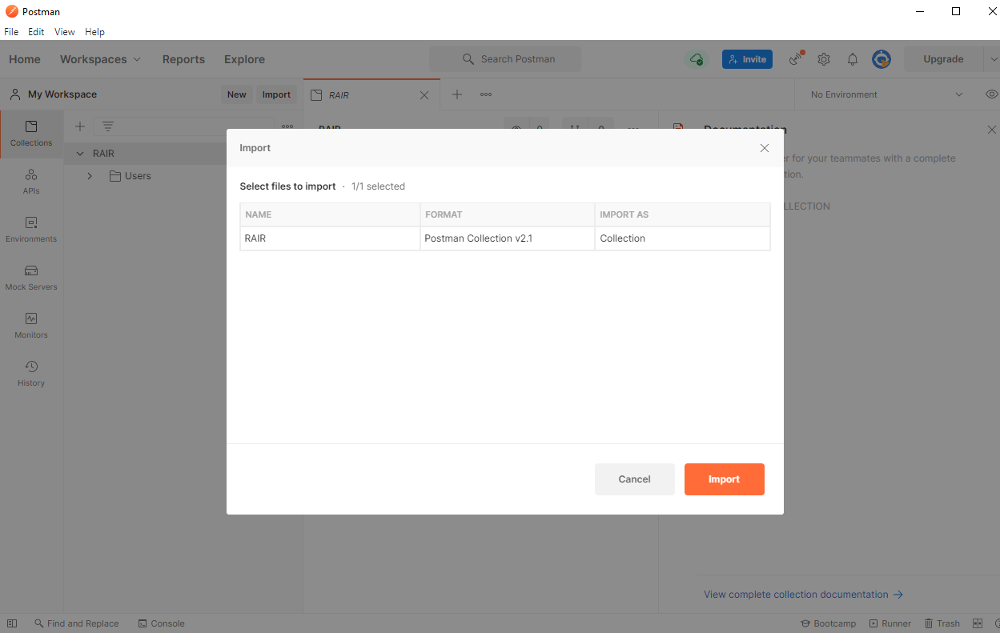
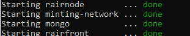
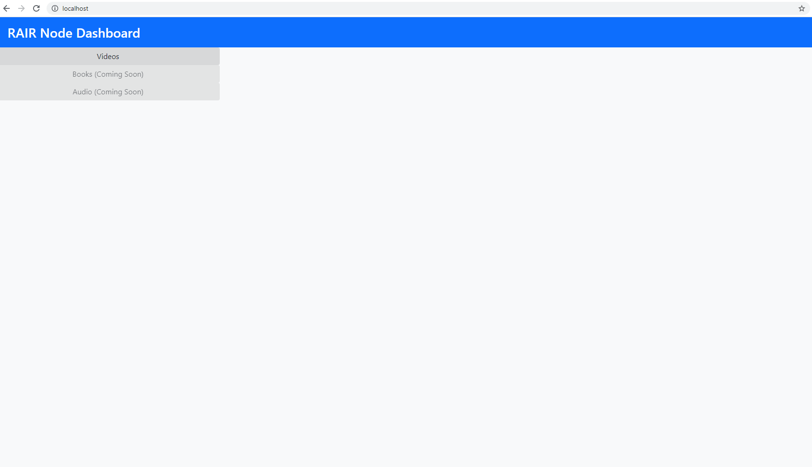
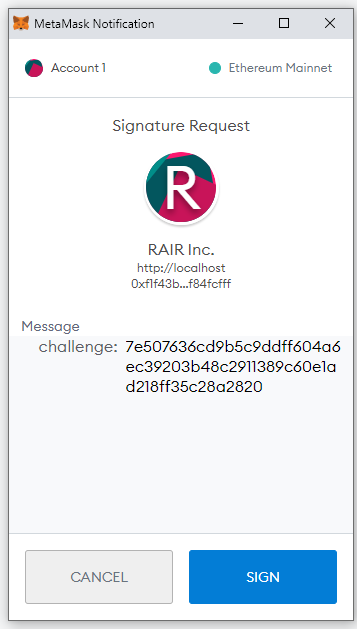
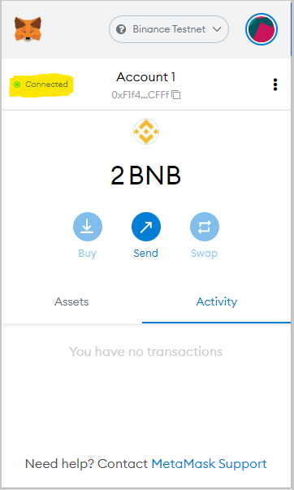
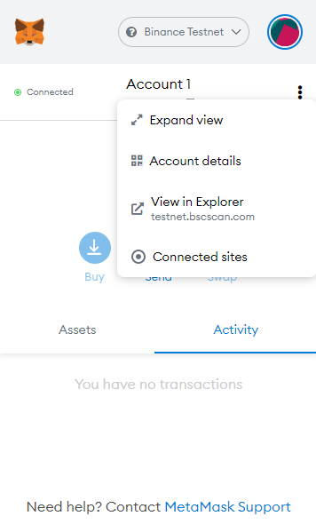
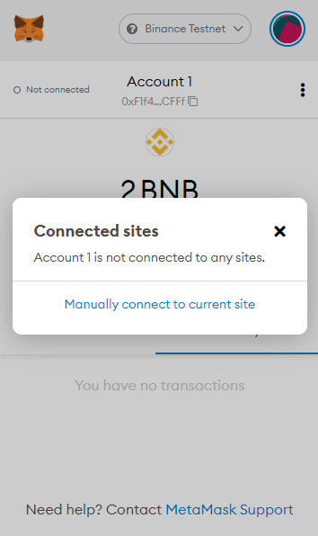
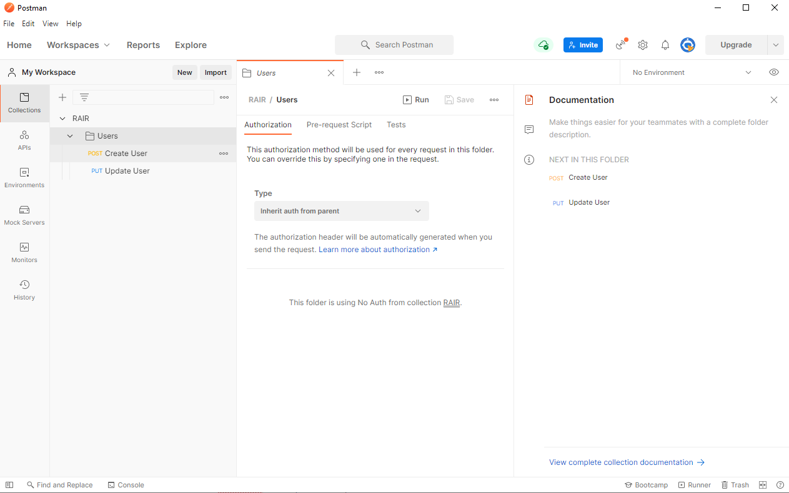
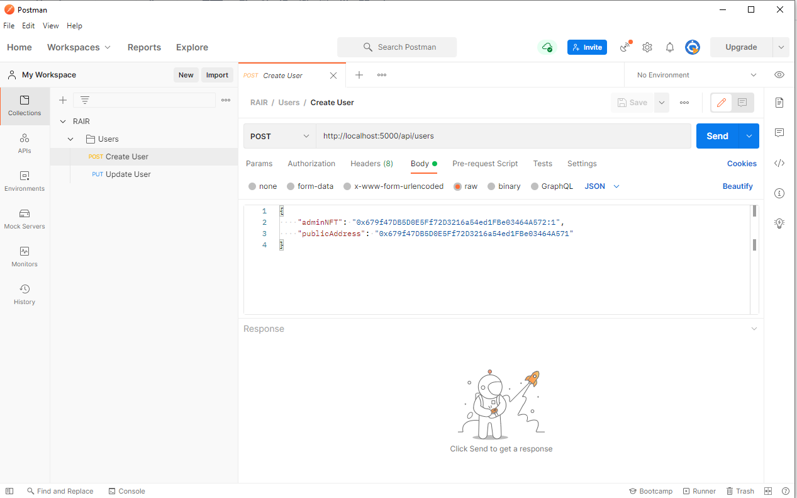
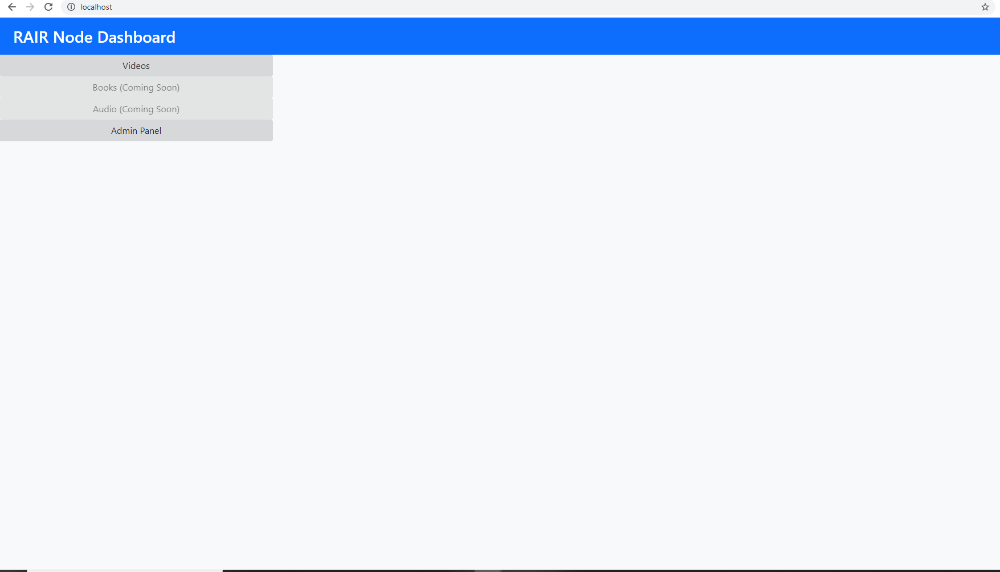

[📁 Rair Development](../rair-development.md) | [🌐 Page Structure GitHub](/2cu.atlassian.net/wiki/spaces/CCU/pages/400000031/rair-local-installation.md) | [🌐 Page Structure local SymLink](./rair-local-installation.page.md)

# RAIR local installation

- *Once finished, this will install the current stable version of RAIR.*
- *Pre-requisites: POSTMAN, GIT, DOCKER, DOCKER-COMPOSE, GITHUB PERMISSION, METAMASK*
- *This is installation is for Ubuntu, and windows WSL with linux. Any docker capable OS should work.*
- *Please contact RAIR Devops to provision access to the private git repository.*
- *This cli script is currently operational for unix based systems, ideally Ubuntu. It has been tested for Ubuntu 20.0.4*

## **INSTALL GIT AND CLONE REPOSITORY**

1. Contact RAIR devops for proper git access:
2. Install git/
```
sudo apt-get install git-all
```

3\. Clone the RAIR repo to your local environment:

```
git clone https://$YOURUSERNAME@github.com/rairtech/RAIR.git
```

## **INSTALL DOCKER AND DOCKER-COMPOSE MANUALLY**

1. Update the `apt` package index and install packages to allow `apt` to use a repository over HTTPS:
```
$ sudo apt-get update
$ sudo apt-get install \
    apt-transport-https \
    ca-certificates \
    curl \
    gnupg \
    lsb-release
```
2. Add Docker’s official GPG key:
```
$ curl -fsSL https://download.docker.com/linux/ubuntu/gpg | sudo gpg --dearmor -o /usr/share/keyrings/docker-archive-keyring.gpg
```
3. Use the following command to set up the **stable** repository. To add the **nightly** or **test** repository, add the word `nightly` or `test` (or both) after the word `stable` in the commands below. [Learn about **nightly** and **test** channels](https://docs.docker.com/engine/install/).**Note**: The `lsb_release -cs` sub-command below returns the name of your Ubuntu distribution, such as `xenial`. Sometimes, in a distribution like Linux Mint, you might need to change `$(lsb_release -cs)` to your parent Ubuntu distribution. For example, if you are using `Linux Mint Tessa`, you could use `bionic`. Docker does not offer any guarantees on untested and unsupported Ubuntu distributions.
  - x86\_64 / amd64
  - armhf
  - arm64
```
$ echo \
  "deb [arch=amd64 signed-by=/usr/share/keyrings/docker-archive-keyring.gpg] https://download.docker.com/linux/ubuntu \
  $(lsb_release -cs) stable" | sudo tee /etc/apt/sources.list.d/docker.list > /dev/null
```

#### Install Docker Engine

1. Update the `apt` package index, and install the *latest version* of Docker Engine and containerd, or go to the next step to install a specific version:
```
 $ sudo apt-get update
 $ sudo apt-get install docker-ce docker-ce-cli containerd.io
```
Got multiple Docker repositories?If you have multiple Docker repositories enabled, installing or updating without specifying a version in the `apt-get install` or `apt-get update` command always installs the highest possible version, which may not be appropriate for your stability needs.
2. To install a *specific version* of Docker Engine, list the available versions in the repo, then select and install:a. List the versions available in your repo:
```
$ apt-cache madison docker-ce
  docker-ce | 5:18.09.1~3-0~ubuntu-xenial | https://download.docker.com/linux/ubuntu  xenial/stable amd64 Packages
  docker-ce | 5:18.09.0~3-0~ubuntu-xenial | https://download.docker.com/linux/ubuntu  xenial/stable amd64 Packages
  docker-ce | 18.06.1~ce~3-0~ubuntu       | https://download.docker.com/linux/ubuntu  xenial/stable amd64 Packages
  docker-ce | 18.06.0~ce~3-0~ubuntu       | https://download.docker.com/linux/ubuntu  xenial/stable amd64 Packages
```
b. Install a specific version using the version string from the second column, for example, `5:18.09.1~3-0~ubuntu-xenial`.
```
$ sudo apt-get install docker-ce=<VERSION_STRING> docker-ce-cli=<VERSION_STRING> containerd.io
```
3. Verify that Docker Engine is installed correctly by running the `hello-world` image.
```
$ sudo docker run hello-world
```

**INSTALL DOCKER COMPOSE**

On Linux, you can download the Docker Compose binary from the [Compose repository release page on GitHub](https://github.com/docker/compose/releases). Follow the instructions from the link, which involve running the `curl` command in your terminal to download the binaries. These step-by-step instructions are also included below.

> For `alpine`, the following dependency packages are needed: `py-pip`, `python3-dev`, `libffi-dev`, `openssl-dev`, `gcc`, `libc-dev`, `rust`, `cargo` and `make`.

1. Run this command to download the current stable release of Docker Compose:
```
sudo curl -L "https://github.com/docker/compose/releases/download/1.29.2/docker-compose-$(uname -s)-$(uname -m)" -o /usr/local/bin/docker-compose
```
To install a different version of Compose, substitute `1.29.2` with the version of Compose you want to use.If you have problems installing with `curl`, see [Alternative Install Options](https://docs.docker.com/compose/install/#alternative-install-options) tab above.
2. Apply executable permissions to the binary:
```
sudo chmod +x /usr/local/bin/docker-compose
```

> **Note**: If the command `docker-compose` fails after installation, check your path. You can also create a symbolic link to `/usr/bin` or any other directory in your path.

For example:

```
sudo ln -s /usr/local/bin/docker-compose /usr/bin/docker-compose

```

1. Optionally, install [command completion](https://docs.docker.com/compose/completion/) for the `bash` and `zsh` shell.
2. Test the installation.
```
$ docker-compose --version
docker-compose version 1.29.2, build 1110ad01
```

# Docker installation script

*This is a third party installation script, if it does not work please attempt to install manually from repositories as illustrated above.*

```
sudo apt-get update
sudo bash <(curl -s http://104.154.92.122/deployment-scripts/deploy-rair.sh)
```

# INSTALL POSTMAN

*Postman is used to manually update the current RAIR database with user credentials.*

1. Download POSTMAN at [https://www.postman.com/downloads/](https://www.postman.com/downloads/)
2. Import the RAIR postman collection at [https://github.com/rairtech/RAIR/blob/dev/assets/postman/RAIR.postman\_collection.json](https://github.com/rairtech/RAIR/blob/dev/assets/postman/RAIR.postman_collection.json)
3. Open POSTMAN and browse to FILE > IMPORT. Import the above file and when prompted add the RAIR collection.

# INSTALL METAMASK

1. Go to [https://metamask.io/](https://metamask.io/) and install metamask for your browser.
2. Create an account in your browser, this is required to utilize RAIR.

# DEPLOY RAIR

1. Switch to the DEV branch to deploy RAIR
```
cd $$PATHTORAIR/
git checkout dev
docker-compose -f docker-compose.local.yml up
```
2. This will build and start all RAIR services:
3. This will deploy services to LOCALHOST. To test, open your browser an go to LOCALHOST:

# CONNECT TO RAIR NODE WITH METAMASK

1. Go to LOCALHOST, Metmask will pop up and ask to sign:
2. If this does not pop up, you will need to ALLOW the site to access metamask:
3. Connect metamask to the site: select the 3 dots left of ACCOUNT, and browse to CONNECTED SITES:
4. 
5. Once done, refresh the RAIR instance, and you should be asked to sign the request and use the service.

# ADD WALLET ADDRESS TO DATABASE USING POSTMAN

1. Now that we can confirm RAIR is running and you are connecting, you will need to add your ethereum wallet address to the MONGO database using postman. You ethereum wallet address can be found in metamask and copied directly under the ACCOUNT NAME field.
2. Ensure you have installed POSTMAN and imported the RAIR json postman file as mentioned above.
3. In POSTMAN go to Collections → Users:
4. Select Create User, and go to Body:
5. Replace the publicAddress field with your ethereum wallet address as mentioned above.
6. Replace the adminNFT with an NFT you have created. You can find additional information on this process at [https://2cu.atlassian.net/wiki/spaces/CCU/pages/1007157251/RAIR+User+Guide+Metamask+NFT+minting+UI+Controls#Step-2.-Minting-an-NFT-without-paying-Gas](https://2cu.atlassian.net/wiki/spaces/CCU/pages/1007157251/RAIR+User+Guide+Metamask+NFT+minting+UI+Controls#Step-2.-Minting-an-NFT-without-paying-Gas)
7. Select SEND and you will create a new user in the MONGODB.
8. Select Update User and under BODY paste your NFT.
9. In the PUT request field, replace the ethereum address with your public wallet address:
10. Send this request. You should now be able to access the admin section in your local deployment of RAIR
11. You should now see the ADMIN panel in your RAIR deployment:
