# Smart Contract Specification

- [Main Goals for RAIR Mainnet smart contracts](#main-goals-for-rair-mainnet-smart-contracts)
  - [1 - Metamask RPC Compatible EVM](#1-metamask-rpc-compatible-evm)
  - [2 - Use audited “off-the-shelf” contracts only](#2-use-audited-off-the-shelf-contracts-only)
  - [3 - Create an ERC1155 contract](#3-create-an-erc1155-contract)
    - [3.1 - Opensea Whitelist (optional)](#31-opensea-whitelist-optional)
    - [3.2- Deploy Contract in Opeasea](#32-deploy-contract-in-opeasea)
  - [4 - Mint our own NFTs](#4-mint-our-own-nfts)
    - [4.1 - Add metadata](#41-add-metadata)
  - [5 - Compatible with Opensea](#5-compatible-with-opensea)
    - [5.1 - View our products in OpenSea](#51-view-our-products-in-opensea)
    - [5.2 - Debug our metadata](#52-debug-our-metadata)
  - [6\. Implementing token URI](#6-implementing-token-uri)
    - [6.1 - Attributes](#61-attributes)
    - [6.2 - Deploy PYTHON's HTTP server to output metaDATA information](#62-deploy-pythons-http-server-to-output-metadata-information)
      - [6.2.1 - Install PYTHON](#621-install-python)
      - [(1) Switch to NPM V8.11.4 and install Python3](#1-switch-to-npm-v8114-and-install-python3)
      - [(2) Complete the installation of python3](#2-complete-the-installation-of-python3)
      - [6.2.2 Install supporting software](#622-install-supporting-software)
      - [6.2.2 Run PYTHON HTTP service](#622-run-python-http-service)
      - [6.2.3 Common Problem](#623-common-problem)
    - [6.3 - Modify the server URI address of the metaDATA of the smart contract](#63-modify-the-server-uri-address-of-the-metadata-of-the-smart-contract)
  - [7 - Store JSON/NFT Images and important NFT contract information in IPFS](#7-store-jsonnft-images-and-important-nft-contract-information-in-ipfs)
    - [7.1 Verifiability](#71-verifiability)
    - [7.2 Download IPFS](#72-download-ipfs)
    - [7.3 IPFS into ERC1155 contract](#73-ipfs-into-erc1155-contract)
    - [7.4 Add NFT asset to IPFS via pinata](#74-add-nft-asset-to-ipfs-via-pinata)
  - [8 - Deploy on mainnet AVAX](#8-deploy-on-mainnet-avax)
- [Use Cases (Things we want Mainnet RAIR token to do)](#use-cases-things-we-want-mainnet-rair-token-to-do)
- [Sources](#sources)
  - [What Willem says](#what-willem-says)
  - [Github source code links](#github-source-code-links)
  - [Example Projects using ERC1155](#example-projects-using-erc1155)
- [Scalable Marketplace Overview Specification](#scalable-marketplace-overview-specification)
  - [metadata-api-python](#metadata-api-python)
  - [opensea-erc1155](#opensea-erc1155)
  - [Calls ERC721/ERC1155](#calls-erc721erc1155)
    - [Base Functions](#base-functions)
    - [Base Events](#base-events)
  - [XDAI - AVAX Bridge](#xdai-avax-bridge)
    - [BridgeBase.sol](#bridgebasesol)
      - [Base Events](#base-events)
      - [Base constructor](#base-constructor)
      - [Base function](#base-function)
    - [BridgeXdai.sol](#bridgexdaisol)
      - [Base constructor](#base-constructor)
    - [BridgeAvax.sol](#bridgeavaxsol)
      - [Base constructor](#base-constructor)
    - [RairToken.sol](#rairtokensol)
      - [Base function](#base-function)
    - [Migrations.sol](#migrationssol)
      - [Base function](#base-function)
    - [TokenBase.sol](#tokenbasesol)
      - [Base function](#base-function)
    - [TokenAvax.sol](#tokenavaxsol)
      - [Base Constructor](#base-constructor)
    - [TokenXdai.sol](#tokenxdaisol)
      - [Base Constructor](#base-constructor)
  - [xDAI - AVAX Scripts](#xdai-avax-scripts)
    - [avax-token-balance.js](#avax-token-balancejs)
    - [xdai-token-balance.js](#xdai-token-balancejs)
    - [xdai-avax-transfer.js](#xdai-avax-transferjs)
    - [xdai-avax-bridge.js](#xdai-avax-bridgejs)
  - [xDAI - AVAX Migrations](#xdai-avax-migrations)
    - [initial\_migration.js](#initial_migrationjs)
    - [deploy\_contracts.js](#deploy_contractsjs)
  - [so far, everything we need will look like this](#so-far-everything-we-need-will-look-like-this)
    - [Due to the 4/20/2021](#due-to-the-4202021)
      - [Version:](#version)
      - [How to:](#how-to)
      - [Result:](#result)
      - [ISSUE:](#issue)
      - [TODO:](#todo)
    - [Due to the 5/11/2021](#due-to-the-5112021)
      - [ISSUE:](#issue)
      - [TODO:](#todo)

# Main Goals for RAIR Mainnet smart contracts

### 1 - Metamask RPC Compatible EVM

\-Mint ERC1155 contracts on Avalanche for lower fees/higher throughput

\-see alt blockchain networks we can choose from later at the bottom. The goal is to find an EVM compatible network we can deploy regular solidity contracts into

\-Must be accessible from Metamask by switching RPC

### 2 - Use audited “off-the-shelf” contracts only

\-Use existing tested/audited contracts as is (no custom development of a standard that is proven safe)

\-this is for the contracts themselves and all required dependencies

### 3 - Create an ERC1155 contract

\-Inherits from TradeableERC1155Token, which in turn is inherited from OpenZeppelin ERC1155 contract(this contract implements all necessary ERC1155 methods). It May have more logic in the future, but for Opensea, the important thing is the token URI method, which allows us to map the tokenID in the Creature contract to the off-chian metadata of the contract

#### 3.1 - Opensea Whitelist (optional)

- In addition, the ERC721Tradable and ERC1155Tradable contracts whitelist the proxy accounts of OpenSea users so that they can automatically conduct any transactions on OpenSea (without paying additional approval fees). On OpenSea, each user has an "agent" account that they control, which is ultimately called by the trading contract to trade their products.

> [!INFO]
> Note: This addition does not mean that OpenSea itself can access these products, it just means that users can more easily list them as needed. They are completely optional, but can greatly reduce friction for users. We can find this code in the overridden isApprovedForAll method and the factory mint method.

#### 3.2- Deploy Contract in Opeasea

- To deploy the contract in Opeasea, we need to verify the repository, to get gree Alchemy API key ,and use Truffle to deploy

(function(){ var data = { "addon\_key":"render-Markdown", "uniqueKey":"render-Markdown\_\_markdown6349258107453243361", "key":"markdown", "moduleType":"dynamicContentMacros", "moduleLocation":"content", "cp":"/wiki", "general":"", "w":"", "h":"", "url":"https://d27i9fmzbobp10.cloudfront.net/render-markdown.html?pageId=1086849030&pageVersion=92&macroHash=e8163e84-846c-4179-82ce-c5958e16d26e&macroId=e8163e84-846c-4179-82ce-c5958e16d26e&outputType=email&highlightStyle=&highlight=&xdm\_e=https%3A%2F%2F2cu.atlassian.net&xdm\_c=channel-render-Markdown\_\_markdown6349258107453243361&cp=%2Fwiki&xdm\_deprecated\_addon\_key\_do\_not\_use=render-Markdown&lic=none&cv=1000.0.0-9ec310e9ed61&traceId=a824f08e420d1e4a43d9436522f1fb1e&spanId=3ebcdd351dff9a49&traceSampled=0", "structuredContext": "{\\"confluence\\":{\\"editor\\":{\\"version\\":\\"v2\\"},\\"macro\\":{\\"outputType\\":\\"email\\",\\"hash\\":\\"e8163e84-846c-4179-82ce-c5958e16d26e\\",\\"id\\":\\"e8163e84-846c-4179-82ce-c5958e16d26e\\"},\\"tracing\\":{\\"traceId\\":\\"a824f08e420d1e4a43d9436522f1fb1e\\",\\"spanId\\":\\"3ebcdd351dff9a49\\",\\"sampled\\":\\"0\\"},\\"content\\":{\\"type\\":\\"page\\",\\"version\\":\\"92\\",\\"id\\":\\"1086849030\\"},\\"space\\":{\\"key\\":\\"CCU\\",\\"id\\":\\"229377\\"}},\\"url\\":{\\"displayUrl\\":\\"https://2cu.atlassian.net/wiki\\"}}", "contentClassifier":"content", "productCtx":"{\\"page.id\\":\\"1086849030\\",\\"macro.hash\\":\\"e8163e84-846c-4179-82ce-c5958e16d26e\\",\\"space.key\\":\\"CCU\\",\\"tracing.sampled\\":\\"0\\",\\"page.type\\":\\"page\\",\\"content.version\\":\\"92\\",\\"page.title\\":\\"Smart Contract Specification\\",\\"macro.localId\\":\\"10e0d8ad-fbbe-4d3b-8f9d-eeeda65c16a1\\",\\"macro.body\\":\\"\* yarn install\\\\nexport ALCHEMY\_KEY=\\\\\\"\\u003cyour\_alchemy\_project\_id\\u003e\\\\\\"\\\\nexport MNEMONIC=\\\\\\"\\\\\\"\\\\nexport NETWORK=\\\\\\"rinkeby\\\\\\"\\\\ntruffle deploy --netwo\\",\\": = | RAW | = :\\":null,\\"space.id\\":\\"229377\\",\\"macro.truncated\\":\\"true\\",\\"content.type\\":\\"page\\",\\"output.type\\":\\"email\\",\\"page.version\\":\\"92\\",\\"macro.fragmentLocalId\\":\\"\\",\\"content.id\\":\\"1086849030\\",\\"tracing.traceId\\":\\"a824f08e420d1e4a43d9436522f1fb1e\\",\\"macro.id\\":\\"e8163e84-846c-4179-82ce-c5958e16d26e\\",\\"tracing.spanId\\":\\"3ebcdd351dff9a49\\",\\"user.isExternalCollaborator\\":\\"false\\",\\"editor.version\\":\\"v2\\"}", "timeZone":"Europe/Berlin", "origin":"https://d27i9fmzbobp10.cloudfront.net", "hostOrigin":"https://2cu.atlassian.net", "sandbox":"allow-downloads allow-forms allow-modals allow-popups allow-popups-to-escape-sandbox allow-scripts allow-same-origin allow-top-navigation-by-user-activation allow-storage-access-by-user-activation", "apiMigrations": { "gdpr": true } } ; if(window.AP && window.AP.subCreate) { window.\_AP.appendConnectAddon(data); } else { require(\['ac/create'\], function(create){ create.appendConnectAddon(data); }); } // For Confluence App Analytics. This code works in conjunction with CFE's ConnectSupport.js. // Here, we add a listener to the initial HTML page that stores events if the ConnectSupport component // has not mounted yet. In CFE, we process the missed event data and disable this initial listener. const \_\_MAX\_EVENT\_ARRAY\_SIZE\_\_ = 20; const connectAppAnalytics = "ecosystem.confluence.connect.analytics"; window.connectHost && window.connectHost.onIframeEstablished((eventData) => { if (!window.\_\_CONFLUENCE\_CONNECT\_SUPPORT\_LOADED\_\_) { let events = JSON.parse(window.localStorage.getItem(connectAppAnalytics)) || \[\]; if (events.length >= \_\_MAX\_EVENT\_ARRAY\_SIZE\_\_) { events.shift(); } events.push(eventData); window.localStorage.setItem(connectAppAnalytics, JSON.stringify(events)); } }); }());

> [!INFO]
> If we are already using the Infura API, we can also use the INFURA\_KEY environment variable instead of ALCHEMY\_KEY.

```
export INFURA_KEY= ""
export MNEMONIC= ""
EXPORT OWNER_ADDRESS=""
EXPORT NFT_CONTRACT_ADDRESS=""
EXPORT FACTORY_CONTRACT_ADDRESS=""
EXPORT NETWORK="rinkeby"
```

> [!NOTE]
> Tip: We only need to run the above export line once in a shell session. I recommend that we put these lines in the .env file, apply it once .env is used, and avoid checking in it when we submit our code.

Please note that in order to deploy with Truffle and Infura, we will need a "mnemonic phrase" from our MetaMask account. In order to get ETH into our Rinkeby MetaMask account, we can use the Rinkeby ETH faucet, but get it from Metamask" Mnemonic phrase", please click "Settings" and click "Show mnemonic phrase".

> [!WARNING]
> Note, please make sure that we are using a wallet account that does not have mainnet assets!

### 4 - Mint our own NFTs

\-UI based contract creation for important aspects of ERC1155 (royalty rate, number of tokens, URI, additional JSON data fields)

\-0xABC:1 URI identifier to work with npm rareify

We need to mint new assets for the newly deployed ERC1155 contract, and we will put these assets in an account we control so that we can test the OpenSea auction process of the product.

After deploying to the Rinkeby test network, there will be a contract on Rinkeby, which will be visible on Rinkeby Etherscan. You can find the address of the deployed contract in the output of the Deployment command, and find it on Etherscan via the following URL:

```
https://rinkeby.etherscan.io/address/ <contract_address>.
```

When running the mint script, the contract address and the address of the metamask account should be set as environment variables

```
export OWNER_ADDRESS="<my_address>"
export NFT_CONTRACT_ADDRESS="<deployed_contract_address>"
node scripts/mint.js
```

we then have deployed a smart contract on the Rinkeby network and cast some new OpenSea creations in the contract. We should be able to visit [rinkeby.opensea.io](http://rinkeby.opensea.io) and view our products in the form of NFT in our wallet.

The default metadata of these creatures is provided by [https://opensea-creatures-api.herokuapp.com/api/creature/{token\_id},](https://opensea-creatures-api.herokuapp.com/api/creature/%7Btoken_id%7D,) which we can edit source code below also. after that, we need to create a custom metadata API.

  
Example Code:

```
//Creature.sol
pragma solidity ^0.5.0;

import "./TradeableERC1155Token.sol";
import "./openzeppelin-solidity/contracts/ownership/Ownable.sol";

/**
 * @title Creature
 * Creature - a contract for my non-fungible creatures.
 */
contract Creature is TradeableERC1155Token {
  constructor(address _proxyRegistryAddress) TradeableERC1155Token("Creature", "OSC", _proxyRegistryAddress) public {  }

  function baseTokenURI() public view returns (string memory) {
    //edit below line
    return "https://opensea-creatures-api.herokuapp.com/api/creature/";
    
  }
}
```

#### 4.1 - Add metadata

Once we have deployed our own contract, we need a way for each individual NFT product to be displayed correctly on OpenSea (and other websites that support NFT tokens). This is the role of off-chain metadata.

Each token identifier in the ERC1155 contract will have a corresponding metadata URI, which returns other important information about the product, such as name, image, description, etc. To find this URI, we use the tokenURI method in ERC721.

A simple example of this metadata is:

```
{
"Name": "PEPE",
"Description": "My name is PEPE from RAIR.",
"Image": "https://storage.googleapis.com/opensea-prod.appspot.com /creature/PEPE.png",
"Attributes":[...]
}
```

We can do many things with metadata-including adding rankings, boosts, animations, dates, and more! I think \[[https://docs.opensea.io/docs/metadata-standards](https://docs.opensea.io/docs/metadata-standards)[\]](https://docs.opensea.io/docs/metadata-standards%5D) will definitely helo us to understand it comprehensively.

We now have our own metadata API. We need to connect it to a token, so change the line same as example in`Creature.sol`to use the API URL, then redeploy the contract and create some test items for the test case.

### 5 - Compatible with Opensea

\-display as store in Opensea [https://opensea.io/rankings](https://opensea.io/rankings)

#### 5.1 - View our products in OpenSea

Assuming that we have deployed our contract on the Rinkeby test network, as a specific example, the address of the OpenSea Creature contract we deployed on Rinkeby is 0x7dca125b1e805dc88814aed7ccc810f677d3e1db.

We have also minted 25 new commodities for this contract, so the current total commodity supply is 25. On Etherscan, we can check the tokenURI of one of the projects to see if it points to the OpenSea Creature API endpoint.

Since OpenSea has a Rinkeby environment that allows developers to test their integration with OpenSea. This can be found at [testnets.opensea.io](http://testnets.opensea.io) by clicking on the correct URL. We should be able to view one of our products on OpenSea immediately. The URL can be constructed as follows:

```
https://testnets.opensea.io/assets/ <asset contract address> / <token ID>
```

Among them, asset\_contract\_address is our contract address, and token\_id is one of the token IDs of our products. For example, for the OpenSea Creature contract, here is an OpenSea Creature #12:

> [!TIP]
> [https://testnets.opensea.io/assets/0x7dca125b1e805dc88814aed7ccc810f677d3e1db/12](https://testnets.opensea.io/assets/0x7dca125b1e805dc88814aed7ccc810f677d3e1db/12)

By using our own contract address and token ID, we can also view our products and double-check that everything is displayed as expected.

> [!INFO]
> Note that the attributes we included in the token metadata are displayed as the "attributes" and "stats" of the product. This happens automatically as long as they are included as binary or int in the attribute section of the metadata.

To test the integration, we just need to navigate to:

```
https://testnets.opensea.io/assets/ <our contract address> / <token ID>
```

By default, OpenSea will cache data for our assets. By force an update of our product, we only need to use the force\_update parameter to change the API

```
https://testnets-api.opensea.io/api/v1/asset/ <our contract address> / <token ID> /? force_update = true
```

#### 5.2 - Debug our metadata

Use/verify endpoint

If we encounter problems with the OpenSea display (perhaps all images or attributes), we can use the following API endpoints to debug metadata.

```
https://testnets-api.opensea.io/asset/ <our contract address> / <our token ID> / validate/
```

Or

```
https://api.opensea.io/asset/ <our contract address> / <our token ID> / validate/
```

We now can visit this URL with our contract address and token ID to see if there are any errors in the metadata URL.

### 6\. Implementing token URI

When OpenSea to pull in off-chain metadata for ERC1155 resources, our contract should return a URI where we can discover the metadata. To discover this URI, we utilize the tokenURI method in ERC1155. To start with, we should check the tokenURI method in the Creature contract.

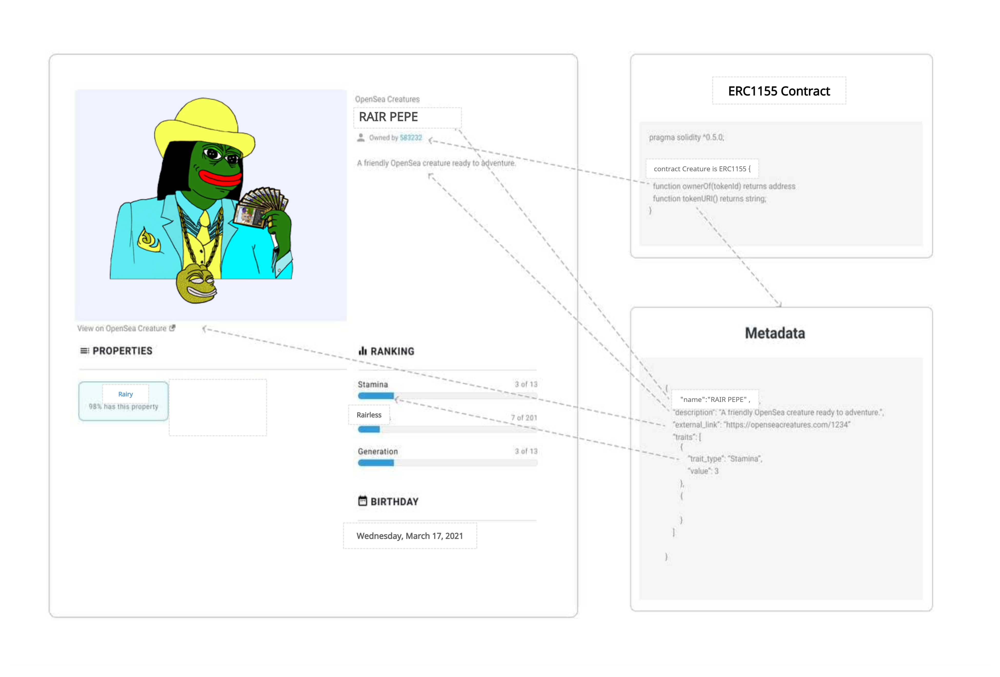

```
 /**
   * @dev Returns an URI for a given token ID
   */
  function tokenURI(uint256 _tokenId) public view returns (string) {
    return Strings.strConcat(
        baseTokenURI(),
        Strings.uint2str(_tokenId)
    );
  }
```

The tokenURI work in our ERC1155 contract should return an HTTP or IPFS URL, like ([https://opensea-creatures-api.herokuapp.com/api/creature/3](https://opensea-creatures-api.herokuapp.com/api/creature/3)). At the point when queried, this URL ought to thus return a JSON blob of data with the metadata for our token.

> [!INFO]
> We can see an example of a simple Python server for serving metadata in the OpenSea creatures repo [here](https://github.com/ProjectOpenSea/opensea-creatures/tree/master/metadata-api). （explaned in 6.2 - please continue read this part）

Or

If we use IPFS to host our metadata, our URL should be in the format `ipfs://<hash>`.

Ex:

```
 ipfs://QmTy8w65yBXgyfG2ZBg5TrfB2hPjrDQH3RCQFJGkARStJb
```

(keep reading on this at 7 - Store JSON/NFT Images and important NFT contract information in IPFS)

#### 6.1 - Attributes

In order to make our products more attractive, OpenSea also allows us to add custom "attributes" to the metadata, which will be displayed below each asset. For example, the following are the properties of one of the OpenSea creatures.

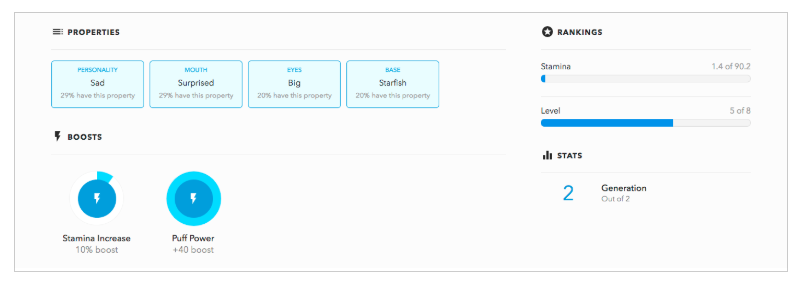

To generate these attributes, the following attribute arrays are included in the metadata:

```
...
{
"attributes": [
    {
      "trait_type": "base", 
      "value": "starfish"
    }, 
    {
      "trait_type": "eyes", 
      "value": "big"
    }, 
    {
      "trait_type": "mouth", 
      "value": "surprised"
    }, 
    {
      "trait_type": "level", 
      "value": 5
    }, 
    {
      "trait_type": "stamina", 
      "value": 1.4
    }, 
    {
      "trait_type": "personality", 
      "value": "sad"
    }, 
    {
      "display_type": "boost_number", 
      "trait_type": "aqua_power", 
      "value": 40
    }, 
    {
      "display_type": "boost_percentage", 
      "trait_type": "stamina_increase", 
      "value": 10
    }, 
    {
      "display_type": "number", 
      "trait_type": "generation", 
      "value": 2
    }
  ]
}
```

The trait\_type is the name of the characteristic and the value of the characteristic value. display\_type is a field that indicates how we want to display the characteristic. For the strings trait, we don't have to worry about display\_type.

For digital features, OpenSea currently supports three different options number (bottom right in the figure below), boost\_percentage (bottom left in the figure below), boost\_number (similar to boost\_percentage but without the percent sign), and ranking (bottom right) ). The default value is located in the upper right corner of the figure below.

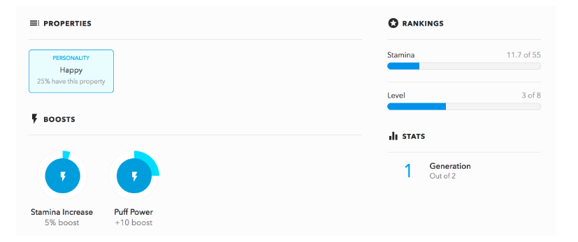

Finally, max\_value is the optional maximum value of the feature's possible value. It defaults to the maximum value OpenSea has seen so far on contract assets.

> [!NOTE]
> Note: If we don't want to have a trait\_type specific trait, we can include only one value in the trait and set it as a common attribute.

Ex:

```
{
    "value": "happy"
  }],
}
```

> [!INFO]
> There are several important considerations when proposing our attributes! we should include string attributes as strings (remember the quotes) and numeric attributes as floats or integers so that OpenSea can display them appropriately.
> We should also use underscore capitalization (for example, max\_power). These attributes are displayed as human-readable strings on OpenSea.

#### 6.2 - Deploy PYTHON's HTTP server to output metaDATA information

[https://github.com/ProjectOpenSea/opensea-creatures/tree/master/metadata-api](https://github.com/ProjectOpenSea/opensea-creatures/tree/master/metadata-api)

##### 6.2.1 - Install PYTHON

login Test server, and Upload the project file

##### (1) Switch to NPM V8.11.4 and install Python3

nvm use v8.11.4  
Or reinstall NPM V8.11.4 version.

##### (2) Complete the installation of python3

Assuming the working directory is cd /usr/local, execute the download version command

```
 wget https://www.python.org/ftp/python/3.6.3/Python-3.6.3.tgz
```

Unzip the downloaded compressed file

```
 tar -xf Python-3.6.3.tgz
```

Enter the decompressed directory, compile and install

```
cd Python-3.6.3
 
 ./configure --prefix=/usr/local/python3 
```

Compile and install

```
make
make install
```

Build a soft chain for python3

```
 ln -s /usr/local/python3/bin/python3 /usr/bin/python3
```

Add /usr/local/python3/bin to PATH

```
nano ~/.bash_profile
```

Edit the content and add python3 executable files

```
# Get the aliases and functions
if [ -f ~/.bashrc ]; then
. ~/.bashrc
fi
# User specific environment and startup programs
PATH=$PATH:$HOME/bin:/usr/local/python3/bin
export PATH
```

Press ctrl+q (save) to exit.

After modifying, remember to execute the following command to make the modification in the previous step take effect:

```
 source ~/.bash_profile
```

Check whether Python3 and pip3 are normally available

```
python3 -V
 pip3 -V
```

> [!TIP]
> \# python3 -V
> Python 3.6.1
> \# pip3 -V
> pip 9.0.1 from /usr/local/python3/lib/python3.6/site-packages (python 3.6)

If it doesn't work, create a pip3 soft link:

```
 ln -s /usr/local/python3/bin/pip3 /usr/bin/pip3
```

##### 6.2.2 Install supporting software

```
sudo apt install python3-pip
 pip3 install flask
 pip3 install Pillow
```

##### 6.2.2 Run PYTHON HTTP service

```
python3 app.py 
```

##### 6.2.3 Common Problem

(1) Python flask cannot access the public network ip through the browser

The HTTP service deployed with PYTHON3 can only be accessed locally for the first time. The key output information is as follows : Running on http://127.0.0.1:5000/ (Press CTRL+C to quit)

If you want to change the IP to an external IP, modify the code of app.py as follows:  
app.run(host='0.0.0.0',port=5000,debug=True, use\_reloader=True)

As long as the user turns on the service, it can be accessed from an external IP:

http://<your server IP here>/api/creature/3

(2) Try to maintaining servers working after Linux SSH client disconnected

Use nohup execution to keep running.

The role of nohup is as the name implies, it makes the subsequent commands not respond to the hang-up (SIGHUP) signal. In other words, after executing nohup through remote login, the program will still execute normally even after logging out.

```
 nohup  python3 app.py &
```

> [!INFO]
> At the same time, notice that nohup will output the PID of the corresponding program. The PID can be used to kill the process when the process needs to be interrupted.

Search for PID number to check if maintain or not

```
ps -ef|grep python3 
```

#### 6.3 - Modify the server URI address of the metaDATA of the smart contract

Filename: Creature.sol

```
contract Creature is TradeableERC1155Token {
  constructor(address _proxyRegistryAddress) TradeableERC1155Token("RAIR", "PEPE", _proxyRegistryAddress) public {  }

  function baseTokenURI() public view returns (string) {
  /*  return "https://opensea-creatures-api.herokuapp.com/api/creature/";*/
  return "http://<your IP here with port>/api/creature/";
  }
}
```

### 7 - Store JSON/NFT Images and important NFT contract information in IPFS

In Heroku  
[https://opensea-creatures-api.herokuapp.com/api/creature/3](https://opensea-creatures-api.herokuapp.com/api/creature/3)

Create IPFS Folder

[/api/creature/](https://opensea-creatures-api.herokuapp.com/api/creature/3)4

[/api/creature/](https://opensea-creatures-api.herokuapp.com/api/creature/3)5

[/api/creature/](https://opensea-creatures-api.herokuapp.com/api/creature/3)6

Pre-install:

[Truffle](https://www.trufflesuite.com/truffle)

[Ganache](https://www.trufflesuite.com/ganache)

or

in Remix

and get [Node.js](https://nodejs.org/en/) ready too.

#### 7.1 Verifiability

The focus of NFT is on digital verification and control of what may be physical or digital assets. If we cannot verify the underlying asset itself in a way similar to verifying the ownership of the token representing the asset, then we will not be able to track the ultimate goal.

#### 7.2 Download IPFS

By choosing any text editor such as vs code as a driver, then make sure IPFS is installed (follow [https://docs.ipfs.io/install/command-line/#official-distributions](https://docs.ipfs.io/install/command-line/#official-distributions), and [https://docs.ipfs.io/how-to/command-line-quick-start/#prerequisites](https://docs.ipfs.io/how-to/command-line-quick-start/#prerequisites))

#### 7.3 IPFS into ERC1155 contract

> [!WARNING]
> We want to issue NFTs for specific assets. We want these assets to be verifiable, just as we want ownership to be verifiable. Therefore, we need to consider the following points here:
> 1. We want to associate NFT with IPFS content identifier (hash)
> 2. We never should mint or create an NFT that maps to the same IPFS hash with another NFT

We are utilizing Counters to help us increase the identifiers for the tokens we mint. We are additionally making a \_tokenIds variable to monitor the entirety of the tokens we've given. Lastly, for our high-level factors, we're making a mapping method for the IPFS hashes related with tokens. This will help forestall giving tokens planned to a hash recently connected with another token.

We also need to add`awardItem`method to our contract that will permit us to mint an NFT for a particular IPFS hash if not token has been minted at this point for that hash.

Example code:

```
//Creature.sol
pragma solidity ^0.5.0;

import "./TradeableERC1155Token.sol";
import "./openzeppelin-solidity/contracts/ownership/Ownable.sol";
import "./openzeppelin/contracts/utils/Counters.sol"

/**
 * @title Creature
 * Creature - a contract for my non-fungible creatures.
 */
contract Creature is TradeableERC1155Token {

  using Counters for Counters.Counter;
  Counters.Counter private _tokenIds;
  mapping(string => uint8) hashes;
  constructor() public TradeableERC1155Token("Creature", "CRT") {}
  

function awardItem(address recipient, string memory hash, string memory metadata)
  public
  returns (uint256)
  {
  require(hashes[hash] != 1);
  hashes[hash] = 1;
  _tokenIds.increment();
  uint256 newItemId = _tokenIds.current();
  _mint(recipient, newItemId);
  _setTokenURI(newItemId, metadata);
  return newItemId;
  } 
}
```

Base logic for`awardItem`function: has two parameters - address variable recipient, string variable hash, and string variable metadata. The address variable is the wallet address of the individual who will get the NFT. The string variable hash is the IPFS hash related with the substance for which we made the NFT. The string variable metadata should highlight a connect to the JSON metadata of the resource. Metadata may incorporate the name of the resource, a connect to a picture that references the resource, or whatever else we need. After defining our function, we make it public. This simply implies that it tends to be called from outside the smart contract. We likewise characterize the return value of the capacity as type uint256.

Presently our contract acknowledges one's Ethereum wallet address and IPFS hash. It checks to ensure that the hash esteem doesn't coordinate with the recently stamped NFT. In the case of everything is typical, another NFT will be made for the IPFS hash.

#### 7.4 Add NFT asset to IPFS via pinata

Since We want to ensure that the valuable assets for which the NFT is created are permanently stored on IPFS. For simplicity as possible, we will replicate it through the Pinata pinning service.

> [!TIP]
> Formatted into IPFS  
> [https://gateway.pinata.cloud/ipfs/QmYpA9GB28MC9jYRmQzNz1BpT4WbW61V5QM4zBHywDs9Jh](https://gateway.pinata.cloud/ipfs/QmYpA9GB28MC9jYRmQzNz1BpT4WbW61V5QM4zBHywDs9Jh)
> Video File Location for RAIR encrypted media - can we add NFT image file into this folder?  
> [https://ipfs.io/ipfs/QmYL87NjCZy2QRMvFejY2rfTLs2K8n3Ey3yGgMqXnE5Pyj](https://ipfs.io/ipfs/QmYL87NjCZy2QRMvFejY2rfTLs2K8n3Ey3yGgMqXnE5Pyj)

We will utilize Pinata to add our resources for IPFS and ensure it stays in a fixed state. We additionally add JSON metadata to IPFS so we can pass it to the token contract we just create. Along these lines, sign in to the record recently made on Pinata. In the upper right corner, click the record drop-down menu and select an account. There, you will actually want to see your API key. You can float your mouse to see your API secrets. Then copy these two codes, as we will use them in the code to upload our asset files.

> [!NOTE]
> Click "New API Key" and make our determination. As far as I might be concerned, I think I just need the way to be utilized once, and just need it to approach the pinFileToIPFS endpoint, since this is the manner by which we push the asset files to IPFS.

Once we have the API key and secret key, Use Pinata’s own convenient upload function in the UI by handle manually

[https://pinata.cloud/pinataupload](https://pinata.cloud/pinataupload)

or we can name uploadFile.js to add the nft asset file to IPFS

```
npm i axios form-data
```

Example Code (only png file, if need get stream part please run Rare-ify):

```
//uploadFile.js

const pinataApiKey = "YOURAPIKEY";
const pinataSecretApiKey = "YOURSECRETKEY";
const axios = require("axios");
const fs = require("fs");
const FormData = require("form-data");
const pinFileToIPFS = async () => {
  const url = `https://api.pinata.cloud/pinning/pinFileToIPFS`;=
  let data = new FormData();
  data.append("file", fs.createReadStream("./pathtoyourfile.png"));
  const res = await axios.post(url, data, {
    maxContentLength: "Infinity", 
    headers: {
      "Content-Type": `multipart/form-data; boundary=${data._boundary}`
      pinata_api_key: pinataApiKey, 
      pinata_secret_api_key: pinataSecretApiKey,
    },
  });
  console.log(res.data);
};
pinFileToIPFS();
```

Result sample:

```
{
  IpfsHash: 'QmYpA9GB28MC9jYRmQzNz1BpT4WbW61V5QM4zBHywDs9Jh',
  PinSize: <pinsize number here>,
  Timestamp: '2021-3-18T18:54:12.s9Jh'
}
```

> [!NOTE]
> This hash value is a verifiable representation of our resources, and it focuses on our nft assets on the IPFS network. On the off chance that somebody messed with our resources and changed our resources, the hash changed too

Finally, make a JSON file that addresses our assets and their metadata by running Rare-ify again. This makes it simpler to show proper metadata for a list of our assets.

> [!INFO]
> RARe-ify the stream by encrypting and writing a rair.json with the metadata
> This will encrypt and write a key file to the same directory

simple JSON file

```
{
  "name":"Hefei 2242",
  "mainManifest": "stream.m3u8",
  "nftIdentifier":"0xd07dc4262.....2430:50984"
  "encryption":"aes-128-cbc",
  "description":"Heifei at night ala BladaRunner",
  "author": "RAIRfly"
}
```

Come back to edit smart contracts metadata IPFS URL.

```
ipfs://OUR_METADATA_HASH
```

By saving the asset to IPFS and associating the IPFS hash value with the asset’s NFT, we can extend the verifiable ownership of the asset to Rare-ify the validity of the underlying asset itself.

### 8 - Deploy on mainnet AVAX

When running the minting script on the mainnet, we need to set the environment variable to not exist in the mainnet. This environment variable affects the URL of the routine in the minting script, not truffle itself.

When deploying, we are using truffle, and we need to provide truffle.js with a parameter (-network real-time) corresponding to the naming in truffle.js.

Example: ([//Github.com/ProjectOpenSea/opensea-creatures/blob/master/scripts/mint.js#L54](https://2cu.atlassian.net//Github.com/ProjectOpenSea/opensea-creatures/blob/master/scripts/mint.js#L54)).

> [!WARNING]
> If we start the minting script but nothing happens, please double check our environment variables.

# Use Cases (Things we want Mainnet RAIR token to do)

- RAIR Admin NFT - Allows users to unlock RAIR node
  - Replicate existing Opensea Admin NFTs on RAIR mainnet [https://opensea.io/collection/rairnodes/](https://opensea.io/collection/rairnodes/)
- RAIR Video (content) NFT - Encrypts video unlocked only if NFT is in user’s wallet
- USER must have 1 RAIR token in wallet to watch any video
- To Mint an NFT - USER must have 10 RAIR
  - Allows a whitelisted admin to mint a token and issue it to a beneficiary

# Sources

### What Willem says

> The "mainnet" version of RAIR as you mentioned can't be on a PoW chain like Ethereum for environmental reasons

Yeah certainly not at the moment. You are lucky there are plenty of cheap PoS EVM/Metamask compatible chains around you could use **(xDAI, Celo, Ava, Ethermint and Moonbeam on L1 and Matic and Optimism on L2).** The RAIR node could be configured to work with NFTs on any (or multiple) of these chains with almost no effort. I also foresee that transferring assets between them is going to be much easier in the future and hopefully possible within metamask itself.

L1

- xDAI
- Celo
- Ava
- Ethermint
- Moonbeam

L2

- Matic
- Optimism

### Github source code links

[https://github.com/OpenZeppelin/openzeppelin-contracts](https://github.com/OpenZeppelin/openzeppelin-contracts)

[https://github.com/enjin/erc-1155](https://github.com/enjin/erc-1155)

[https://github.com/ProjectOpenSea](https://github.com/ProjectOpenSea)

[https://github.com/ProjectOpenSea/opensea-erc1155](https://github.com/ProjectOpenSea/opensea-erc1155)

### Example Projects using ERC1155

[https://digitalax.gitbook.io/digitalax/roadmap-2021](https://digitalax.gitbook.io/digitalax/roadmap-2021)

[https://github.com/DIGITALAX/digitalax-contracts](https://github.com/DIGITALAX/digitalax-contracts)

# Scalable Marketplace Overview Specification

**Glue Together Opensea basic functionality with xDAI Scalability (unique.one/xDAI)**

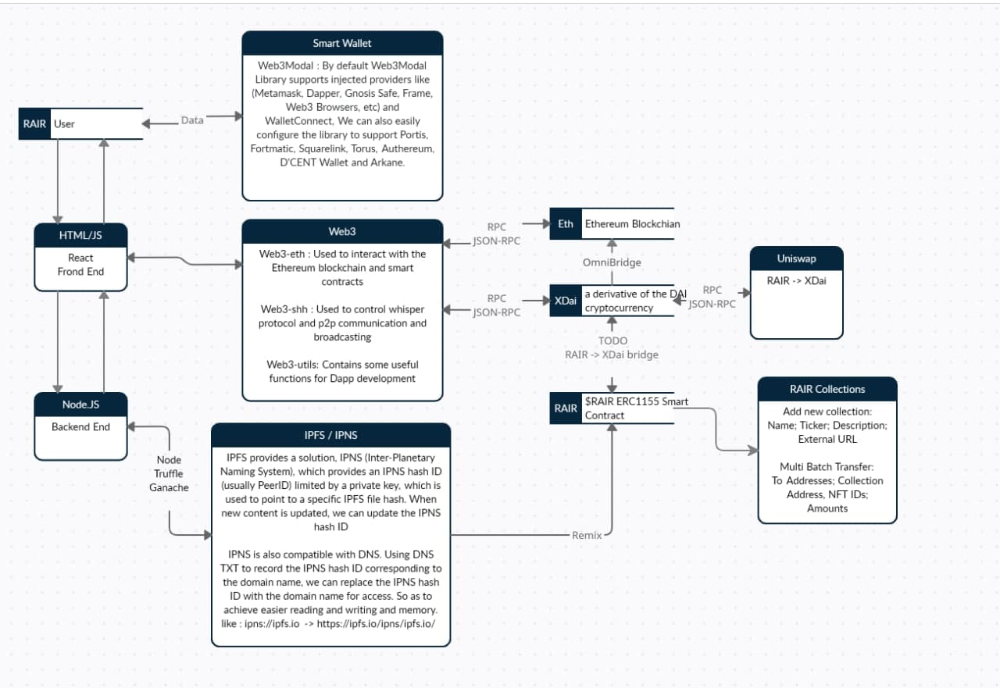

All the things we need:

- IPFS
- IPNS
- JSON metadata server
- Smart Contracts (1155)
- Smart Concract Dependencies (Web3.js etc)

### [metadata-api-python](https://github.com/ProjectOpenSea/metadata-api-python)

### [opensea-erc1155](https://github.com/ProjectOpenSea/opensea-erc1155)

[https://github.com/ProjectOpenSea/opensea-js](https://github.com/ProjectOpenSea/opensea-js)

Weird hash URI

[https://testnet.unique.one/token/eb29f396-58bd-4214-8007-830cc9d5d8e0/0x792eDb670693216b52d9d558C1b40Ae93d607056](https://testnet.unique.one/token/eb29f396-58bd-4214-8007-830cc9d5d8e0/0x792eDb670693216b52d9d558C1b40Ae93d607056)

Eporio URI - In proper RAIR format

[https://epor.io/tokens/0x13a24ba31a6f81b4b4f8e9759b8bda49bd5904a1/918](https://epor.io/tokens/0x13a24ba31a6f81b4b4f8e9759b8bda49bd5904a1/918)

## Calls ERC721/ERC1155

### Base Functions

constructor(string uri\_)

uri(uint256) : string

balanceOf(address account, uint256 id) : uint256 //account cant be the zero address

balanceOfBatch(address\[\] accounts, uint256\[\] ids) : uint256\[\] //accounts and ids must have the same length

setApprovalForAll(address operator, bool approved)

isApprovedForAll(address account, address operator) : bool //turn on to be erc1155 other than that will be erc721

safeTransferFrom(address from, address to, uint256 id, uint256 amount, bytes data)  
safeBatchTransferFrom(address from, address to, uint256\[\] ids, uint256\[\] amounts, bytes data)  
\_setURI(string newuri)

\_mint(address account, uint256 id, uint256 amount, bytes data) //account cannot be the zero address

\_mintBatch(address to, uint256\[\] ids, uint256\[\] amounts, bytes data) //IDs and amounts must have the same length, and return the acceptance magic value.

\_burn(address account, uint256 id, uint256 amount) //account cannot be the zero address and must have at least amount tokens of token type id

\_burnBatch(address account, uint256\[\] ids, uint256\[\] amounts) //IDs and amounts must have the same length.

\_beforeTokenTransfer(address operator, address from, address to, uint256\[\] ids, uint256\[\] amounts, bytes data) //When from and to are both non-zero, amount of from's tokens of token type id will be transferred to to; when to is zero, amount of from's tokens of token type id will be burned; ids and amounts have the same, non-zero length; from and to are never both zero

###   
Base Events

TransferSingle(address operator, address from, address to, uint256 id, uint256 value) //Emit when value tokens of token type id are transferred from to to by the operator

TransferBatch(address operator, address from, address to, uint256\[\] ids, uint256\[\] values) //Emit where operator, from, and to are the same for all transfers

ApprovalForAll(address account, address operator, bool approved) //Emit when account grants or revokes permission to operator to transfer their tokens, according to approved

URI(string value, uint256 id) //Emit when the URI for token type id changes to value if it is a non-programmatic URI.

## XDAI - AVAX Bridge

example XDAI - AVAX Bridge contracts would be this layout tree (would use erc20 here for now)

```
├─BridgeBase.sol
├─BridgeXdai.sol
├─BridgeAvax.sol
├─RairToken.sol
├─Migrations.sol
├─TokenBase.sol
├─TokenXdai.sol
└TokenAvax.sol
```

### BridgeBase.sol

#### Base Events

> [!TIP]
> event Transfer(  
> address from,  
> address to,  
> uint256 amount,  
> uint256 date,  
> uint256 nonce,  
> bytes signature,  
> Step indexed step  
> );

#### Base constructor

```
constructor(address _token) {
  admin = msg.sender;
  token = IToken(_token);
}
```

#### Base function

function burn(address to, uint256 amount, uint256 nonce, bytes calldata signature) //set processedNonces msg.sender nonce as false after transfer processed; emit msg.sender to amount, block.timestamp, nonce, signature, Step.burn

function mint(address from, address to, unit256 amount, unit256 nonce, bytes calldata signature) // ABI should encode too here; emit transfer from to amount, block. timestamp, nonce, signature, Step. Mint)

function prefixed(bytes32 hash) internal pure returns (bytes32) // return abi encoded here

function recoverSigner(bytes32 message, bytes memory sig) // set uint8 v; bytes32 r; bytes32 s;

(v,r,s) = splisignature(sig); return to ecrecover(message, v, r, s)

function splitSignature(bytes memory sig) //return uint8, bytes32, bytes32; if sig.length=65 → return(uint8 v, bytes32 r,byters32 s)

```
 assembly {
        // first 32 bytes, after the length prefix
        r := mload(add(sig, 32))
        // second 32 bytes
        s := mload(add(sig, 64))
        // final byte (first byte of the next 32 bytes)
        v := byte(0, mload(add(sig, 96)))
    }
```

(find in eth, no sure this math is good for xdai…)

### BridgeXdai.sol

#### Base constructor

```
constructor(address _token) BridgeBase(token) {
}
```

### BridgeAvax.sol

#### Base constructor

```
constructor(address _token) BridgeBase(token) {
}
```

### RairToken.sol

#### Base function

function mint(address to, uint256 amount)

function burn(address owner, uint256 amount)

### Migrations.sol

#### Base function

function setCompleted(uint completed) // set public restricted; last completed migration should be equally completed since this function should be restricted to the contract’s owner

### TokenBase.sol

#### Base function

function updateAdmin(address newAdmin) //only admin has right to be msg.sender and add new admin

function mint(address to, uint256 amount) //only admin has right to be msg.sender and mint

function burn(address owner, uint256 amount) //only admin has right to be msg.sender and burn

### TokenAvax.sol

#### Base Constructor

```
constructor() TokenBase('Avax Token', 'AVAX')
```

### TokenXdai.sol

#### Base Constructor

```
constructor() TokenBase('Xdai Token', 'XDAI')
```

## xDAI - AVAX Scripts

After all the .sol smart contract parts done would likely build scripts in js following below:

```
├─avax-token-balance.js
├─xdai-token-balance.js
├─xdai-avax-transfer.js
└xdai-avax-bridge.js
```

### avax-token-balance.js

```
const TokenAvax = artifacts.require('./TokenAvax.sol');

const [recipient, _] = await web3.Avax.getAccounts(); //await web3.eth.getAccounts() before
const tokenAvax = await TokenAvax.deployed();
const balance = await tokenAvax.balanceOf(recipient);
console.log(balance.toString());
done();
```

### xdai-token-balance.js

```
const TokenXdai = artifacts.require('./TokenXdai.sol');

const [recipient, _] = await web3.Xdai.getAccounts(); //await web3.eth.getAccounts() before
const tokenXdai = await TokenXdai.deployed();
const balance = await tokenXdai.balanceOf(recipient);
console.log(balance.toString());
done();
```

### xdai-avax-transfer.js

```
const BridgeXdai = artifacts.require('./BridgeXdai.sol');

const privKey = 'priv key of sender';

  const nonce = 1;
  const accounts = await web3.Xdai.getAccounts(); //await web3.eth.getAccounts() before
  const bridgeXdai = await BridgeXdai.deployed();
  const amount = 1000;
  const message = web3.utils.soliditySha3( 
    {t: 'address', v: accounts[0]},
    {t: 'address', v: accounts[0]},
    {t: 'uint256', v: amo
```

```
unt},
    {t: 'uint256', v: nonce},
  ).toString('hex');  //double check math here, work for eth
  const { signature } = web3.Xdai.accounts.sign(
    message, 
    privKey
  ); 
  
  await bridgeXdai.burn(accounts[0], amount, nonce, signature);
  done();
```

### xdai-avax-bridge.js

```
const Web3 = require('web3');

const web3Xdai = new Web3('url to Xdai node (websocket)');
const web3Avax = new Web3('url to Avax node (websocket)');
const adminPrivKey = '';
const { address: admin } = web3Avax.Xdai.accounts.wallet.add(adminPrivKey);

const bridgeXdai = new web3Xdai.Xdai.Contract(); //Include BridgeXdai.abi
const bridgeAvax = new web3Avax.Xdai.Contract(); //Include BridgeAvax.abi

bridgeXdai.events.Transfer(
  {fromBlock: 0, step: 0}
)
.on('data', async event => {
  const { from, to, amount, date, nonce, signature } = event.returnValues;

  const tx = bridgeAvax.methods.mint(from, to, amount, nonce, signature);
  const [gasPrice, gasCost] = await Promise.all([
    web3Avax.Xdai.getGasPrice(),
    tx.estimateGas({from: admin}),
  ]);
  const data = tx.encodeABI();
  const txData = {
    from: admin,
    to: bridgeAvax.options.address,
    data,
    gas: gasCost,
    gasPrice
  };
  const receipt = await web3Avax.Xdai.sendTransaction(txData);
  console.log(`Transaction hash: ${receipt.transactionHash}`);
  console.log(`
    Processed transfer:
    - from ${from} 
    - to ${to} 
    - amount ${amount} tokens
    - date ${date}
    - nonce ${nonce}
  `);
});
```

## xDAI - AVAX Migrations

```
├─initial_migration.js
└deploy_contracts.js
```

### initial\_migration.js

```
const Migrations = artifacts.require("Migrations");

module.exports = function (deployer) {
  deployer.deploy(Migrations);
};
```

### deploy\_contracts.js

```
const TokenXdai = artifacts.require('TokenXdai.sol');
const TokenAvax = artifacts.require('TokenAvax.sol');
const BridgeXdai = artifacts.require('BridgeXdai.sol');
const BridgeAvax = artifacts.require('BridgeAvax.sol');

if(network === 'XdaiTestnet'){
  await deployer.deploy(TokenXdai);
  const tokenXdai = await TokenXdai.deployed();
  await tokenXdai.mint(addresses[0], 1000);
  await deployer.deploy(BridgeXdai, tokenXdai.address);
  const bridgeXdai = await BridgeXdai.deployed();
  await tokenXdai.updateAdmin(bridgeXdai.address);
}

if(network === 'AvaxTestnet') {
  await deployer.deploy(TokenAvax);
  const tokenAvax = await TokenAvax.deployed();
  await deployer.deploy(BridgeAvax, tokenAvax.address);
  const bridgeAvax = await BridgeAvax.deployed();
  await tokenAvax.updateAdmin(bridgeAvax.address);
};
```

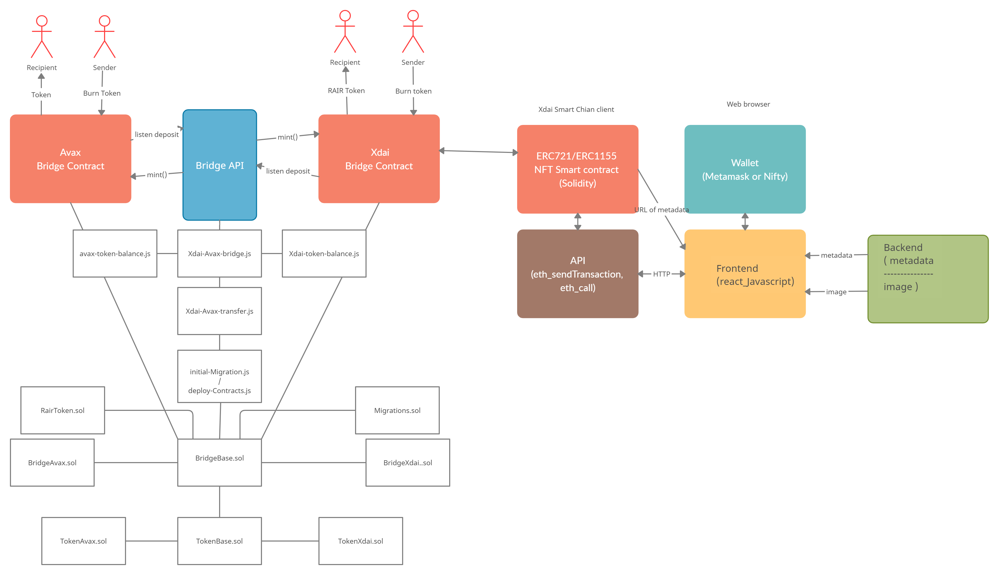

## so far, everything we need will look like this 

```
└─rairtech/weiyirait
    └─rairnftmarketplace
        ├─public
        │  └─TODO
        ├─server
        │  └─TODO
        ├─smart_contracts
        │  ├─build/contracts
        │  │  ├─.json TODO
        │  ├─contracts
        │  │  ├─XDAI_AVAX_Bridge
        │  │  │  ├─BridgeBase.sol
        │  │  │  ├─BridgeXdai.sol
        │  │  │  ├─BridgeAvax.sol
        │  │  │  ├─TokenBase.sol
        │  │  │  ├─TokenXdai.sol
        │  │  │  ├─TokenAvax.sol
        │  │  │  ├─RairToken.sol
        │  │  │  ├─Migrations.sol
        │  │  │  └─.sol TODO
        │  │  ├─ERC1155
        │  │  │  ├─ERC1155.sol
        │  │  │  ├─ERC1155Burnable.sol
        │  │  │  └─.sol TODO
        │  │  ├─ERC721
        │  │  │  ├─ERC721.sol
        │  │  │  ├─ERC721Token.sol
        │  │  │  ├─AddressUtils.sol
        │  │  │  ├─ERC721Basic.sol
        │  │  │  ├─ERC721BasicToken.sol
        │  │  │  ├─ERC721Enumerable.sol
        │  │  │  ├─ERC721Metadata.sol
        │  │  │  ├─ERC721Receiver.sol
        │  │  │  ├─Ownable.sol
        │  │  │  ├─SafeMath.sol
        │  │  │  ├─Migrations.sol
        │  │  │  └─.sol TODO
        │  │  ├─ERC20
        │  │  │  ├─ERC20.sol
        │  │  │  ├─ERC20Token.sol
        │  │  │  ├─Migrations.sol
        │  │  │  ├─WethToken.sol
        │  │  │  └─.sol TODO
        │  │  ├─mock
        │  │  │  └─.sol TODO
        │  │  ├─uniswapv2
        │  │  │  ├─interfaces
        │  │  │  │  ├─IERC20.sol
        │  │  │  │  ├─IuniswapV2Callee.sol
        │  │  │  │  ├─IUniswapV2ERC20.sol
        │  │  │  │  ├─IUniswapV2Facotry.sol
        │  │  │  │  ├─IUniswapV2Router1.sol
        │  │  │  │  ├─IUniswapV2Pair.sol
        │  │  │  │  ├─IUniswapV2Router2.sol
        │  │  │  │  ├─IWETH.sol
        │  │  │  │  └─.sol TODO
        │  │  │  ├─libraires
        │  │  │  │  ├─UniswapV2Libary.sol
        │  │  │  │  ├─SafeMath.sol
        │  │  │  │  ├─Math.sol
        │  │  │  │  ├─FixedPoint.sol
        │  │  │  │  ├─TransferHelper.sol
        │  │  │  │  └─.sol TODO
        │  │  │  ├─UniswapOracleExample.sol
        │  │  │  ├─UniswapV2ERC20.sol
        │  │  │  ├─UniswapV2Factory.sol
        │  │  │  ├─UniswapV2OracleLibrary.sol
        │  │  │  ├─UniswapV2Pair.sol
        │  │  │  ├─UniswapV2Router2.sol
        │  │  │  └─.sol TODO
        │  │  ├─RairAccessControls.sol
        │  │  ├─RairAuction.sol
        │  │  ├─RairVideosNFT.sol
        │  │  ├─RairArtsNFT.sol //PEPE.sol here
        │  │  ├─RairMarketplace.sol
        │  │  └─KeppVideosAlive.sol
        │  ├─migrations
        │  │  ├─initial_migration.js
        │  │  └─deploy_contracts.js
        │  ├─test
        │  │  ├─playlist
        │  │  │  │─test1.m3u8
        │  │  │  │─test2.m3u8
        │  │  │  └─test3.m3u8
        │  │  └─rairnftmarketplaceTest.js
        │  ├─package-lock.json
        │  ├─package.json
        │  ├─traffle-config.js
        │  └─truffle.js
        ├─src
        │  ├─actions
        │  │  └─index.js
        │  ├─components
        │  │  ├─TODO
        │  ├─reducers
        │  │  └─index.js
        │  ├─App.css
        │  ├─App.test.js
        │  ├─index.css
        │  ├─index.js
        │  ├─logo.svg
        │  └─registerServiceWorker.js
        ├─.gitignore
        ├─helper
        ├─package-lock.json
        ├─package.json
        └─README.MD       
```

### Due to the 4/20/2021

the Base`rairnftmarketplace`/`smart_contracts` - PEPE.sol(`cover RairArtsNFT.sol in plan`) and Migration.sol has done. (with test/PEPEtest.js)

> [!INFO]
> build/contracts .json file should be automated generated after truffle test the contract package

```
└─rairtech/weiyirait
    └─rairnftmarketplace
        ├─smart_contracts
        │  ├─build/contracts
        │  │  ├─AddressUtils.json
        │  │  ├─ERC165.json
        │  │  ├─ERC721.json
        │  │  ├─ERC721Basic.json
        │  │  ├─ERC721BasicToken.json
        │  │  ├─ERC721Enumerable.json
        │  │  ├─ERC721Metadata.json
        │  │  ├─ERC721Receiver.json
        │  │  ├─ERC721Token.json
        │  │  ├─Migrations.json
        │  │  ├─Ownable.json
        │  │  ├─PEPE.json
        │  │  ├─SafeMath.json
        │  │  └─SupportsInterfaceWithLookup.json
        │  ├─contracts
        │  │  ├─Migrations.sol
        │  │  └─PEPE.sol
        │  ├─migrations
        │  │  ├─1_initial_migration.js
        │  │  └─2_deploy_PEPE.js //TODO
        │  ├─test
        │  │  ├─PEPEtest.js
        │  ├─package.json
        │  ├─package-lock.json
        │  ├─truffle.js
        │  ├─truffle-config.js
```

#### Version:

Truffle v4.1.8 (core: 4.1.8)  
Solidity v0.4.23 (solc-js)

`ganache-cli`(`Ganache CLI v6.12.2 (ganache-core: 2.13.2)`)

#### How to:

```
$ ipfs daemon   //Run ipfs server at other terminal

$ ganache-cli   //Run TestRPC at 3rd terminal

$ cd rairnftmarketplace/smart_contracts

$ truffle init //choose all No for overwrite

$ npm init
$ npm install --save openzeppelin-solidity //same as "@openzeppelin-solidity", will able edit verion in package-lock.json and package.json

$ truffle test  //2.png, TestRPC will update as well(1.png)
```

1.png

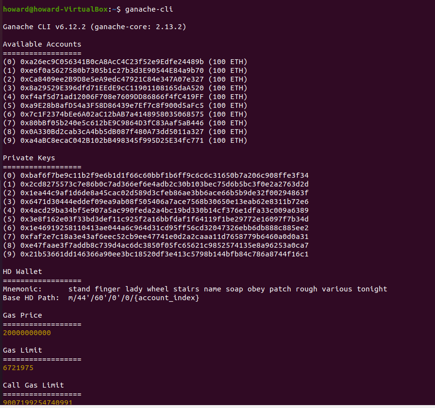

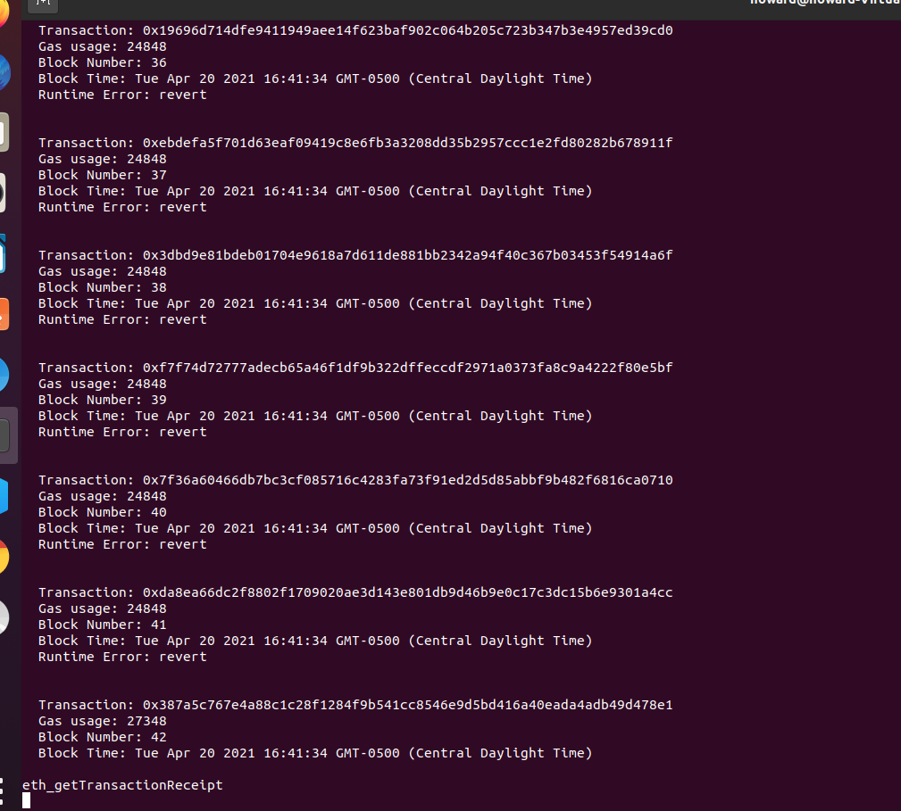

2.png

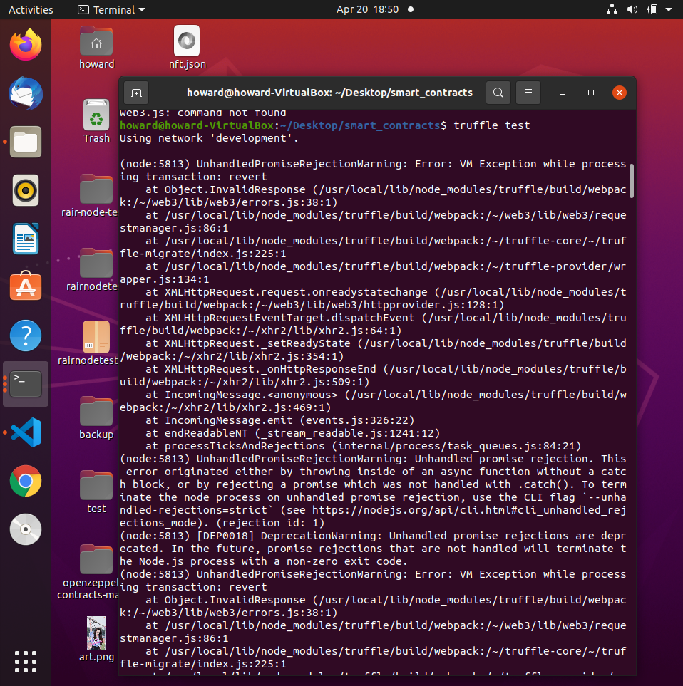

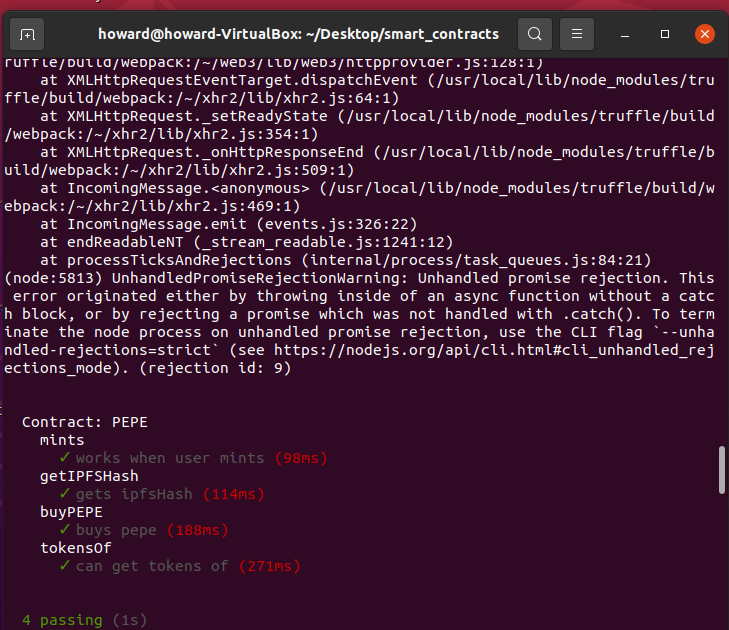

#### Result:

Contract: PEPE  
mints  
✓ works when user mints (98ms)  
getIPFSHash  
✓ gets ipfsHash (114ms)  
buyPEPE  
✓ buys pepe (188ms)  
tokensOf  
✓ can get tokens of (271ms)

#### ISSUE:

1. (node:9160) UnhandledPromiseRejectionWarning: Error: VM Exception while processing transaction: revert error, which also cause Runtime Error: revert at TestRPC

#### TODO:

1. automated deploy PEPE.sol, `work more in deploy_PEPE.js` (should able fix new bug below)
2. fix (node:9160) UnhandledPromiseRejectionWarning: Error: VM Exception while processing transaction: revert error, which also cause Runtime Error: revert at TestRPC

### Due to the 5/11/2021

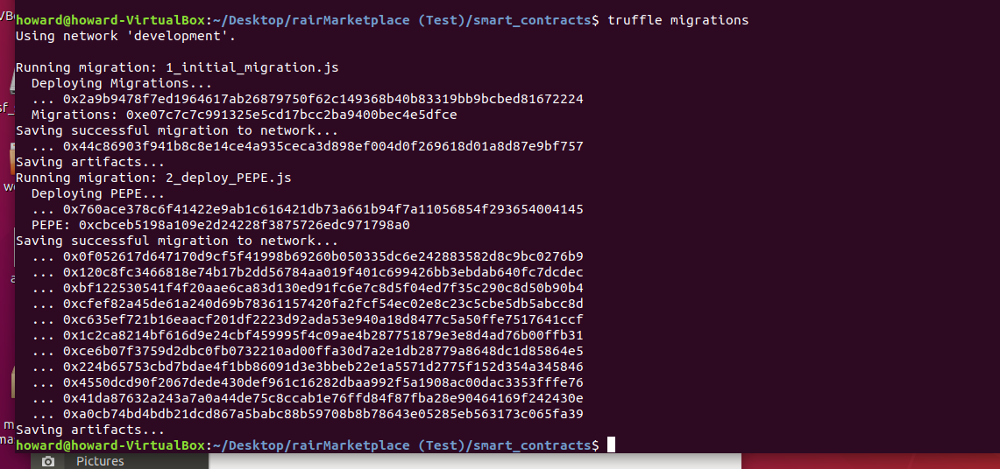

Automated deploy PEPE.sol is done, which also fixed (node:9160) UnhandledPromiseRejectionWarning: Error: VM Exception while processing transaction: revert error

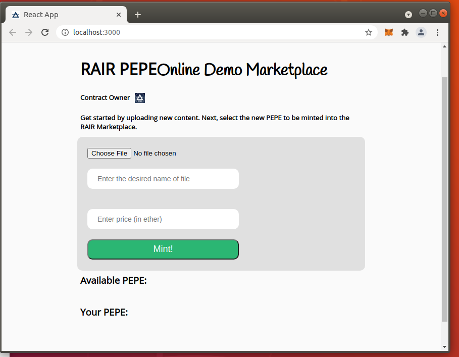

front end RAIR PEPE (Demo) Marketplace is added alone with backend

#### ISSUE:

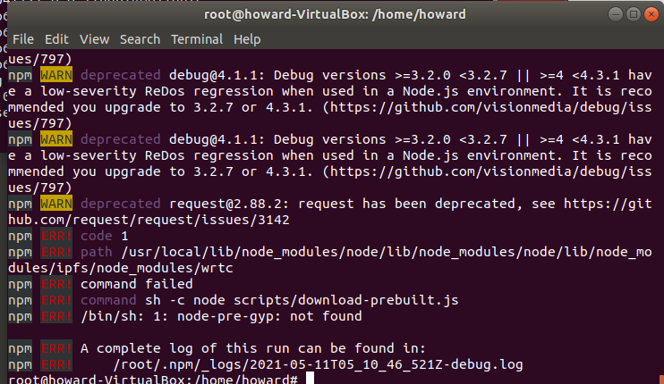

backend dependency issue, especially in IPFS, which cause （after type $ npm start) get npm error in node-pre-gyp: not found

#### TODO:

Fix errors in the backend so we can accept file uploads and handle them over to IPFS