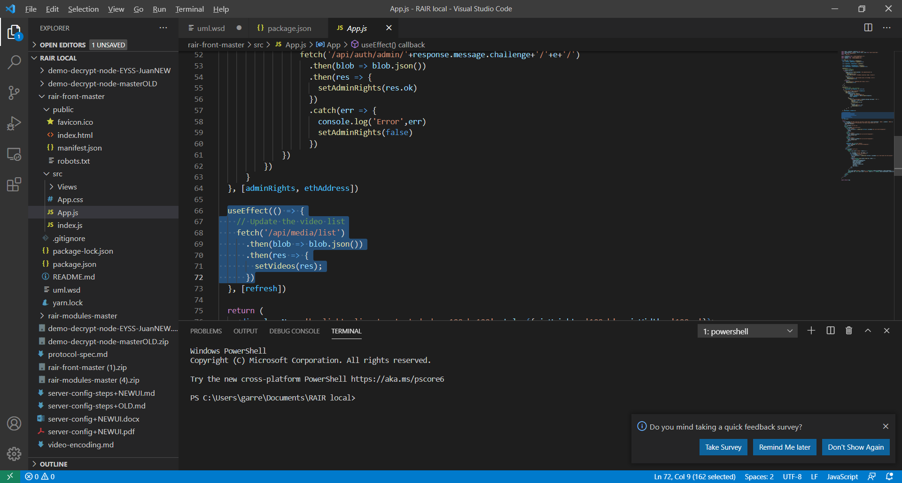
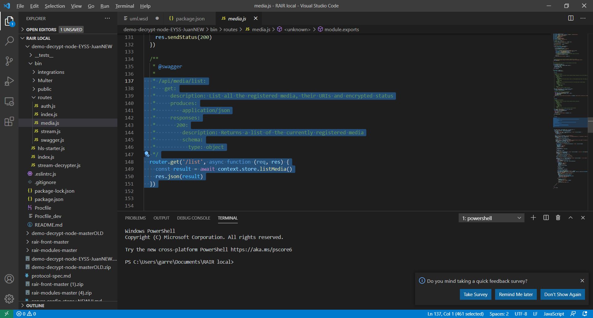

[📁 Rair Development](../rair-development.md) | [🌐 Page Structure GitHub](/2cu.atlassian.net/wiki/spaces/CCU/pages/400000036/troubleshooting.md) | [🌐 Page Structure local SymLink](./troubleshooting.page.md)

# Troubleshooting

- [Internal Error Issue](#internal-error-issue)

# Internal Error Issue

Meeting with Vivek 3/23

[https://us02web.zoom.us/rec/share/92hDRVR2kdL0lPekdHF4z6dU0THKdZDJVePvkSnPNNFr1DJMHVavVHtf\_GOyp1eH.pxRe44sESyFsO4ZJ](https://us02web.zoom.us/rec/share/92hDRVR2kdL0lPekdHF4z6dU0THKdZDJVePvkSnPNNFr1DJMHVavVHtf_GOyp1eH.pxRe44sESyFsO4ZJ) 

Passcode: jkMgtm%3

Frontend API Call Location - App.js line 66

Backend API call location - media.js line 137

Clone Hetzner node from snapshot

Ngnix.conf

frontend → backend communication

Existing POC Localhost version. Fully encapsulated Virtualbox deployment running as Linux Mint so can use the Chrome browser GUI inside the VM.
