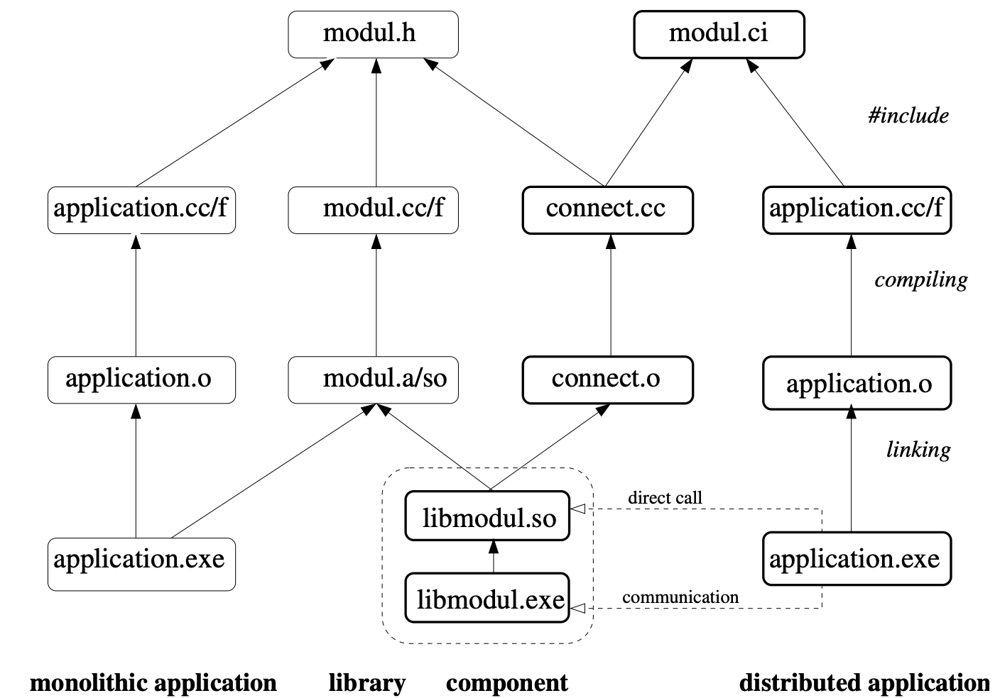

[📁 EAMD.ucp Repository](../eamducp-repository.md) | 🌐 Page Structure NOT FOUND

# UCP

The most simple and precise definition of a what is a componenten and what not:

TL;NR:  
To be titled as a **Component** a unit has to fulfill 4 qualities:

1. It is self contained.
2. It is a Blackbox.
3. It exposes an interface.
4. It provides a machine readable self description through it's interface.

Everything that is **not** fulfilling **all 4** qualities is only a **Unit**.

A **Package** is itself a Component, so fulfills all 4 qualities, but only **contains Components**.

This is a fractal definition of **Units**, **Components** and **Packages**, short **UCP**.

Some more Details: a **Component** needs to be a:

1. It is self contained.  
So it is is a unit, one single thing. The descriptor is not in a separate location like a windows registry or a Linux etc…
2. It is a Blackbox.  
So you do not need to know anything about what is inside to use it. Normally a component contains more units, that do not fulfill the component qualities alone but fulfill at least one aspect, e.g. the interface declaration or the implementation definition.
3. It exposes an interface.  
The typed interface semantic specifies the possible interactions with the Blackbox.
4. It provides a machine readable self description through it's interface.  
So any environment can find out what the component is about, how to display it, install, start, stop, delete it. An optimal implementation describes the complete lifecycle of a component independently from its environment.

## Reference Implementation for Web 4.0

The [EAMD.ucp Repository](../eamducp-repository.md) is the place to lookup UCP components. The ONCE kernel will manage the lifecycle of the UCP components.

## Comparison and Discussion of Implementations

Early Implementations where available e.g. in Delphi VCL (Visual Component Library) and JavaBeans like SWING which where a respecification of the VCL specification. The Java Jar file fullfils the UCP definition with the availability of a meta.inf descriptor and an implemented BeanDescriptor. Both implementations comply the quality #2 by guaranteeing an empty constructor, so that instances could be created via a simple Drag and Drop action.

Though the OSGi standard came close to completely fulfilling the UCP definition and even adding important service oriented concepts, they basically failed in quality #2 since most of the bundles require multiple parameters on the construction via constructed or factory patterns. Thus you need to know the configuration and parameters that are required to create an instance.

Most of the existing component frameworks predate the time of a general WWW in the sense of Timothy John Berners-Lee, yet he did not have the vision of UCP Components not even object orientation but was rather imprinted procedural. Only with the later upcoming JavaScript the Web itself became rather functional from its root paradigm. Though it would be easily possible to implement UCP also in this paradigm it arose from the object oriented school of Alan Kay and Anders Heijlsberg, rather than from Haskell Curry.

But only later than the birth of the WWW the OO school tried the Hercules task to consolidate all technologies and protocols into one ubiquitous vision within the OMG (not "Oh my God", but rather Object Management Group) into CORBA, the CCM (CORBA 3.0 COMPONENT MODEL) and finally came true with UML 2, MDA, SOA and finally TLA.

As the complexity of reality was much too scary for newbie developers and the OMG still was to much imprinted by C/C++ only Java 2 Enterprises Edition (J2EE) ever implement a successful massively simplified version of the CCM as the so called JEE Application Server with Enterprises JavaBeans as the Components and multiple similar Package implementations like JAR, EAR, WAR.

The WAR package was the first ever drag & drop installable Package on the WEB with Apache Tomcat, but as SUN failed and got prey for Oracle, Java did not deliver to their promise "write once, run anywhere" anymore… and especially their WebStart Apps never lifted off.

The revival of Apps was done by a pupil of Alan Key as he learned about OO and UCP at Xerox Park and made it finally in 2007 to bring a breakthrough device onto the market, that fulfilled UCP with iOS Apps on iTunes, the Apple iPhone store based on the work of Next.

As the success of OSGi whipped out all proprietary JEE composition frameworks of the different vendors during 2000-2015, and the Eclipse Modeling Framework (EMF) became the standard MDA reference implementation we are left over wit the most mature implementations in a broken nonsupportif legacy environment where an Oracle has to tell us about our future. Even the open source OpenJDK only gives a finte distant silver glow of hope to leverage our heritance into a bright future. When even our Gang of 4 superhero Eric Gamma left the drowning ship and hired with the organization hosting the originator Anders Heijlsberg as the chief architect of Visual Studio Code.

The incredible rise of such a phoenix like Visual Studio Code brings a new area to the table, the PWA…accepted by GAFAM as THE App standard with which we finally move to Steve Jobs (RIP) Vision of the Universal (Next) App.

Still we are about to reinvent all XML schema and XMI achievements now in another Hercules task into JSON schema with an open outcome just to satisfy our newbie developers needs for simplicity into a foggy future of reinventing wheels…

None of the Component frameworks ever other than JEE specified their descriptors ever in XML, the first and the last fully bootstraped language defined in itself by XSD and thus fully machine readable and verifyable.

This is where the "Avengers assemble" and bring together the best of the best inventions ever to save the world with Web 4.0 on the reference implementation of The Last Architecture (TLA) with ONCE and WODA.

Where ONCE is the Object Network Communication Engine that is creating an environment where you "Write ONCE, Deploy anywhere" independently of vendors, programming languages and other egos to finally deliver "The Internet of Services" that makes the "Internet of Things" a holistic place to grow throughout the universe with an Interplanetary File System… to bring myData under myControl in a big Supernova of the WWW…

TBC…

## History

The UCP Component standard goes back to the united states command and control system [2c.com.](http://2c.com)  

> WIKI  
> [Component-based software engineering](https://en.wikipedia.org/wiki/Component-based_software_engineering)
> 
> The idea that [software](https://en.wikipedia.org/wiki/Software) should be componentized - built from prefabricated *components* - first became prominent with [Douglas McIlroy](https://en.wikipedia.org/wiki/Douglas_McIlroy)'s address at the [NATO](https://en.wikipedia.org/wiki/NATO) conference on [software engineering](https://en.wikipedia.org/wiki/Software_engineering) in [Garmisch](https://en.wikipedia.org/wiki/Garmisch-Partenkirchen), [Germany](https://en.wikipedia.org/wiki/Germany), 1968, titled *Mass Produced Software Components*.[\[3\]](https://en.wikipedia.org/wiki/Component-based_software_engineering#cite_note-3) The conference set out to counter the so-called [software crisis](https://en.wikipedia.org/wiki/Software_crisis). McIlroy's subsequent inclusion of [pipes and filters](https://en.wikipedia.org/wiki/Pipeline_(Unix)) into the [Unix](https://en.wikipedia.org/wiki/Unix) [operating system](https://en.wikipedia.org/wiki/Operating_system) was the first implementation of an infrastructure for this idea.
> 
> Source:  
> McIlroy, Malcolm Douglas (January 1969). ["Mass produced software components"](http://homepages.cs.ncl.ac.uk/brian.randell/NATO/nato1968.PDF)(PDF). *Software Engineering: Report of a conference sponsored by the NATO Science Committee, Garmisch, Germany, 7-11 Oct. 1968*. Scientific Affairs Division, NATO. p. 79.

[What is UCP](http://box.CeruleanCircle.com/CeruleanCircle): [http://box.CeruleanCircle.com/CeruleanCircle GmbH/Productmanagement/EAMD.ucp/What is UCP.pptx](http://box.CeruleanCircle.com/CeruleanCircle%20GmbH/Productmanagement/EAMD.ucp/What%20is%20UCP.pptx)

Nice sources

[**wiki.c2.com**](http://wiki.c2.com) [**c2.com**](http://c2.com)

[https://wiki.c2.com/?ComponentDefinition](https://wiki.c2.com/?ComponentDefinition)

[http://wiki.c2.com/?ComponentOrientedProgrammingLanguage](http://wiki.c2.com/?ComponentOrientedProgrammingLanguage)

[http://congress.cimne.upc.es/cfsi/frontal/doc/ppt/11.pdf](http://congress.cimne.upc.es/cfsi/frontal/doc/ppt/11.pdf)

[https://c4model.com/](https://c4model.com/)

[https://www.infoq.com/articles/C4-architecture-model/](https://www.infoq.com/articles/C4-architecture-model/)
