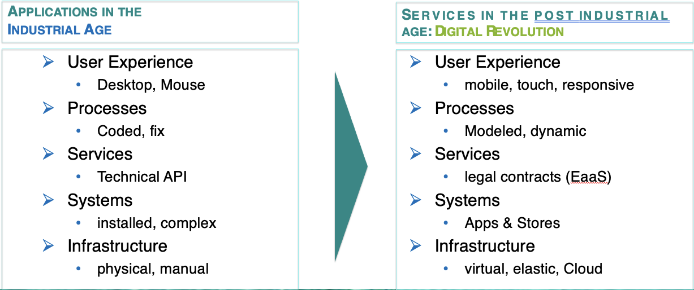
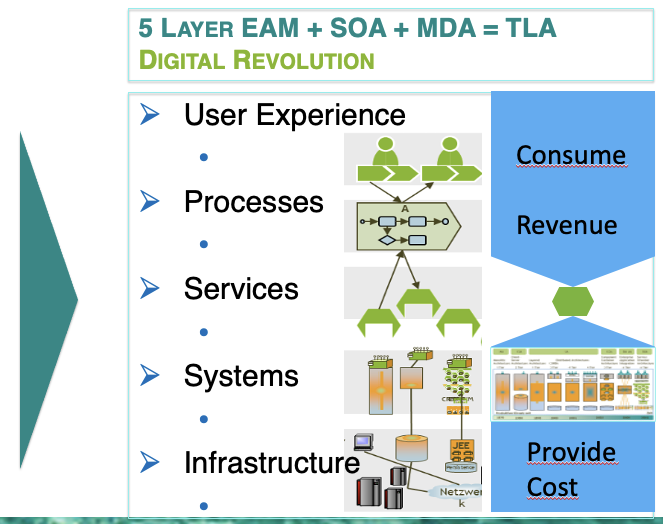
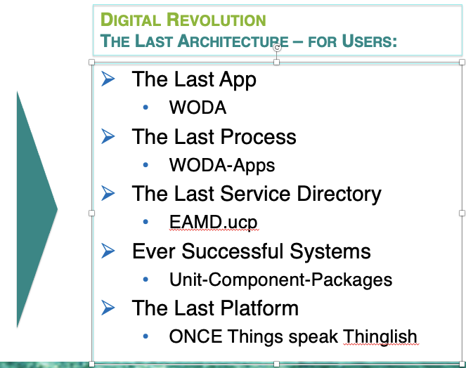
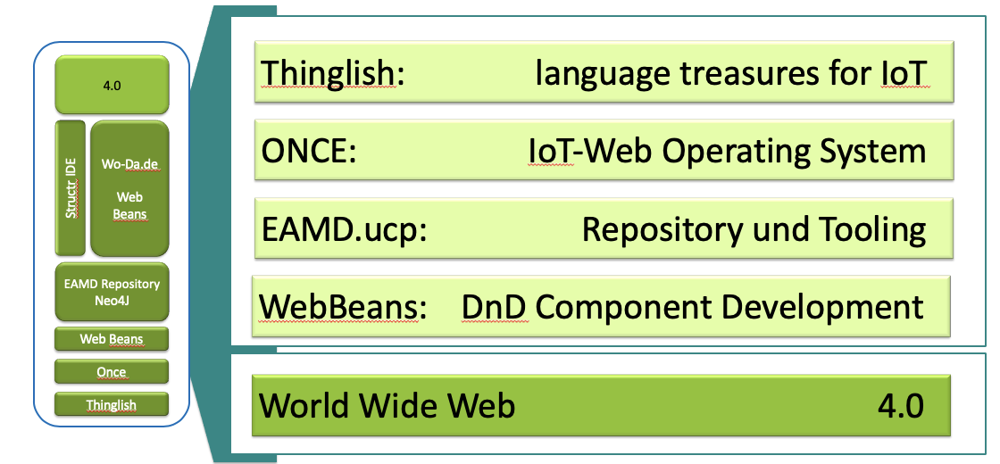
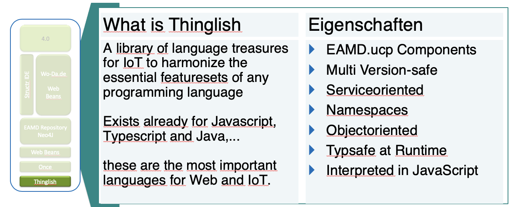
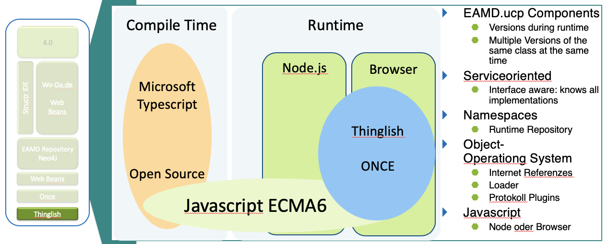
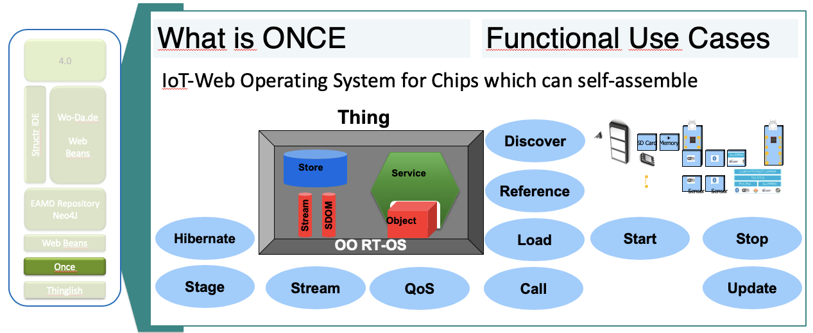
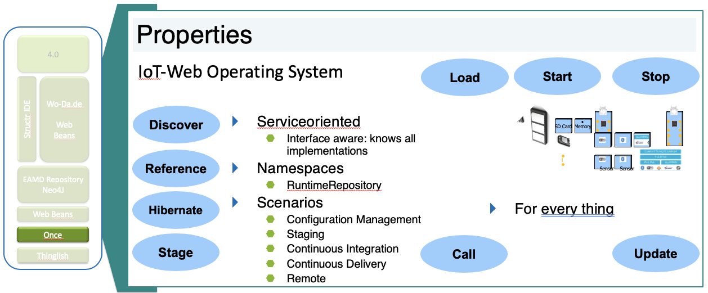
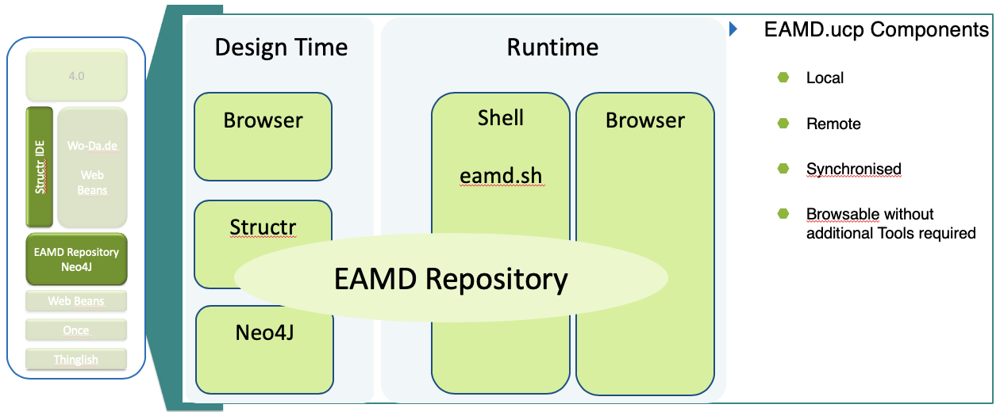
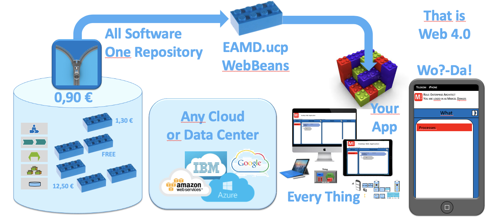

# Web 4.0

The stack that forms the reference implementation for Web 4.0, that is the Internet of Services as a basis for the Internet of Things derived from [TLA](http://donges.it/category/architecture/): The Last Architecture.

## Thinglish

## ONCE

also see [ONCE](../../development/once.md), [ONCE Documentation](../../development/once/once-documentation.md)

## EAMD.ucp

also see [EAMD.ucp Repository](../coast/eamducp-repository.md), [EAMD Scripts](../../development/once/once-documentation/eamd-scripts.md), [OOSH](./2cu.atlassian.net/wiki/spaces/CCU/pages/269156359/OOSH.md)

## WebBeans

