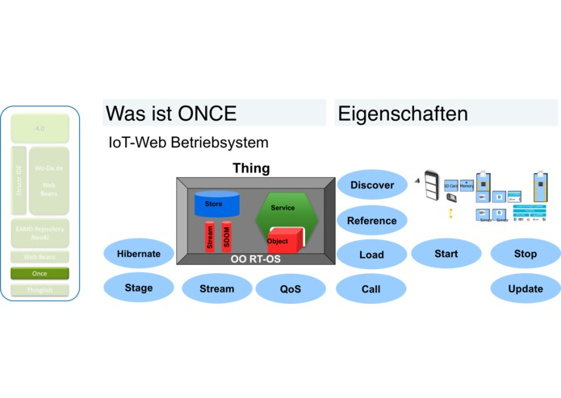

# Once.sh

- [New features](#new-features)
- [sh Parameter](#sh-parameter)



# Usage examples

|     |     |
| --- | --- |
| once.sh | check if once.sh exists and initialice the environment where it is executed |
| once | and will go to the last successfully executed "$ONCE\_STATE" from the state diagram |
| once v | prints out the current version of once - alias for once version |
| once version | prints out the hard coded version tag of $This |
| once help | prints a list of all the functions in once.sh |
| once su | alias for once superuser |
| once superuser | help on additional advanced once features that require root priviledges |
| once init | forces reinitialisation |
| once find | finds and lists any Once process. Use it if its not sure it a process is running or not. |
| once status | alias to once state |
| **once test** | **run ale testcases on the kernel to see if its well installed and configured** |
| once stop <?PID> | stops the server... if $ONCE\_PID is wrong it can be overwritten by specifying the optional PID parameter |
| once server.stop | stops the server |
| once start | starts the Once Server in the background and remembers its PID if there is no other instance is running |
| once server.start | starts the once server if not already up and running |
| once status | shows the current status and configuration of the once server |
| once config | starts vim to edit the current .once config |
|     |     |
| once cat | prints the current once log file to the console and exits |
| once [check.all.pm](http://check.all.pm) | adds tools and configurations to package manager (brew, apt-get, addgroup, adduser, dpkg, pkg) |
| once check.installation | checks for a once installation in given path |
| once [check.pm](http://check.pm) | checks for a package manager |
| once check.privileges | checks the administrative rights of the current once instance |
| once checkAndFix | checks and fixing/adding files |
| once clean | uninstalls once and removes the current .once configuration. Afterwards once.sh has to be used to reinstall |
| once clean all | removes all .once configurations from all scenarios |
| once cmd | checks if the <command> is available or installs it via the package manager in $ONCE\_PM. If the package name is different it can be specified with e.g. once cmd ssh openssl |
| once cmd <command> <?package> | chcecks if the <command> is available or installs it via the package manager |
|     | in $ONCE\_PM. If the package name is different it can be specified with |
|     | e.g. once cmd ssh openssl |
| once code | starts vim to edit the Once.class.js Kernel |
| once createDir | creates respective directory requested in parameter |
| once discover | discovers the environment the current once instance is hosted in |
| once done | finalising script execution in a clean process |
| once edit | starts vim to edit the once script |
| once env | lists the current $PATH paths on the screen |
| once hibernate | save environmental variables and puts once in hibernation |
| once list.config | prints a list of configurations (COMPONENTS\_DIR, REPO\_DIR, SCENARIOS\_DIR, ONCE\_DIR, ONCE\_DEFAULT\_SCENARIO, ONCE\_LOAD\_DIR) |
| once list.www | tries to find domain configurations on the current server location |
| once load | loads the components |
| once log | opens the once log file and continues monitoring |
| once mv | to be deleted: moves the Repo prefix...just a test |
| once path | sets the path to the scripts to be loaded by once as well the sources of the $ONCE\_ environment variables |
| once path.create | creates respective paths |
| once paths.edit | manually edit paths with vim |
| once paths.list | printing list of paths |
| once paths.load | loading all paths |
| once paths.save | saves the current $PATH into the file in $ONCE\_DEFAULT\_SCENARIO/paths |
| once pm | calls package manager |
| once repo.init | forces reinitialisation |
| once reset | reset path |
| once root | populates the environmental variables with root administrative rights |
| once scenario | forces re-discovery of the current environment and scenario configurations |
| once start new | forces to start another once server on a dynamic port (counting upward from 8080) |
| once stage | lists the current state of the once server and the current configuration |
| once stepDebugger | steppes through the once.sh script |
| once update | does a git pull on the repository to get the newest versions |
| once update fromBranch <?origin> | updates the current branch from the origin, e.g., once update from Branch origin/test/sprint12 |
| once update cmd <command> | updates the command |
| once update.variables | updates the environmental variables: REPO\_DIR, COMPONENTS\_DIR, SCENARIOS\_DIR, ONCE\_DIR, ONCE\_DEFAULT\_SCENARIO, ONCE\_LOAD\_DIR |
| once user | populates the environmental variables with user administrative rights |

## New features

```
once mode


```

```
switches between starting nodejs or docker: 'once mode docker'or 'once mode nodejs'
sets ONCE_MODE=docker  or ONCE_MODE=nodejs


```

# sh Implementation

### sh Parameter

```
command argument1 command2 a2 a3 "Hello World"

///////
$1 argument1
$2 command2
$3 a2
...
$9

$* "argument1 a2 a3 Hello World"
$@ "argument1" "a1" "a2" "Hello World"


for $%


////////
```

//<!\[CDATA\[ (function(){ var data = { "addon\_key":"render-Markdown", "uniqueKey":"render-Markdown\_\_markdown2712450240151575247", "key":"markdown", "moduleType":"dynamicContentMacros", "moduleLocation":"content", "cp":"/wiki", "general":"", "w":"", "h":"", "url":"https://d27i9fmzbobp10.cloudfront.net/render-markdown.html?pageId=345964771&pageVersion=23&macroHash=65487d27-a32c-4be2-8f13-32d2bf94cacd&macroId=65487d27-a32c-4be2-8f13-32d2bf94cacd&outputType=email&highlightStyle=&highlight=&xdm\_e=https%3A%2F%2F2cu.atlassian.net&xdm\_c=channel-render-Markdown\_\_markdown2712450240151575247&cp=%2Fwiki&xdm\_deprecated\_addon\_key\_do\_not\_use=render-Markdown&lic=none&cv=1000.0.0-9ec310e9ed61&traceId=9375e09195e57c9b5a1c0f6004b95c02&spanId=801133a8a67023c3&traceSampled=0", "structuredContext": "{\\"confluence\\":{\\"editor\\":{\\"version\\":\\"v2\\"},\\"macro\\":{\\"outputType\\":\\"email\\",\\"hash\\":\\"65487d27-a32c-4be2-8f13-32d2bf94cacd\\",\\"id\\":\\"65487d27-a32c-4be2-8f13-32d2bf94cacd\\"},\\"tracing\\":{\\"traceId\\":\\"9375e09195e57c9b5a1c0f6004b95c02\\",\\"spanId\\":\\"801133a8a67023c3\\",\\"sampled\\":\\"0\\"},\\"content\\":{\\"type\\":\\"page\\",\\"version\\":\\"23\\",\\"id\\":\\"345964771\\"},\\"space\\":{\\"key\\":\\"CCU\\",\\"id\\":\\"229377\\"}},\\"url\\":{\\"displayUrl\\":\\"https://2cu.atlassian.net/wiki\\"}}", "contentClassifier":"content", "productCtx":"{\\"page.id\\":\\"345964771\\",\\"macro.hash\\":\\"65487d27-a32c-4be2-8f13-32d2bf94cacd\\",\\"space.key\\":\\"CCU\\",\\"tracing.sampled\\":\\"0\\",\\"page.type\\":\\"page\\",\\"content.version\\":\\"23\\",\\"page.title\\":\\"Once.sh\\",\\"macro.localId\\":\\"c4bb632c-b058-4d41-a03b-1e93248aaeeb\\",\\"macro.body\\":\\"\[once state.svg\](http://test.wo-da.de/EAMD.ucp/Components/tla/EAM/layer1/Thinglish/Once/4.0.0/docs/once.sh%20-%20State%20Diagram\\",\\": = | RAW | = :\\":null,\\"space.id\\":\\"229377\\",\\"macro.truncated\\":\\"true\\",\\"content.type\\":\\"page\\",\\"output.type\\":\\"email\\",\\"page.version\\":\\"23\\",\\"macro.fragmentLocalId\\":\\"\\",\\"content.id\\":\\"345964771\\",\\"tracing.traceId\\":\\"9375e09195e57c9b5a1c0f6004b95c02\\",\\"macro.id\\":\\"65487d27-a32c-4be2-8f13-32d2bf94cacd\\",\\"tracing.spanId\\":\\"801133a8a67023c3\\",\\"user.isExternalCollaborator\\":\\"false\\",\\"editor.version\\":\\"v2\\"}", "timeZone":"Europe/Berlin", "origin":"https://d27i9fmzbobp10.cloudfront.net", "hostOrigin":"https://2cu.atlassian.net", "sandbox":"allow-downloads allow-forms allow-modals allow-popups allow-popups-to-escape-sandbox allow-scripts allow-same-origin allow-top-navigation-by-user-activation allow-storage-access-by-user-activation", "apiMigrations": { "gdpr": true } } ; if(window.AP && window.AP.subCreate) { window.\_AP.appendConnectAddon(data); } else { require(\['ac/create'\], function(create){ create.appendConnectAddon(data); }); } // For Confluence App Analytics. This code works in conjunction with CFE's ConnectSupport.js. // Here, we add a listener to the initial HTML page that stores events if the ConnectSupport component // has not mounted yet. In CFE, we process the missed event data and disable this initial listener. const \_\_MAX\_EVENT\_ARRAY\_SIZE\_\_ = 20; const connectAppAnalytics = "ecosystem.confluence.connect.analytics"; window.connectHost && window.connectHost.onIframeEstablished((eventData) => { if (!window.\_\_CONFLUENCE\_CONNECT\_SUPPORT\_LOADED\_\_) { let events = JSON.parse(window.localStorage.getItem(connectAppAnalytics)) || \[\]; if (events.length >= \_\_MAX\_EVENT\_ARRAY\_SIZE\_\_) { events.shift(); } events.push(eventData); window.localStorage.setItem(connectAppAnalytics, JSON.stringify(events)); } }); }()); //\]\]>