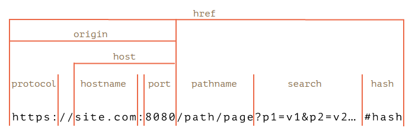

[📁 ONCE Specification](../once-specification.entry.md) | [🌐 Page Structure](../../../../2cu.atlassian.net/wiki/spaces/CCU/pages/)

# Loader

# Why

Module Systems in JavaScript:

- CommonJS
- AMD modules
- Bower require
- nodejs require  
npm packages and node\_modules
- import / export statement  
[https://hacks.mozilla.org/2015/08/es6-in-depth-modules/](https://hacks.mozilla.org/2015/08/es6-in-depth-modules/)  
main problem: extremely static for a dynamic language
- JavaScript Loader in some distant future  
[https://github.com/whatwg/loader](https://github.com/whatwg/loader)
- webPack  
get a fast loading license cocktail codemess
- Babel  
fix the hundreds of syntax shit with another hundred alternatives

WHAT A MESS!

# What needs to be done

A simple dynamic Loader system for real Components like in the [UCP](../../../development/coast/eamducp-repository/ucp.md) standard.  
In optimal fully extensible for all the old legacy ways as dedicated Loader implementations.

# How

Loaders rely on the IOR principles: Internet Object references which can be loaded form a simple reference string.

```
const ref = new IOR().init("ior:did:rest:SomeType/someID123abc")
let instance = await ref.load();

// or even better
let value = ref.someInstanceAttribute;
// which could work if IOR is even a ES6 Proxy
```

The Loader Interface then deeds to have a possibility to discover the right classes to process the different types of IORs and find out which IOR is using which technology stack to communicate to the server that is hosting the object.

## Review with Bene

1. 
 InstanceStore does not really make use of Store
2. 
 InstanceStore key is only an arrays index (:5263)  
but should be the origin? but origin should be fixed too (see 5.)  
BE: Can be every thing. But is not used for query.
3. 
 fix all instanceStore.register(0, with instanceStore.register(ior.origin,  
Only one Instance exists. This is correct.
4. 
 fix InstanceStore lookup and discover correspondingly
5. 
 DocumentScriptLoader does not store script: fixed
6. DocumentScriptLoader check for less and css…or better an own lodder since it does not create a script tag on css but a link tag
7. 
 IOR normalizeHref should add document.location.origin if origin is empty (:4752)  
BE: Url Object adds now on import the orinig, Protocoll and Port in case no origin is found in the String.
8. 
 EAMDucpLoader should not store urlString but ior.normalizeHref
9. 
 tidy up URL, Url, urlString, urlObject, href, normalizeHref,….  
especially on RESTClient  
BE: Have to create a Page about that
10. 
 HTMLScriptClient.instanceStore.getInstanceInit();  
better? HTMLScriptClient.factory(); as part of the interface?
11. 
 killed declarationListPerScript in DocumentScriptLoader (:4807): fixed
12. 
 DefaultHTTPClient  
this.type.class.instanceStore.register(this);  
should be  
this.type.class.instanceStore.register(urlString, this);  
or better  
this.type.class.instanceStore.register(ior.origin, this);  
BE: Correct is this.type.class.instanceStore.register(this.id, this);  
The reason is, thas the key is not used to find the correct instance. The Method canConnect is used to find the right instance.