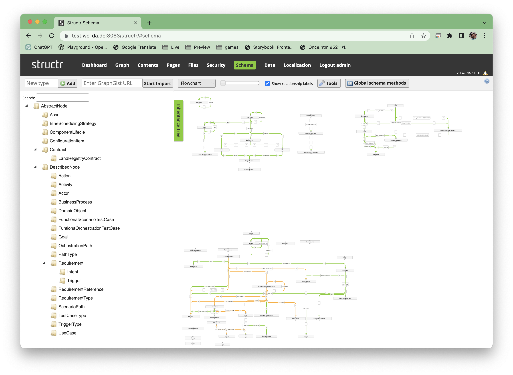
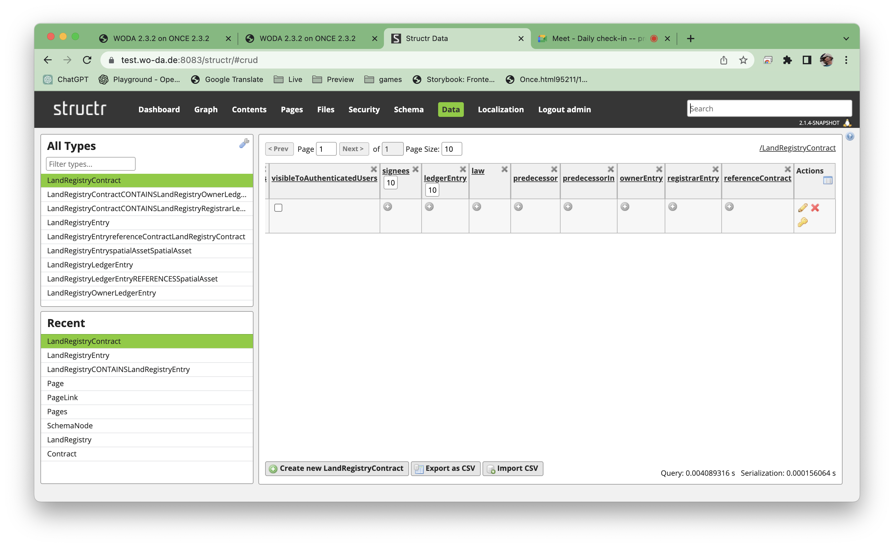
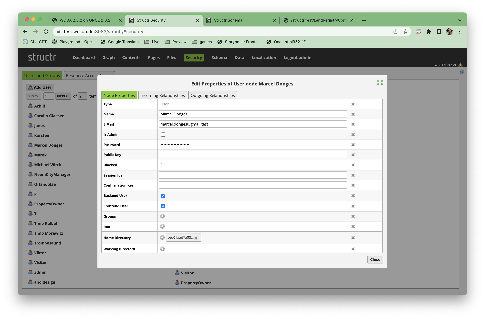

[📁 Woda Training](../woda-training.md) | [🌐 Page Structure GitHub](/2cu.atlassian.net/wiki/spaces/CCU/pages/400000110/structr-training.md) | [🌐 Page Structure local SymLink](./structr-training.page.md)

# Structr Training

> [!CAUTION]
> Attention: Structr is a very dynamic life system. Use it with care…use the [test.wo-da.de:8083/structr](http://test.wo-da.de:8083/structr) for development

- [Structr WebSite Links](#structr-website-links)
- [Logging](#logging)
- [Login](#login)
  - [Schema](#schema)
  - [Graph](#graph)
    - [Rest](#rest)
    - [Cyper](#cyper)
      - [Cypher to find non visible SchemaNodes](#cypher-to-find-non-visible-schemanodes)
      - [Visible to Public](#visible-to-public)
      - [Working with null](#working-with-null)
      - [Delete and force delete](#delete-and-force-delete)
  - [new User](#new-user)

# Structr WebSite Links

- [Documentation](https://docs.structr.com/docs/step-by-step-tutorial)
- [WebSite](https://structr.com/)

# Logging

logging of the structr server: ossh login WODA.test

```
ossh login WODA.test    
# you need access to the server via public_key

docker logs -f once-structr-server
```


screenshot

# Login

> [!CAUTION]
> user: admin  
> pw: \*\*\*\*\*\*\*


screenshot


## Schema

create new Entities

- create in Schema
- make sure its
  - visibleToPublicUsers
  - visibleToAuthenticatedUsers
- create an instance in the DATA page
  - click at the end on the “key“ icon
    - add groups and visibility options on one item and it APPLEIS FOR ALL


screenshot



- click at the end on the “key“ icon


- add groups and visibility options on one item and it APPLEIS FOR ALL



## Graph

### Rest

```
SchemaNode/ui?visibleToAuthenticatedUsers=false
SchemaNode?visibleToAuthenticatedUsers=false
```

### Cyper

```
MATCH (n:SchemaNode)
RETURN n
```

#### Cypher to find non visible SchemaNodes

```
MATCH (n:SchemaNode)
 WHERE n.visibleToAuthenticatedUsers = false
 RETURN n
```

> [!CAUTION]
> Invalid input 'n': expected whitespace, comment, '{', node labels, MapLiteral, a parameter, a relationship pattern, '(', '.', '\[', "=~", IN, STARTS, ENDS, CONTAINS, IS, '^', '\*', '/', '%', '+', '-', '=', "<>", "!=", '<', '>', "<=", ">=", AND, XOR, OR, LOAD CSV, START, MATCH, UNWIND, MERGE, CREATE, SET, DELETE, REMOVE, FOREACH, WITH, CALL, RETURN, UNION, ';' or end of input (line 1, column 71 (offset: 70)) "MATCH (n:SchemaNode)WHERE n.visibleToAuthenticatedUsers = falseRETURN n" ^

> [!TIP]
> Make sure you add “ “ spaces in the first line of each statement after MATCH  
> ” “WHERE …

#### Visible to Public

```
MATCH (n:SchemaNode)
 WHERE n.visibleToPublicUsers = false
 RETURN n
```

```
MATCH (n:SchemaNode)
 WHERE n.visibleToPublicUsers = false
 SET n.visibleToPublicUsers = true
 
MATCH (n:SchemaNode)
 WHERE n.visibleToAuthenticatedUsers = false
 SET n.visibleToAuthenticatedUsers = true
```

#### Working with null

```
MATCH (n:SchemaNode)
 WHERE n.name IS NULL
 RETURN n
```

#### Delete and force delete

```
MATCH (n:SchemaNode)
 WHERE n.name IS NULL
 DELETE n
 
# on error 
# Cannot delete node<15168>, because it still has relationships. To delete this node, you must first delete its relationships.
 
MATCH (n:SchemaNode)
 WHERE n.name IS NULL
 DETACH DELETE n
```


screenshot


## new User

- enable checkbox
  - isAdmin
  - Forntenduser
  - Backenduser
- add Groups


