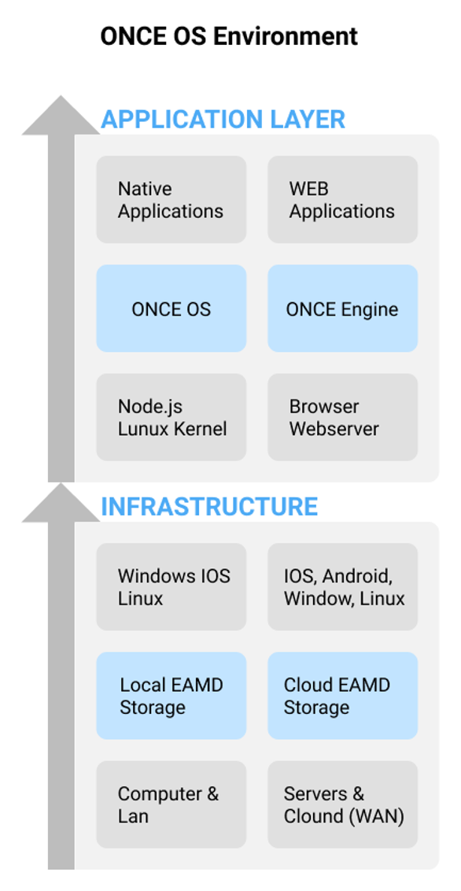

# Product ONCE

 **O**bject **N**etwork **C**ommunication **E**ngine

ONCE runs always on both sides as the communications engine. The Web App loads the engine first to then establish the communication to the software component repository and load all neccessary UCP components.

Definitions:

**ONCE    Object N**etwork **C**ommunication **E**ngine

**UCP    U**nified **C**omponent **P**ackage

**EAMD  E**nterprise **A**rchitecture **M**gmt. **D**escriptor)

**The 4 Laws of Unified Component Packaging (UCP)**

**§1 Its a Black Box ->**                                 

No other information is needed to run the Black Box, even not what is inside of it

**§2 It is Self-Contained ->**                          

Nothing of a Component is outside of the Black Box.

**§3 Exposes at least one Interface->**          

To interact with the Black Box the Component must expose one Interface.

**§4 It describes itself to its environment ->** The Component describes itself in the EAMD Format and enables an M2M communication without human Interaction, similar to Bluetooth between devices.