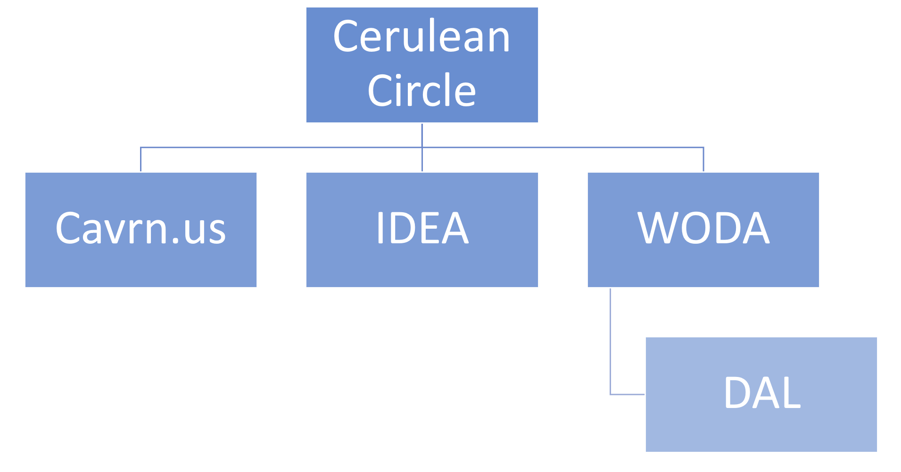
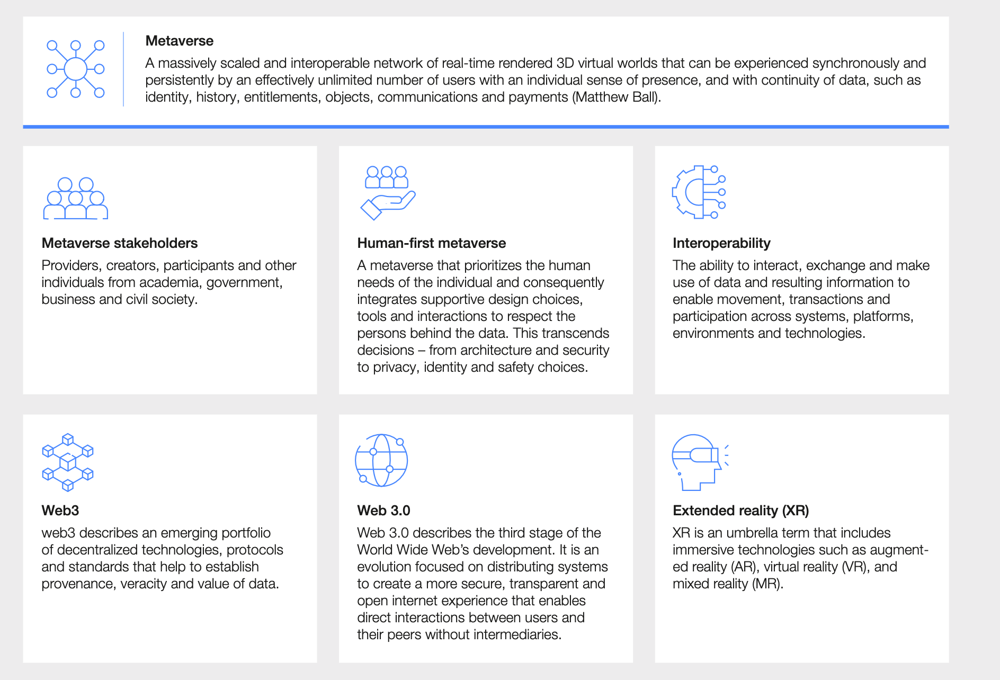
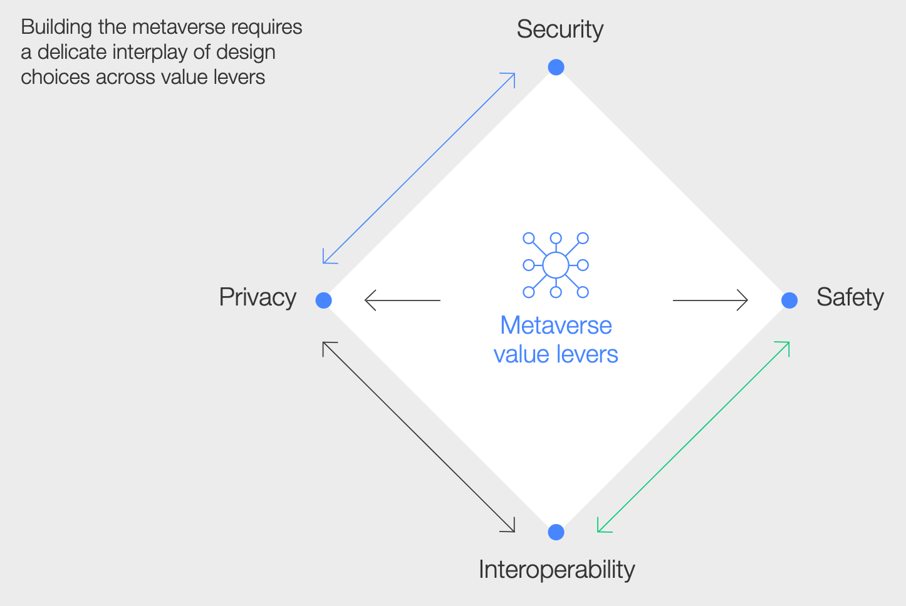
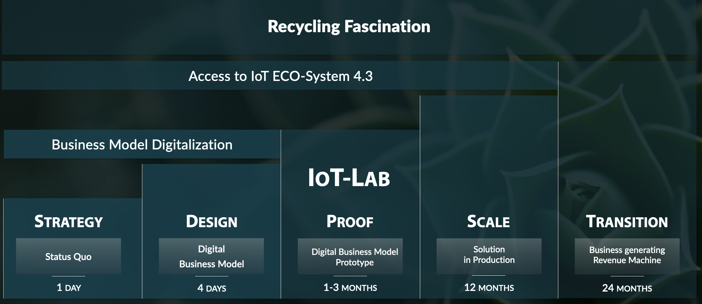
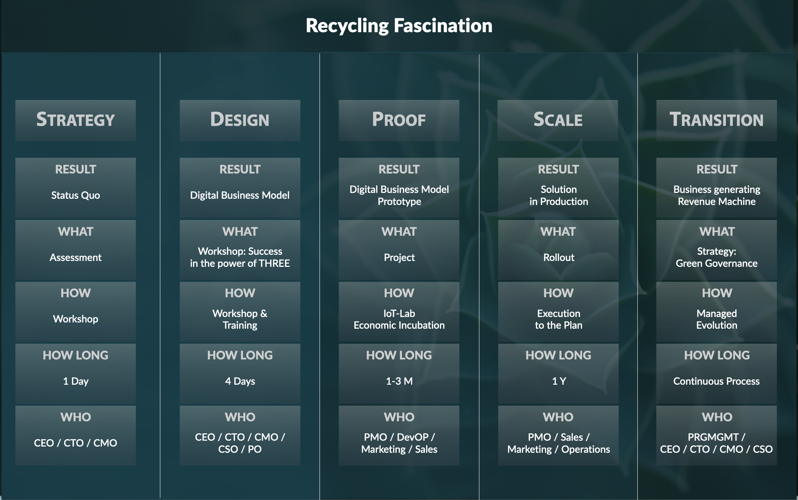
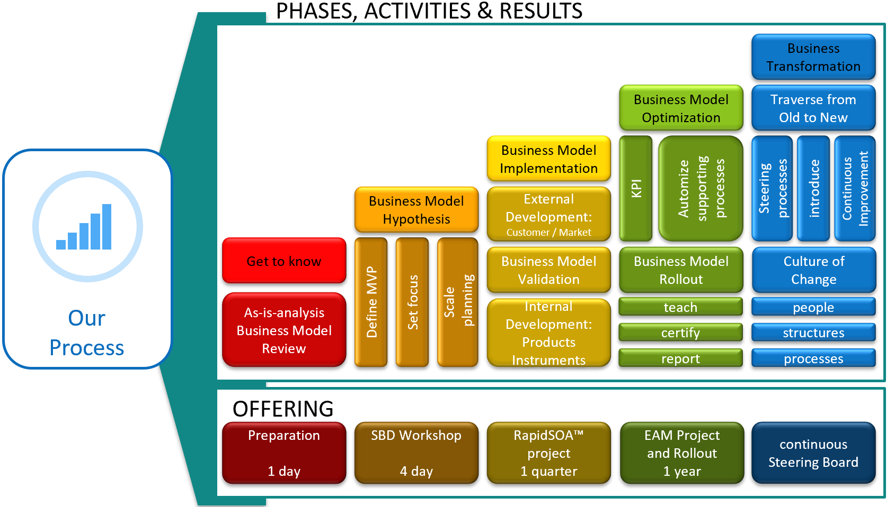

# MEP Proposal

> [!WARNING]
> e#-DRAFT - April 27, 2023
> - defining the ask is
> - understanding the incentives
> - discovering the problems with the incentives
> - What kind of civic and business use cases
> - ROI
>   
> 5 use cases to start with → 500k per use case
> 20x further use case workshops → 500k x 20
> instead: bar camp 50% cost
> [RFI - Meetings](../mep-metaverse-main/rfi-meetings.md)

- [Introduction](#introduction)
- [Company Background](#company-background)
- [Response to RFI Questions](#response-to-rfi-questions)
  - [Question Cluster 1: Domain knowledge / Understanding of the Background](#question-cluster-1-domain-knowledge-understanding-of-the-background)
  - [Question Cluster 2: WHAT: Solutions](#question-cluster-2-what-solutions)
  - [Question Cluster 3: HOW: Approach / Methodology: Systemic Business Design](#question-cluster-3-how-approach-methodology-systemic-business-design)
- [Supporting Materials](#supporting-materials)
- [Key Personnel](#key-personnel)
- [Pricing and Contract Terms](#pricing-and-contract-terms)
- [Conclusion](#conclusion)

> [!NOTE]
> To be mentioned: ([https://theinnovator.news/interview-of-the-week-cathy-li-world-economic-forum](https://theinnovator.news/interview-of-the-week-cathy-li-world-economic-forum) )
> - general
>   - **security**
>   - more immersive and three-dimensional experience
>   - direct **ownership of data**, ID, and digital assets by consumers
>   - benefits and challenges of the metaverse for consumers, industry, and enterprise?
>   - areas such as **sustainability**, governance, **digital identity**, privacy, **security**, and safety
>   - establish guardrails to prevent repeating the mistakes of Web 2.0
> - **interoperability** ([https://www3.weforum.org/docs/WEF\_Interoperability\_in\_the\_Metaverse.pdf](https://www3.weforum.org/docs/WEF_Interoperability_in_the_Metaverse.pdf))
> - inclusive
> - **jurisdictional interoperability**
> - who owns digital assets, true digital asset ownership
> - Global Collaboration Village, a metaverse where organizations can convene to learn about, create solutions for, and take action on the world’s most pressing challenges.
>   - manufacturing
>   - healthcare (prevention and diagnosis to collaborative surgery)
>   - real estate
>   - education and training
>   - tourism

## Introduction

> [!INFO]
> - Briefly introduce your company or organization
> - Thank the requester for the opportunity to provide information

Cerulean Circle

Wittelsbacherplatz 1

82110 Germering

**About Cerulean Circle:**

We develop some of the most  
scalable & truly sustainable digital  
infrastructure initiatives on the planet.  
We are the Cerulean Circle.

**Key-facts Cerulean Circle**

- Workshops and Requirements Analysis
- Software Development Platform
- Domain oriented Design
- Company Presentation

## Company Background

> [!INFO]
> - Provide an overview of your company's history and mission
> - Describe your products or services
> - Highlight any relevant experience or expertise

- [ ] History and Success Stories aligned to new website content

- [ ] One sentence on PoC phase, our role and our achievements

> Cerulean Circle has delivered a POC for a Metaverse-as-a-Service inside a portion of THE LINE MARINA within 3 months, which will include high-end visualizations and immersive user experiences based on 5 use cases, in conjunction with back-end technologies as a framework to establish NEOM’s governing rules, early urban development tools, and a monetization processes in preparation for future consumer consumption. The final POC shall proof how NEOM’s Metaverse can serve as an experiential marketing tool.

- [ ] Strategic Partnership: Why are you a strategic partner? Can you consider being a permanent unit in MEP? → ROI, Effective/planable output

As a strategic Business Company we are experts in both, strategic business development and software engineering. With our partners we are able to compete in all aspects of metaverse experiences.

## Response to RFI Questions

> [!INFO]
> - Address each question asked in the RFI in a clear and concise manner
> - Use bullet points, tables, and diagrams to make your response easy to read

### Question Cluster 1: Domain knowledge / Understanding of the Background

- Metaverse
  - Describe Metaverse Solution
  - How do you realize integration of all existing microverses?
  - Can you follow the inspiration of Aldariya?
  - Are you capable to deliver a realistic design, integrating interactive components and creating a sense of community?
  - Can you deliver a village for multiple devices and a set of “Minimum Features”?
  - Can you build the initial experiences through all domains 
.
  - Can you provide the design?
  - Can you provide a metaverse platform builder?
  - Perform Content Management
  - Deliver all Required Platform Features, inkl. SDK/API integrations. **ultimate metaverse-builder solution,** support both the **Unity and Unreal Engine pipelines**
- Requirements of KSA

> The objective of the Saudi House is to provide a next-generation metaverse ecosystem for residents, tourists, visitors, investors, local government, and other potential stakeholders. The Virtual Saudi House should be a standalone metaverse integrated with the WEF Metaverse which involves various government/private entities.
> 
> The initial objectives of the Saudi Village include:
> 
> · Providing Immersive Tourism for various sites especially the historical ones
> 
> · Become a prime location for Networking & corporate events
> 
> · Seamlessly host cultural events and virtual conferences/exhibitions/consultations
> 
> · Provide Governmental services
> 
> · Enable Digital twins of future developments

- Requirements of WEF Metaverse Initiative
  - 
  - 

### Question Cluster 2: WHAT: Solutions

- MyIdentity “My Data Under My Control”
- Metaverse as a Service
- 20 VR Headsets
- governmental and regulatory requirements shall match with technical possibilities
- Additionally: Payment handler for business or market experiences
- Additionally: technology for myId and myProfile
- Additionally: Smart Vests and gloves
- Additionally: Accessebility and training for the unskilled

### Question Cluster 3: HOW: Approach / Methodology: Systemic Business Design

- Requirements Analyse \[R2.1\] Workshops for Use Case Identification
  - How do you setup Workshops and ensure to retrieve the right use-cases?
  - Can you conduct the analysis and lock the use cases?

- [ ] How do you define Saudi village?
- [ ] How do you define immersive tourism?
- [ ] How do you define a real-life metaverse?

- Project Experience
  - Describe how to cover End to End Experiences.
  - Can you provide the project artifacts and teaming up with MEP?
  - Can you deliver the main activities (Phase 2) including documentation, architectures, test cases, uat documentation, knowledge transfer (kt) and training?
- Team
  - Describe your experienced team structure with clear roles and responsibilities.
    - Requirements Analyst
    - Metaverse Architect
    - Metaverse Designer
    - Overall Project Manager
    - Product Owner
    - Scrum Master
    - Scrum Developers
    - Value Added Features Architect
    - Operations Manager
    - Cloud Specialist
    - Platform Administrator
    - Service Desk
    - Content Manager
    - Training Instructor
    - Technical Writer
    - Quality Assurance
  - Can you provide vendors for other tasks 
 ?
- Design \[R2.2.1
- Systemarchitektur \[R2.2.2\]
- Deployment \[R2.3\]
- Operations \[R2.4\]
  - Preparing the platform and supporting all the necessary launch activities
  - Administrate the Plattform.
  - Perform Hosting and Migration
- Post Launch activities
  - Support
    - Provide 500 days of additional support within 2 years, which could include new projects
    - Can you provide 3-month bug-free warranty after each new version?
  - Training
    - Perform Training session

## Supporting Materials

> [!INFO]
> Include any relevant brochures, case studies, or other materials to support your response

- [ ] Reference project / case study

## Key Personnel

> [!INFO]
> Describe the key personnel in your organization who will be involved in the project, their qualifications and experience, and their roles and responsibilities

- [ ] Name specific persons as key contact persons (most critical roles)

- Contacts:
  - Gunther Sonnenfeld - Strategic Analyst
  - Marcel Donges - Technical Evangelist
  - Felix Zirpel - Programme Lead
  - Dierk Wiedemann - Product Owner

## Pricing and Contract Terms

> [!INFO]
> - Provide an overview of your pricing and payment terms
> - Describe any terms and conditions that may apply to the contract

- WODA: Dev + SBD + License = 12.400.000 Euro
  - Metaverse Platform
  - Metaverse System Builder
  - Metaverse Design
  - Additional Services / Personnel
  - 
- Business Analysis
  - Strategy:
    - 20x Use Case Gathering Workshop (1 day) → 5k€ \*20x → 100k€
      - **→ 2 consultants →** **40 person days**
  - Design:
    - 20x SBD Workshops (4 days) → each 15k€ \*20x → 300k€
      - Result: 20 use cases
      - → **3 consultants** → **240 person days**
  - Burn-down: 2 Days Workshop → 10k€
    - Result: 5 Uses Case Sets
      - → **4 consultants → 8 person days**
  - Travel expenses
    - Per travel per person → 3000€ → 2 person days
      - Plan: 7 travels = **21.000€ → 14 person days**

**Cost: 302 person days = 906 k€**

- *Alternative to 20 Individual Strategy Workshops:*
  - *Bar Camp Workshop Days (2 days)*
    - ***→ 4 consultants → 8 person days***

**New Cost: 270 person days = 810 k€**

- Metaverse as a Service
  - a) Platform is available for testing → rental
  - b) Platform needs to be setup on dedicated hardware → expensive
- Metaverse Graphical Design  
Assumption 5 Use Cases need a design in the Metaverse:
  - 5 Metaverse Design Experiences x 500.000 €/Design = 2.500.000 € **(= 833 PD)**
- Business Application Services
  - 1 PoC per Use Case = 10 FTE \* 60 days = 600 PD = 1.800.000 € → 5 PoC \* 600 PD/PoC **(= 1800 PD)**
  - 1 Full End 2 End development per Use Case = 5.000.000 € / Use Case **(= 1660 PD)**
- Data Center / KSA IT Infrastructure
  - Setup Software and Hardware = 100.000 €
  - Migrate to KSA Datacenter (Oracle OCI) = 100.000 €
  - Support = 100.000 € = 1 FTE, 1700€, 60 days OR 3000€ using 30 Tagen

## Conclusion

> [!INFO]
> - Summarize the key points of your response
> - Reiterate your interest in the opportunity
> - Provide contact information for further discussion or questions.

- Create a metaverse aligned with the WEF and Saudi requirements.
- Fast ROI, efficiency