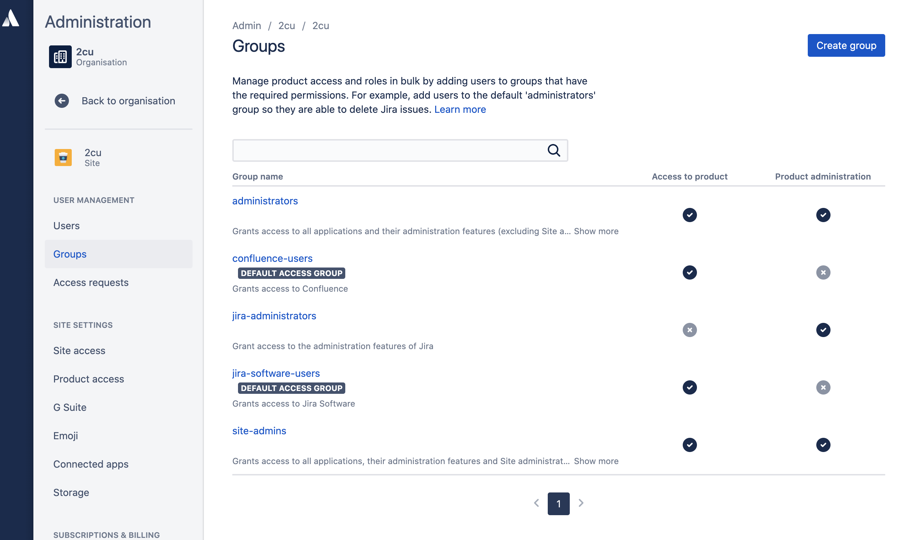

# Admin Inital Setup

* * *

# Groups

Create group

Manage product access and roles in bulk by adding users to groups that have the required permissions. For example, add users to the default 'administrators' group so they are able to delete Jira issues. [Learn more](https://confluence.atlassian.com/x/24xjL)

| **Group name** | **Access to product** | **Product administration** |
| --- | --- | --- |
| [administrators](https://admin.atlassian.com/s/84e4e077-9832-4ab3-bab6-518b1d102dd2/groups/782d31db-c961-4d78-9fd5-0cc8c52f1697)  Grants access to all applications and their administration features (excluding Site administration)Show more |     |     |
| [confluence-users](https://admin.atlassian.com/s/84e4e077-9832-4ab3-bab6-518b1d102dd2/groups/cf18ea09-efaa-4c59-b5fa-6b5629202545)  **DEFAULT ACCESS GROUP**  Grants access to Confluence |     |     |
| [jira-administrators](https://admin.atlassian.com/s/84e4e077-9832-4ab3-bab6-518b1d102dd2/groups/a5112e8b-c65a-40e4-acfb-a20a41f9acb3)  Grant access to the administration features of Jira |     |     |
| [jira-software-users](https://admin.atlassian.com/s/84e4e077-9832-4ab3-bab6-518b1d102dd2/groups/25e6bdcc-b7ff-40b3-962f-df9b746be944)  **DEFAULT ACCESS GROUP**  Grants access to Jira Software |     |     |
| [site-admins](https://admin.atlassian.com/s/84e4e077-9832-4ab3-bab6-518b1d102dd2/groups/65e62639-e824-425f-85d1-bd3ed96f0819)  Grants access to all applications, their administration features and Site administration, which includes managing users and billsShow more |     |     |