# Onboarding Hello Mirrors MVP2

| **Screenshot** | **Function** |     |     |
| --- | --- | --- | --- |
| 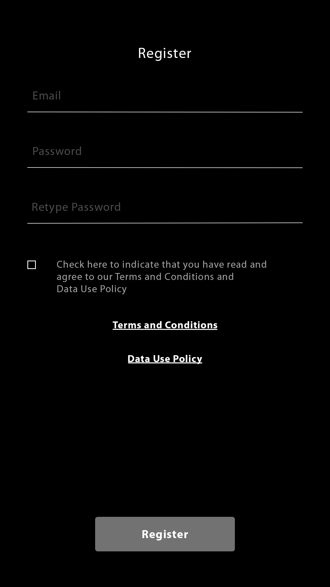  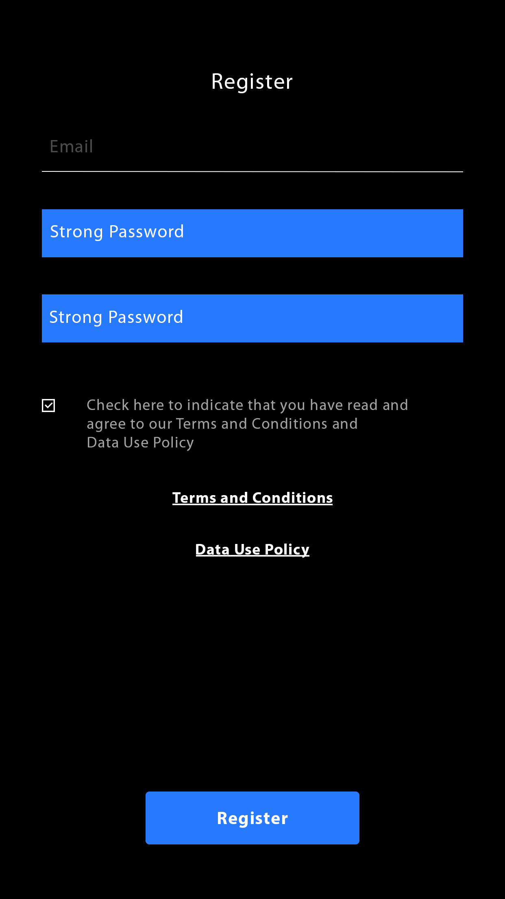 | **Register**  - Email (mandatory) - Password (mandatory) - Retype Password (mandatory)  The user opens the Android / iOS app. He klicks on of the text fields and a keyboard opens up where he can type in his Email and Password. After typing in something in the Password bars, it changes blue with an indicator of the strength of the password. The password has to contain at least one number, one special character and one Capital letter. As each text field is filled and the Data use Box ticked, the “Register” Button becomes blue and clickable. By clicking the button, the user receives an email.  By clicking on Data Use Policy/ Term and Conditions your standart browser opens and the Hello Mirrors website shows up. |     |     |
| 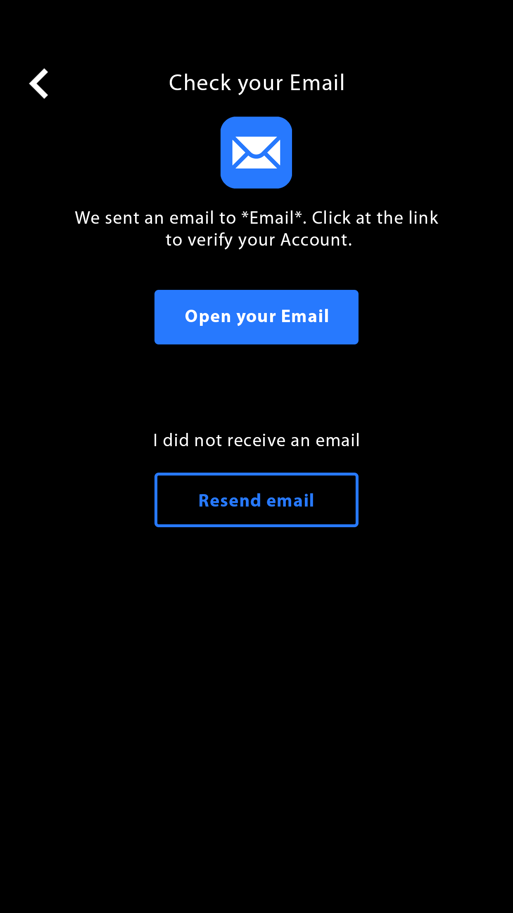 | **Check Email**  By clicking on “Open your Email” the users Email app opens. By clicking “Resend email“ the user receives the email one more time. |     |     |
|  | **Last steps**  - First name (mandatory) - Last name (mandatory) - User name (mandatory)  Three text fields, by clicking on them a keyboard opens up. As every field is filled, the “Next” button becomes clickable. |     |     |
| 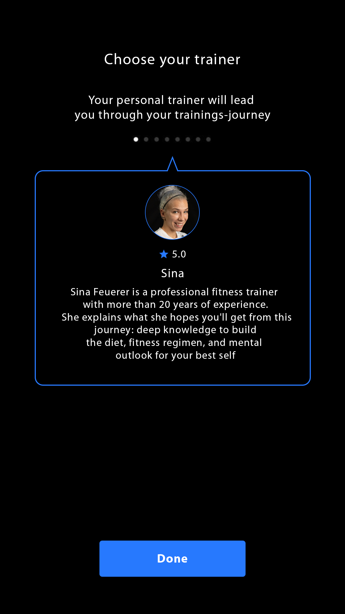 | **Chosen your trainer**  Each dot over the trainer box is another trainer. By swiping to right and left the user can switch between the trainers. By clicking “done” the user selects the trainer. |     |     |
|  | **Welcoming**  The next pages are simulating a chat with the trainer, so they are build like a chat.  Messages pop up. |     |     |
| 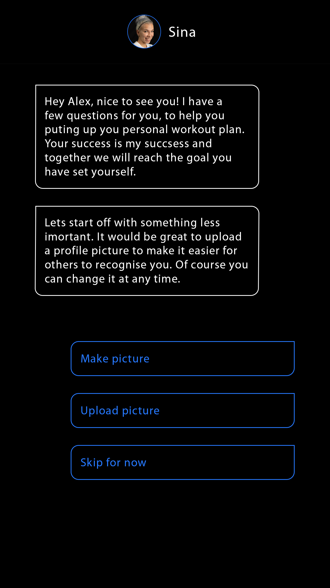 | **Personalisation**  After the second message popped up, the three buttons occur. By clicking on “Make picture” the selfie cam opens and the user can make a picture.  By clicking on “Upload picture” the library opens up and the user can choose a picture. After making or uploading a picture the picture can be seen in the chat in a circular shape (seen in screenshot below)  By clicking on “Skip for now” the next message from the trainer pops up and the “skip for now“ becomes completely blue, the text white and it moves to the exact same place where the “Make picture” button was.  After clicking one option the other buttons disapear. |     |     |
| 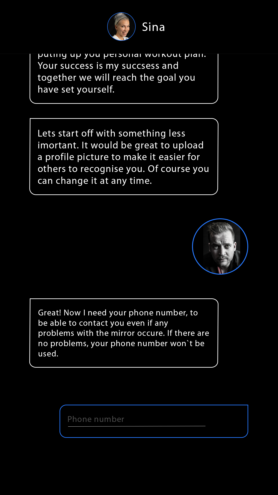 | **Phone number (mandatory)**  The next message from the trainer appears up and a text field. By clicking on the text field a keyboard pops up. when something is written a “Done” button appears under the Text field. By clicking on “Done” the Text in the text field turns white, the button becomes completely blue and the “Done” button disappears. The next message from the trainer popes up. |     |     |
| 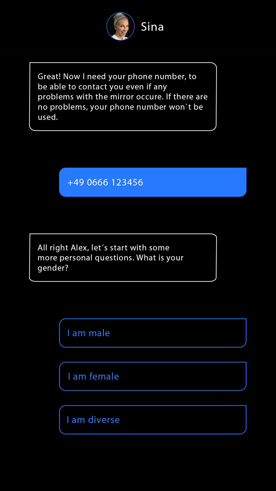 | **Gender (mandatory)**  The message pops up and three answering suggestions. By clicking one of them it moves to the spot where the “I am male” button is, turns blue, the text turns white and the other buttons disappear. The next message from the trainer appears. |     |     |
| 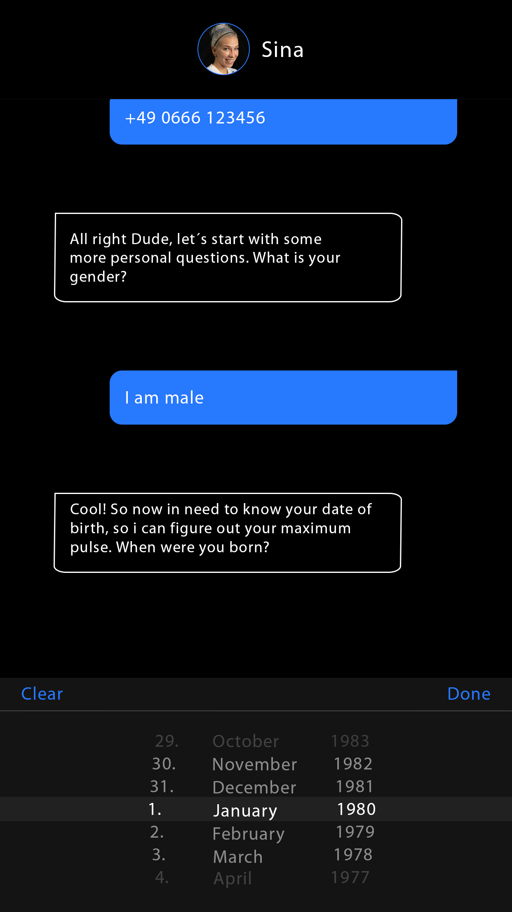 | **Date of birth (mandatory)**  The message pops up, together with a selection wheel, that is split up into three different parts. At the first part you can choose numbers between 1 and 31 to select the day. At the second part you can choose between the 12 months and the third one represents the year and you can choose from 1900 on every number till 2021. Once you clicked on “Done” the selected parts will transform into a message with completely blue background and white text. Now the next message pops up. |     |     |
|  | **Heigh/Weight (mandatory)**  The message pops up and the same wheel appears, but this time with only one part. Numbers from 0,50m to 2,50m can be chosen and after clicking “Done“ the wheel disappears and the selection transforms into a message again. Then the next message appears, as well as another wheel, made of one part. This time the user can select numbers from 20kg to 200kg and once you click “Done“ it becomes a message again. Then the next message appears. |     |     |
| 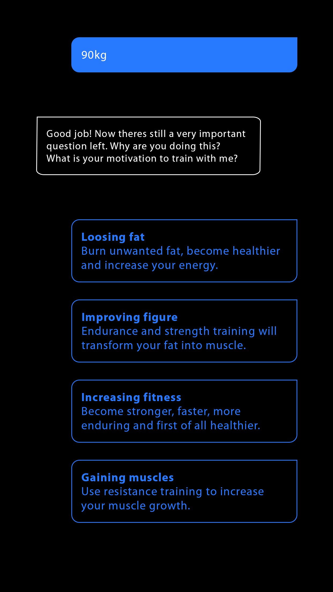 | **Goals (mandatory)**  The message appears and four buttons pop up. Once the user selects one of them it turns completely blue, the text becomes white and its moves to the same place of the “Loosing fat“ button. The other buttons disappear. Then the next trainer message pops up. |     |     |
|    | **Days of training (mandatory)**  The message appears and a selection between every seven days in the week pops up. Behind each day is a tickable box. By clicking on the box the user selects the day, more than one selection is possible. As soon as one box is ticked another button pops up with the label “done“ on it. By clicking on it the selected day turn into a message with blue background and white text, the “Done“ button disappears and the next message from the trainer drops in. |     |     |
| 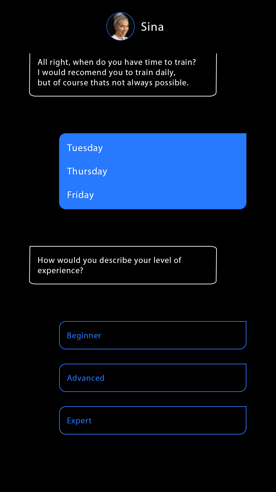 | **Experience level (mandatory)**  The message pops up and three answering suggestions appear. Once the user clicks one of them, the background turns completely blue, the text becomes white, it jumps to the exactly same place where the “Beginer“ button is and the other buttons disappear. Then the next message from the trainer pops up. |     |     |
| 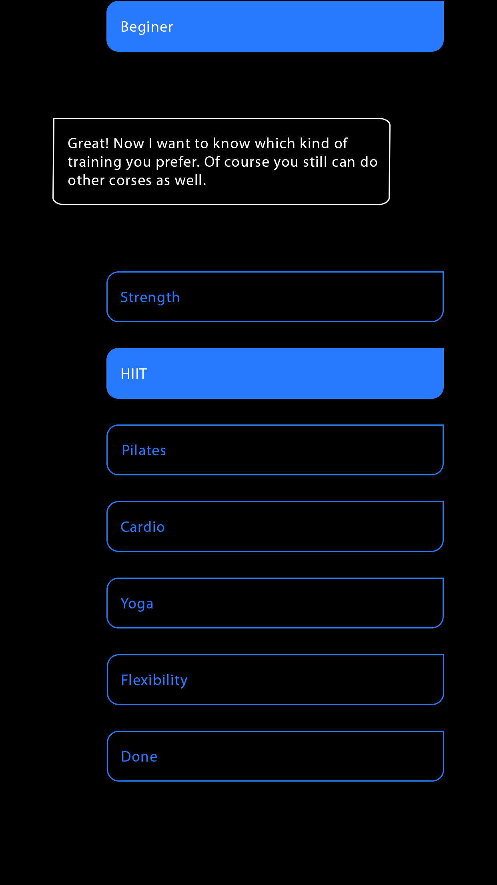 | **Workout preference (mandatory)**  The message appears together with the six answering options and an “Done“ button beneath. By clicking on one of these options, its background becomes blue and the text white. If the user clicks on another option, the first one turns back to original and the new one turns blue with white text. By clicking on “Done“ the selected button moves to the place of the “Strength” button and the others disappear, as well as the “Done” button. The next trainer message pops up. |     |     |
| 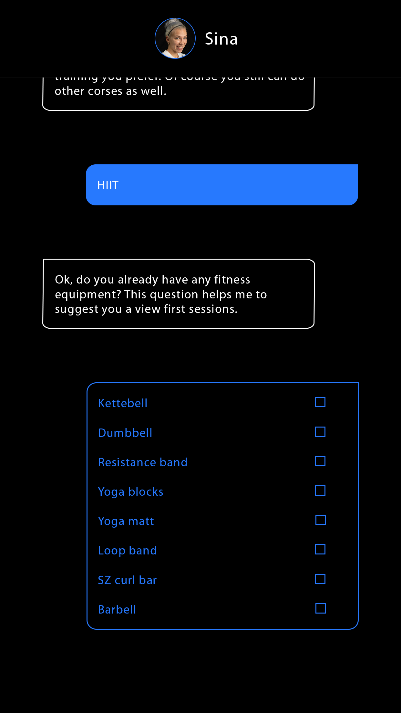 | **Equipment (mandatory)**  The message appears together with a list of eight fitness tools. Each one has a tickable box behind it. By clicking on the box it gets ticked. Once one box is ticked a “Done“ button appears again. By clicking on this button all selected tools transform into a message with white text and blue background. The next message from the trainer pops up. |     |     |
| 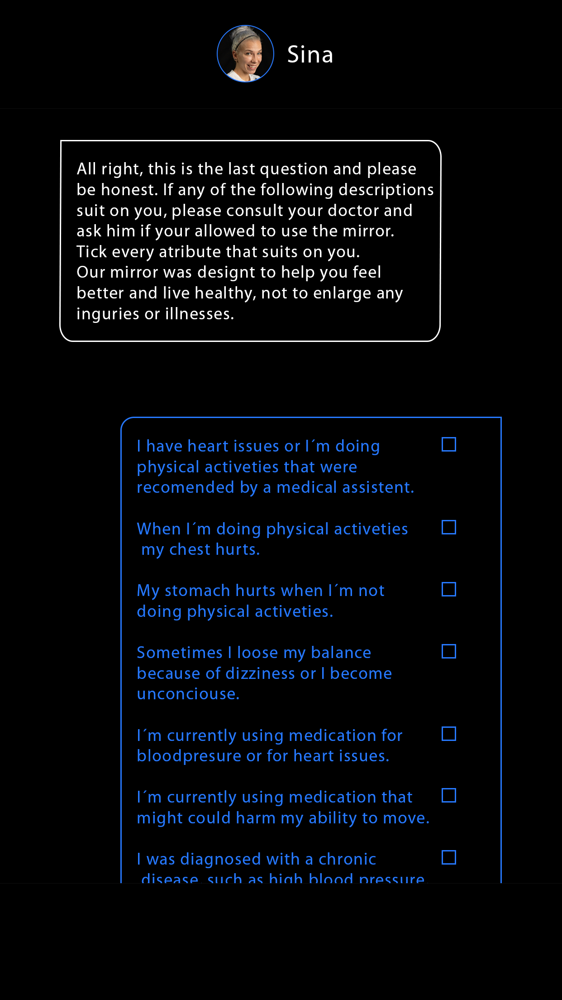  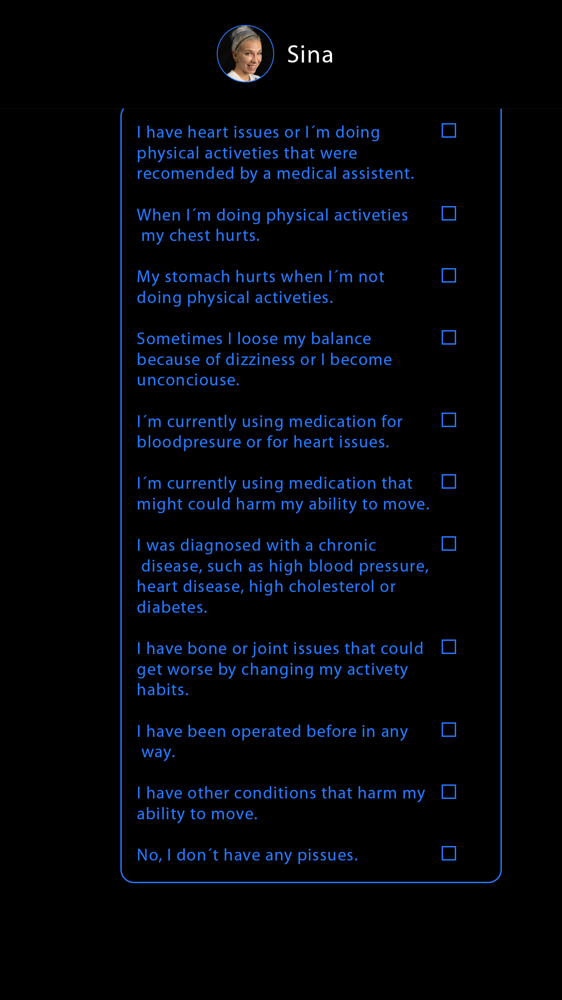 | **health restrictions (mandatory)**  The message pops up. A list of eleven different options appears and behind each option is a tickable box. After one box is ticked, by clicking on it, a “Done“ button appears. By clicking the button all selected options transform into a message with blue background and white text. As one of the boxes is ticked a “Done“ appears beneath the the list. By clicking it the next page opens up and the chat is finished. |     |     |
|  | **User profiles** |     |     |