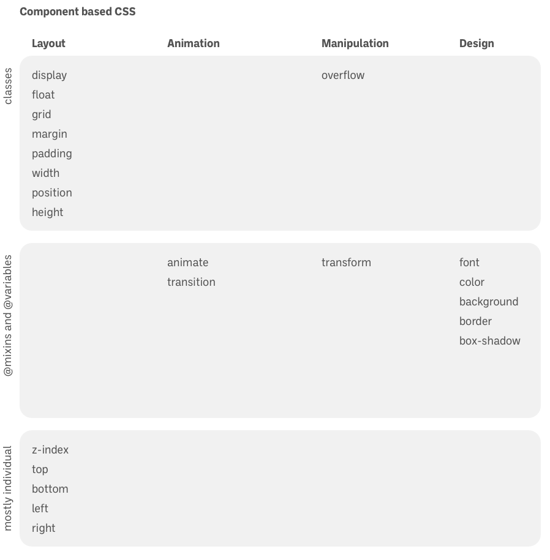
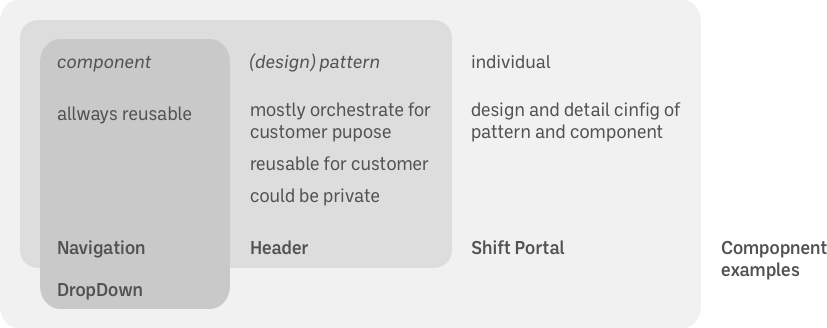

# Design Studies

- CSS  
Top Down: form coarse grain to fine grain
  - master page pattern
    - Theme
      - Atomic design
- composition patterns
- Content and Semantics and Structure

- Functionality
  - navigation
- Performance

# Separation of Concerns

|     | **Component based CSS**   Top Down: form Coarse grain to fine grain |     |     |     |
| --- | --- | --- | --- | --- |
|     | Layout | Animation | Manipulation | Design |
| classes | display  float  grid  margin  padding  width  position  height |     |     |     |
| @mixins and @variables |     | animate  transition | transform | font  color   [Color from Image](https://www.canva.com/colors/color-palette-generator/)   [Less Color functionality](http://lesscss.org/functions/#color-definition)  maybe default color   color: var(--button-label, #fff);  background  border  box-shadow |
| mostly individual | z-index  top  bottom  left |     |     |     |

- master page pattern
  - Theme
    - Atomic design
- composition patterns
  - Pattern Library/Component Library  
(specific design presets for certain use cases i.e. Call to Action, Contact Form, Button)  
These can be easily changed/edited by the customer/company
    - Basics about living style guides: [https://medium.com/@operatino/living-style-guide-tools-in-depth-overview-28cfffb92d05](https://medium.com/@operatino/living-style-guide-tools-in-depth-overview-28cfffb92d05)
    - [Styledown](https://github.com/styledown/styledown) - Markdown based style dude generator
    - [SC5 style guide generator](https://github.com/SC5/sc5-styleguide) - Styleguide generator is a handy little tool that helps you generate good looking styleguides from stylesheets using KSS notation
    - [SourceJS](https://github.com/sourcejs/Source) - Living Style Guides Engine and Maintenance Environment for Front-end Components. Core repository.
    - **Really good Example:** [https://www.sipgatedesign.com/pattern-library/pattern-uebersicht](https://www.sipgatedesign.com/pattern-library/pattern-uebersicht) and [https://www.sipgatedesign.com](https://www.sipgatedesign.com)
    - [https://uiengineering.de](https://uiengineering.de/)
    - [https://github.com/dennisreimann/uiengine](https://github.com/dennisreimann/uiengine)
  - Vision for WODA  

- Content and Semantics and Structure

- Functionality
  - navigation
  - MercuryOS
    - [https://www.mercuryos.com/architecture](https://www.mercuryos.com/architecture)
- Performance
  - mention last because the browser is the bottleneck