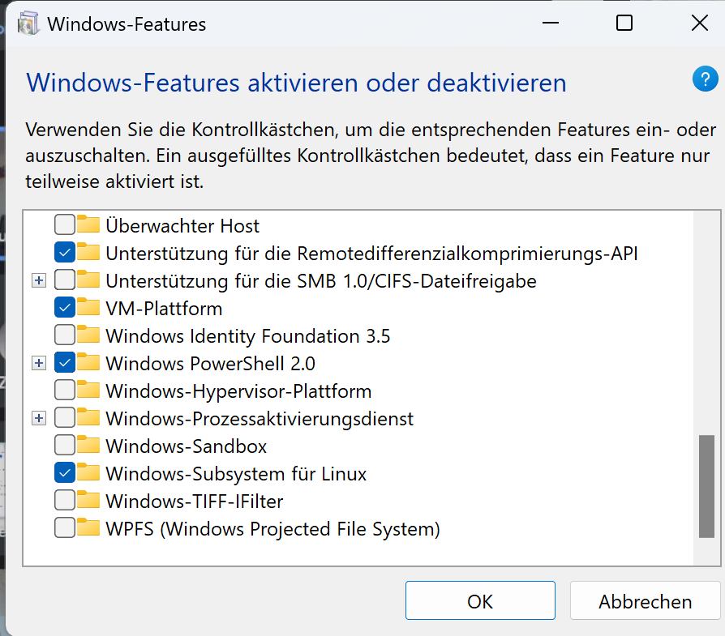

# Install on Windows 10

Status: FINAL

Version: 25.1.23

# Install WSL

In Windows Powershell:

```
wsl --install
```

[https://learn.microsoft.com/de-de/windows/wsl/install](https://learn.microsoft.com/de-de/windows/wsl/install)

| **Table of content** |
| --- |
| - [Install WSL](#install-wsl)<br>  - [Activate WSL](#activate-wsl)<br>  - [Get Ubuntu](#get-ubuntu)<br>  - [Setup root user in WSL](#setup-root-user-in-wsl)<br>  - [Mounting WSL to Windows 10](#mounting-wsl-to-windows-10)<br>- [Install VS Code](#install-vs-code)<br>  - [Recommended extensions](#recommended-extensions)<br>  - [How to open a terminal inside VS Code](#how-to-open-a-terminal-inside-vs-code)<br>- [Install Docker Desktop](#install-docker-desktop) |

## Activate WSL


via Powershell

Open PowerShell as Administrator.

```
To install WSL, run this command: 
dism.exe /online /enable-feature /featurename:Microsoft-Windows-Subsystem-Linux /all /norestart


Enable the Virtual Machine Platform optional feature by running the following command: 
dism.exe /online /enable-feature /featurename:VirtualMachinePlatform /all /norestart

Restart Windows 10.


```


via GUI

If WSL not installed, please enable the Feature (German: “Feature aktivieren/deaktivieren”) Linux Subsystem for Windows



## Get Ubuntu

→ ([https://apps.microsoft.com/store/detail/ubuntu/9PDXGNCFSCZV?hl=de-de&gl=de&rtc=1](https://apps.microsoft.com/store/detail/ubuntu/9PDXGNCFSCZV?hl=de-de&gl=de&rtc=1) )

## Setup root user in WSL


start as user

```
mkdir scripts
vim .bashrc
PATH-$PATH:~/scripts


#in cmd
wsl -u root
passwd <username>


touch /etc/wsl.conf
vim /etc/wsl.conf

# paste this content into the file
[user]
default=<username>

///
Inside the instance, as root, create/edit /etc/wsl.conf and add these lines

[user]
default=username
Then close it, run wsl --terminate <distro name> in PowerShell, and restart it.

That's from an issue in the WSL repo. The registry hack answer is also in there, but /etc/wsl.conf is now officially the supported solution.

```


source

[https://www.reddit.com/r/bashonubuntuonwindows/comments/jrxmbc/i\_do\_not\_remember\_entering\_a\_password\_but\_it\_is/](https://www.reddit.com/r/bashonubuntuonwindows/comments/jrxmbc/i_do_not_remember_entering_a_password_but_it_is/)

[https://askubuntu.com/questions/931940/unable-to-change-the-root-password-in-windows-10-wsl#:~:text=If you forgot your password,root without asking for password.](https://askubuntu.com/questions/931940/unable-to-change-the-root-password-in-windows-10-wsl#:~:text=If%20you%20forgot%20your%20password,root%20without%20asking%20for%20password.)

##  Mounting WSL to Windows 10

- [ ] Still having issues, edit /etc/esl.conf to login with root user

```
wsl --list
wsl -l -v
wsl --setdefault DISTRO-NAME

Map Network Drive
\\wsl$    Browse

net use DRIVE: PATH
net use U: \\wsl.localhost\Ubuntu-22.04

```

Quelle: [https://pureinfotech.com/set-default-distro-wsl2-windows-10/#:~:text=Set default Linux distro on WSL2&text=Open Start on Windows 10,the Run as administrator option.&text=Quick tip: You can also,like this: wsl -l .&text=In the command, replace DISTRO,as default (see step No.](https://pureinfotech.com/set-default-distro-wsl2-windows-10/#:~:text=Set%20default%20Linux%20distro%20on%20WSL2&text=Open%20Start%20on%20Windows%2010,the%20Run%20as%20administrator%20option.&text=Quick%20tip%3A%20You%20can%20also,like%20this%3A%20wsl%20%2Dl%20.&text=In%20the%20command%2C%20replace%20DISTRO,as%20default%20(see%20step%20No.)

Quelle: [https://www.howtogeek.com/118452/how-to-map-network-drives-from-the-command-prompt-in-windows/](https://www.howtogeek.com/118452/how-to-map-network-drives-from-the-command-prompt-in-windows/)

 [N1-24](https://2cu.atlassian.net/browse/N1-24) - Getting issue details... STATUS

# Install VS Code

Download [https://code.visualstudio.com/download](https://code.visualstudio.com/download) and install.

## Recommended extensions

1. WSL
2. Remote Development
  1. Dev Containers
  2. Remote SSH
  3. Remote Explorer
3. Bash IDE
4. GitLens

## How to open a terminal inside VS Code

Menu >> View >> Terminal

# Install Docker Desktop

Install winget and Docker Desktop using powershell

```
# winget
Invoke-WebRequest -Uri “https://github.com/microsoft/winget-cli/releases/download/v1.2.10271/Microsoft.DesktopAppInstaller_8wekyb3d8bbwe.msixbundle” -OutFile “C:\Temp\WinGet.msixbundle”
Add-AppxPackage “C:\Temp\WinGet.msixbundle”

# Docker Desktop
winget install Docker.DockerDesktop
```

Here you can check if docker runs perfectly:

```
docker ps
```