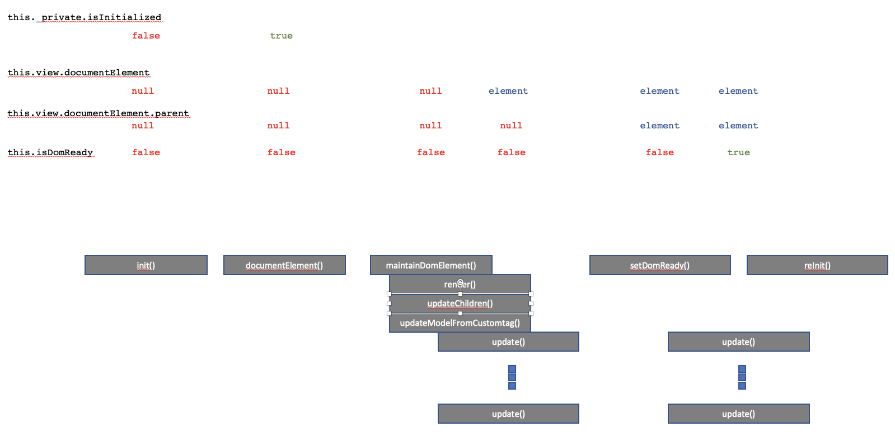

# WebBean Rendering Version 1.1.0

- [UcpComponentSupport](#ucpcomponentsupport)
- [Rerender Flow](#rerender-flow)
  - [UcpComponent](#ucpcomponent)
    - [Rendering](#rendering)
      - [States](#states)
      - [add()](#add)
      - [updateAllViews()](#updateallviews)
      - [onUpdateView(view, updateObject)](#onupdateviewview-updateobject)
      - [get itemView get overView get detailsView getViews()](#get-itemview-get-overview-get-detailsview-getviews)
  - [UcpView](#ucpview)
    - [RAW TEXT level](#raw-text-level)
      - [render()](#render)
      - [UcpComponentSupport.weBeanRegistry.textTemplate2TemplateContent(textWeBean)](#ucpcomponentsupportwebeanregistrytexttemplate2templatecontenttextwebean)
    - [DOM level](#dom-level)
      - [documentElement()](#documentelement)
      - [maintainDomElement()](#maintaindomelement)
      - [checkTargetElement(element)](#checktargetelementelement)
      - [prepend(element)](#prependelement)
      - [append(element)](#appendelement)
      - [replace(element)](#replaceelement)
      - [rerender(element)](#rerenderelement)
      - [replaceContainer(currentDOM, newWeBean)](#replacecontainercurrentdom-newwebean)
      - [setDomReady(targetElement, newWeBean, prepare)](#setdomreadytargetelement-newwebean-prepare)
      - [updateChildren(parentElement)](#updatechildrenparentelement)
    - [Component Level](#component-level)
      - [maintainContainment(parentUcpView, currentUcpView)](#maintaincontainmentparentucpview-currentucpview)
      - [updateModelFromCustomTag(ucpModel, customTag)](#updatemodelfromcustomtagucpmodel-customtag)
      - [removeChild(child)](#removechildchild)
      - [onUpdateView(this, this.ucpModel.changeLog)](#onupdateviewthis-thisucpmodelchangelog)
      - [clear()](#clear)
      - [close()](#close)
      - [remove()](#remove)
      - [removeChild(child)](#removechildchild)
      - [get container](#get-container)
      - [get parent](#get-parent)
      - [set parent](#set-parent)
      - [updateAllWeBeanProperties()](#updateallwebeanproperties)
      - [updateWeBeanProperty(weBeanProperty)](#updatewebeanpropertywebeanproperty)
- [Array changes and/or updating: How to trigger onUpdate versus onModelChanged with array changes](#array-changes-andor-updating-how-to-trigger-onupdate-versus-onmodelchanged-with-array-changes)

- [Troubleshooting](#WebBeanRenderingVersion1.1.0-Troubleshooting)

## UcpComponentSupport

[https://test.wo-da.de/EAMD.ucp/Components/tla/EAM/layer1/Thinglish/Once/4.0.0/docs/Components & Roadmap.pptx](https://test.wo-da.de/EAMD.ucp/Components/tla/EAM/layer1/Thinglish/Once/4.0.0/docs/Components%20%26%20Roadmap.pptx)


rendering state (outdated since WODA 3.1.0)



## Rerender Flow


### UcpComponent

#### Rendering

##### States

- ucpComponent.\_private.isInitialized
- ucpComponent.\_private.rendering
- ucpComponent.\_private.renderingCounter
- ucpComponent.\_private.updateCounter
- ucpComponent.willReplaceAfterUpdateView
- ucpComponent.isDomReady
- ucpComponent.\_private.element
- element.isInDom

##### add()

##### updateAllViews()

forces an update of all views

##### onUpdateView(`view, updateObject`)

is a Callback Method that notifies you which view has to be rerendered.  
calling `view.update()` will force a complete rerendering.

this implies losing all DOM listeners. after rerendering `onDomReady(view)` will be called again to reinatialize DOM listeners

calling `this.documentElement` does the first rendering.  
The framework tries to postpone this step to the last possible point so that you can initialize the model first and do not have to re-render many times. The last possible point to render, is if the element will be appended to to an element that is already in the DOM. The UcpView method checkTargetElement finds out if an element isInDom and attaches the boolean to the element.

alternatively you can check the updateObject to see what in the model did change  
and update the dom manually here on view.documentElement or view.subViewElement

##### get itemView  
get overView  
get detailsView  
getViews()

### UcpView

#### RAW TEXT level

##### render()

##### UcpComponentSupport.weBeanRegistry.textTemplate2TemplateContent(textWeBean)

#### DOM level

##### documentElement()

gets the root DOM element for a UcpView

- ucpComponent.\_private.element

##### maintainDomElement()

rerenders a component without it's children

##### checkTargetElement(element)

checks if the element is currently in the DOM and maintains this tate on the element in  
element.isInDom

@TODO can be replaced by element.isConnected()

##### prepend(element)

adds this.documentElement as the first child DOM node of element

##### append(element)

adds this.documentElement as the last child DOM node of element

##### replace(element)

##### rerender(element)

- ucpComponent.willReplaceAfterUpdateView
- ucpComponent.setDomReady(element, newWeBean);

##### replaceContainer(currentDOM, newWeBean)

##### setDomReady(targetElement, newWeBean, prepare)

##### updateChildren(parentElement)

- UcpComponentSupport.getAllViews(parentElement);

#### Component Level

##### maintainContainment(parentUcpView, currentUcpView)

- Thinglish.super(parentUcpView, Container);
- parentUcpView.\_private.interfaces.Container.add(currentUcpView);

##### updateModelFromCustomTag(ucpModel, customTag)

##### removeChild(child)

##### onUpdateView(this, this.ucpModel.changeLog)

##### clear()

##### close()

##### remove()

##### removeChild(child)

##### get container

##### get parent

##### set parent

##### updateAllWeBeanProperties()

##### updateWeBeanProperty(weBeanProperty)

## Array changes and/or updating: How to trigger onUpdate versus onModelChanged with array changes

1. Firstly, just updating an array with, e.g., push, pop, slice, splice, etc. doesn’t trigger onUpdate and onModelChanged.
2. The whole array, thus the whole value of the key-value pair of the model, has to be replaced.
3. The rule of thumb is to use shallow copying/pass by reference when possible, e.g.,
```
let array = [1,2,3,];
this.model.options = array;
```
4. However, onUpdate and onModelChanged might behave differently and so shallow copying/pass by reference is not always possible.
5. onUpdate has in general no problem with shallow copying/pass by reference, but onModelChanged doesn’t always trigger with shallow copying/pass by reference.
6. So for onModelChanged deep copying/pass by value is then a better choice.
7. For a one dimensional array the following is an example,
```
let array = [1,2,3];
this.model.options = [...array];
or
let array = [1,2,3];
this.model.options = array.slice();
```
8. For a multidimensional array or object the following is an example,
```
let object = [1,{2:[4,5,6]},{3:{7:[8,9,10]}}];
this.model.options = JSON.parse(JSON.stringify(object));
```

# Troubleshooting

- Did you overwrite the updateView or update method?