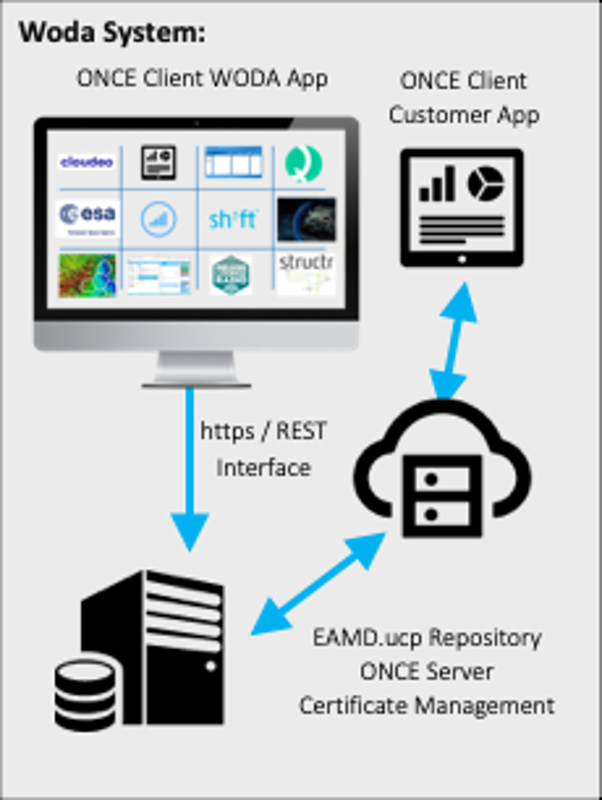

# Product WODA

Product Brief

With WODA, the complete **I**ntegrated **D**evelopment **E**nvironment (IDE) you can minimize coding and generate UCP Components and reusable software. The result is 100% interoperable with all EAM Descriptor based Software in the world. WODA consists of a Web application, local and Cloud based asset library called EAMD Repository and a UCP Component generator. This allows you to create a **P**rogressive **W**eb **A**pp (PWA) in front of your customers eyes! This App will run instantly on any common System.

**The WODA System consists of:**

- Complete WODA IDE
- ONCE Server and ONCE OS
- WODA UCP component library
- Local and Cloud EAMD repository
- Free Cerulean Circle UCP components
- EAMD Authentication Server